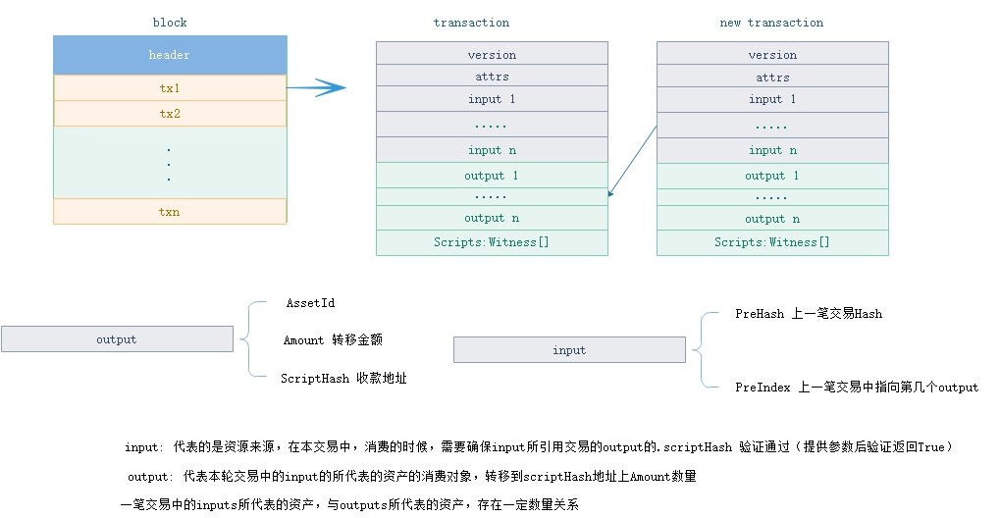

<h2>Header, Block, Transaction</h2>

&emsp;&emsp;区块链（Blockchain）本身是一种数据结构，后一个区块存储有上一个区块的hash值，形成一种链式结构。在比特币系统中，可以存在多个链条并行（即分叉），但选择最长的链条作为参考（提供了最多的工作量证明）。 在NEO网络中，只有一条链，由共识节点负责打包新块，构建下一个区块。

 
 </p

| 尺寸 | 字段 | 类型 | 描述 |
|-----|-----|------|-------|
| 1   | Type    | uint8 | 交易类型 |
| 1 | Version | uint8 | 交易版本号，目前为0 |
| ? | - | - | 特定交易的数据 |
| ?*? | Attributes | tx_attr[] | 该交易所具备的额外特性 |
| 34*? | Inputs | tx_in[] | 输入 |
| 60 * ? | Outputs | tx_out[] | 输出 |
| ?*? | Scripts | Witness[] | 用于验证该交易的脚本列表 |

### **TransactionType**

| 值 | 名称 | 系统费用 | 描述 |
|--|------|---------|------|
| 0x00 | MinerTransaction | 0 | 用于分配字节费的交易 |
| 0x40 | RegisterTransaction | 10000/0 |  (已弃用) 用于资产登记的交易|
| 0x01 | IssueTransaction | 500/0 | 用于分发资产的交易 |
| 0x02 | ClaimTransaction | 0 | 用于分配 NeoGas 的交易 |
| 0x20 | EnrollmentTransaction | 1000 | (已弃用) 用于报名成为共识候选人的特殊交易 |
| 0x90 | StateTransaction | 1000/0 | 申请见证人或共识节点投票 |
| 0x80 | ContractTransaction | 0 | 合约交易，这是最常用的一种交易 |
| 0xd0 | PublishTransaction | 500*n | (已弃用) 智能合约发布的特殊交易 |
| 0xd1 | InvocationTransaction | 0 | 	调用智能合约的特殊交易 |

### **Input**

| 尺寸 | 字段 | 类型 | 描述 |
|---|-------|------|------|
| 32 | PrevHash | UInt256 | 被引用交易的散列值 |
| 2 | PrevIndex | ushort | 被引用交易输出的索引 | 

### **Output**

| 尺寸 | 字段 | 类型 | 描述 |
|---|-------|------|------|
| 32 | AssetId | UIntBase | 资产Id |
| ?  | Value | BigDecimal | 转账金额 | 
| 20 | ScriptHash | UInt160 | 地址 |

### **Attribute**

| 尺寸 | 字段 | 类型 | 描述 |
|---|-------|------|------|
| 1 | Usage | byte | 属性类型 |
| ? | Data | byte[] | 属性值 | 

TransactionAttributeUsage，交易属性使用表

| 字段 | 值 | 描述 |
|-------|-----|----|
| ContractHash | 0x00 | 外部合同的散列值 |
| ECDH02 | 0x02 | 用于ECDH密钥交换的公钥，该公钥的第一个字节为0x02 |
| ECDH03 | 0x03 | 用于ECDH密钥交换的公钥，该公钥的第一个字节为0x03 |
| Script | 0x20 | 用于对交易进行额外的验证, 如股权类转账，存放收款人的脚本hash |
| Vote | 0x30 |  |
| DescriptionUrl | 0x81 |  |
| Description | 0x90 |  |
| Hash1 | 0xa1 |  |
| Hash2 | 0xa2 |  |
| Hash3 | 0xa3 |  |
| Hash4 | 0xa4 |  |
| Hash5 | 0xa5 |  |
| Hash6 | 0xa6 |  |
| Hash7 | 0xa7 |  |
| Hash8 | 0xa8 |  |
| Hash9 | 0xa9 |  |
| Hash10 | 0xaa |  |
| Hash11 | 0xab |  |
| Hash12 | 0xac |  |
| Hash13 | 0xad |  |
| Hash14 | 0xae |  |
| Hash15 | 0xaf |  |
| Remark | 0xf0 | 备注 |
| Remark1 | 0xf1 |  |
| Remark2 | 0xf2 |  |
| Remark3 | 0xf3 |  |
| Remark4 | 0xf4 |  |
| Remark5 | 0xf5 |  |
| Remark6 | 0xf6 |  |
| Remark7 | 0xf7 |  |
| Remark8 | 0xf8 |  |
| Remark9 | 0xf9 |  |
| Remark10 | 0xfa |  |
| Remark11 | 0xfb |  |
| Remark12 | 0xfc |  |
| Remark13 | 0xfd |  |
| Remark14 | 0xfe |  |
| Remark15 | 0xff |  |

### **Witness**

| 尺寸 | 字段 | 类型 | 描述 |
|--|-------|------|------|
| ?  | InvocationScript | byte[] |执行脚本，补全脚本参数 |
| ?  | VerificationScript | byte[] | 验证脚本  | 
| 20  | ScriptHash | UInt160 | 脚本hash |

