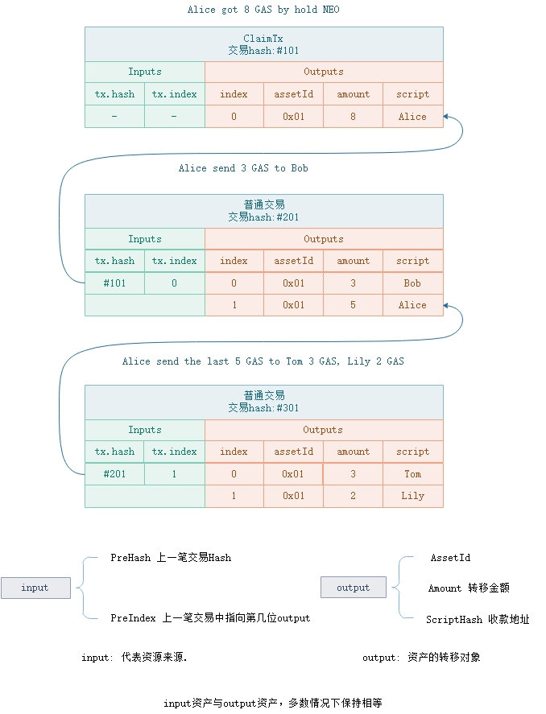
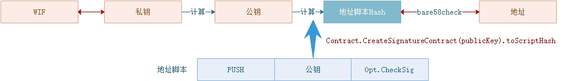

<h2>Header, Block, Transaction</h2>

&emsp;&emsp;区块链（Blockchain）本身是一种数据结构，后一个区块存储有上一个区块的hash值，形成一种链式结构。在比特币系统中，可以存在多个链条并行（即分叉），但选择最长的链条作为参考（提供了最多的工作量证明）。 在NEO网络中，只有一条链，由共识节点负责打包新块，构建下一个区块。

 </p

### **Header** 

区块头，包含了一个区块的基本信息，block的hash操作实际上是对header的数据进行hash。每个区块的时间戳，必须大于前一个区块的时间，时间差间隔在15秒左右。同时，区块高度必须等于前一个区块高度价一。

| 尺寸 | 字段 | 名称  | 类型 | 描述 |
|----|-----|-------|------|------|
|  4  | Version | 区块版本 | uint | 区块版本号，目前为 `0` |
|32   | PrevHash | 上一个区块Hash | uint256 |  |
|  32  | MerkleRoot | Merkle树 | uint256 | 该区块中所有交易的Merkle树的根 |
| 4  | Timestamp |  时间戳 | uint |  |
| 4   | Index | 区块高度 | uint |  创世块高度为0 |
|  8  | ConsensusData | Nonce | ulong | 共识过程存放的数据，` ConsensusData = Nonce`, 随机值  |
| 20  | NextConsensus | 下一个共识地址 | UInt160 | 下一个出块的共识节点的三分之二签名脚本hash   |
| 1  | - | - | uint8 | 	固定为 1   |
|  ?  | Witness | 见证人 |  Witness | 验证脚本的执行封装：执行脚本（所需参数）+验证脚本（具体验证的脚本） |
| 1  | - | - | uint8 | 	固定为 0   |

### **Block**

区块，区块链的核心数据结构，是对一批交易的打包，并按照链式结构构建。 一个区块有且只有一个`MinerTransaction`交易，并在交易列表第一位置上。

| 尺寸 | 字段 | 名称  | 类型 | 描述 |
|----|-----|-------|------|------|
|  4  | Version | 区块版本 | uint | 区块版本号，目前为 `0` |
| 32   | PrevHash | 上一个区块Hash | UInt256 |  |
|  32  | MerkleRoot | Merkle树 | uint256 | 该区块中所有交易的Merkle树的根 |
| 4  | Timestamp |  时间戳 | uint |  |
| 4   | Index | 区块高度 | uint |  创世块高度为0 |
|  8  | ConsensusData | Nonce | ulong | 共识过程存放的数据，` ConsensusData = Nonce`, 随机值  |
| 20  | NextConsensus | 下一个共识地址 | UInt160 | 下一个出块的共识节点的三分之二签名脚本hash   |
| 1  | - | - | uint8 | 	固定为 1   |
|  ?   | Witness | 见证人 |  Witness | 验证脚本的执行封装：执行脚本（所需参数）+验证脚本（具体验证的脚本） |
|  ?*? | **Transactions** | 交易 |  Transaction[] | 对比区块头，新增部分 |

 Block进行散列的时候，只考虑前7个字段（即区块头），因 MerkleRoot 已经包含了所有交易的散列值，修改交易也会改变区块的散列值。block持久化的时候，存放的是交易hash列表，交易另外单独存放，以方便查询。

### **GenesisBlock**

创世块，是默认已经定义在代码中不可修改的区块链的第一个区块，高度为0。在创世块中，定义了NEO，GAS资产。

| 尺寸 | 字段 | 名称  | 类型 | 值 |
|----|-----|-------|------|------|
|  4  | Version | 区块版本 | uint | `0` |
| 32   | PrevHash | 上一个区块Hash | UInt256 |  `0x0000000000000000000000000000000000000000000000000000000000000000` |
|  32  | MerkleRoot | Merkle树 | uint256 |`0x803ff4abe3ea6533bcc0be574efa02f83ae8fdc651c879056b0d9be336c01bf4`  |
| 4  | Timestamp |  时间戳 | uint | `2016-07-15 | 23:08:21` |
| 4   | Index | 区块高度 | uint |  `0` |
|  8  | ConsensusData | Nonce | ulong | `2083236893`, 比特币创世块nonce值，向比特币致敬  |
| 20  | NextConsensus | 下一个共识地址 | UInt160 | 下一个出块的共识节点的三分之二签名脚本hash   |
| 1  | - | - | uint8 | 	固定为 1   |
|  ?   | Witness | 见证人 |  Witness |  `0x51`, 代表`PUSHT`指令，返回永真 |
|  ?*? | **Transactions** | 交易 |  Transaction[] | 目前存了4笔交易， 见后续表 |

第一笔，MinerTransaction，挖矿交易，所有的block的第一笔交易，必须是挖矿交易

| 尺寸 | 字段 | 名称  | 类型 | 值 |
|----|-----|-------|------|------|
| 1   | Type    | uint8 | 交易类型 | `0x00` |
| 1 | Version | uint8 |  交易版本号 | `0` |
| 8 | Nonce | ulong | nonce  | `2083236893` |
| ?*? | Attributes | tx_attr[] | 该交易所具备的额外特性 |    空 |
| 34*? | Inputs | tx_in[] | 输入 | 空 |
| 60 * ? | Outputs | tx_out[] | 输出 | 空 |
| ?*? | Scripts | Witness[] | 用于验证该交易的脚本列表 | 空 |

第二笔，RegisterTransaction，定义NEO代币

| 尺寸 | 字段 | 名称  | 类型 | 值 |
|----|-----|-------|------|------|
| 1   | Type    | byte | 交易类型 | `0x00` |
| 1 | Version | byte |  交易版本号 | `0` |
| 1 | AssetType | byte | 资产类型  | `0x00` |
| ? | Name | string | 资产名字  | `NEO` |
| 8 | Amount | Fix8 | 总量  | `100000000` |
| 1 | Precision | byte | 精度  | `0` |
| ? | Owner | ECPoint | 所有者公钥  | todo |
| 32 | Admin | UInt160 | 管理者  | `0x51`.toScriptHash |
| ?*? | Attributes | tx_attr[] | 该交易所具备的额外特性 |    空 |
| 34*? | Inputs | tx_in[] | 输入 | 空 |
| 60 * ? | Outputs | tx_out[] | 输出 | 空 |
| ?*? | Scripts | Witness[] | 用于验证该交易的脚本列表 | 空 |

`NEO`名称定义 = `[{"lang":"zh-CN","name":"小蚁股"},{"lang":"en","name":"AntShare"}]`

第三笔，RegisterTransaction，定义GAS代币

| 尺寸 | 字段 | 名称  | 类型 | 值 |
|----|-----|-------|------|------|
| 1   | Type    | byte | 交易类型 | `0x00` |
| 1 | Version | byte |  交易版本号 | `0` |
| 1 | AssetType | byte | 资产类型  | `0x01` |
| ? | Name | string | 资产名字  | `GAS` |
| 8 | Amount | Fix8 | 总量  | `100000000` |
| 1 | Precision | byte | 精度  | `8` |
| ? | Owner | ECPoint | 所有者公钥  | todo |
| 32 | Admin | UInt160 | 管理者  | `0x00`.toScriptHash, 即 `OpCode.PUSHF`指令脚本 |
| ?*? | Attributes | tx_attr[] | 该交易所具备的额外特性 |    空 |
| 34*? | Inputs | tx_in[] | 输入 | 空 |
| 60 * ? | Outputs | tx_out[] | 输出 | 空 |
| ?*? | Scripts | Witness[] | 用于验证该交易的脚本列表 | 空 |

`GAS`名称定义 =  `[{"lang":"zh-CN","name":"小蚁币"},{"lang":"en","name":"AntCoin"}]`

第四笔，IssueTransaction，发放NEO到合约地址

| 尺寸 | 字段 | 名称  | 类型 | 值 |
|----|-----|-------|------|------|
| 1   | Type    | byte | 交易类型 | `0x00` |
| 1 | Version | byte |  交易版本号 | `0` |
| ?*? | Attributes | tx_attr[] | 该交易所具备的额外特性 |    空 |
| 34*? | Inputs | tx_in[] | 输入 | 空 |
| 60 * ? | Outputs | tx_out[] | 输出 | 有一笔output，见下表 |
| ?*? | Scripts | Witness[] | 用于验证该交易的脚本列表 | `0x51`, 代表 `OpCode.PUSHT` |

其中，Output定义将所有的NEO代币，转移到共识节点多方签名地址上。

| 尺寸 | 字段 | 名称  | 类型 | 值 |
|----|-----|-------|------|------|
| 1   | AssetId    | byte | 资产类型 | `0x00`， NEO代币 |
| 8 | Value | Fix8 |  转账总量 | `100000000` |
| 20 | ScriptHash | UInt160 |  收款脚本hash |  备用共识节点的三分之二多方签名脚本hash |

### **Transaction**

在NEO中，UTXO模型与账户模型同时存在。UTXO模型主要用在全局资产的转账，账户模型主要用在提供智能合约支持。

与账户模型不同的是，UTXO（Unspent Transaction Output）并不直接记录账户资产，而是通过未花费的`output`计算用户资产。每一笔UTXO类型的资产（如全局资产)，都是`input-output`关联模型，`input`指明了资金来源，`output`指明了所有资产的去向。如下图中，Alice 持有NEO分红得到8个GAS，记录在交易 #101 的第一位output上。当Alice转账给Bob时，新交易的`input`指向资金来源是交易#101的0号位置上的output所代表的资产——8个GAS，并在交易中一笔output指向给Bob 3个GAS，另外一笔output指向Alice 5个GAS(找零)。

 
 [!WARNING]
> 1. 当有手续费交易时，input.GAS > output.GAS
> 2. 当持有NEO提取GAS分红时 input.GAS < output.GAS
> 3. 当发行资产时，input.Asset < output. Asset

| 尺寸 | 字段 | 类型 | 描述 |
|-----|-----|------|-------|
| 1   | Type    | byte | 交易类型 |
| 1 | Version | byte | 交易版本号，目前为0 |
| ? | - | - | 特定交易的数据 |
| ?*? | Attributes | tx_attr[] | 该交易所具备的额外特性 |
| 34*? | Inputs | tx_in[] | 输入 |
| 60 * ? | Outputs | tx_out[] | 输出 |
| ?*? | Scripts | Witness[] | 用于验证该交易的脚本列表 |

### **TransactionType**

| 值 | 名称 | 系统费用 | 描述 |
|--|------|---------|------|
| 0x00 | MinerTransaction | 0 | 用于分配字节费的交易 |
| 0x40 | RegisterTransaction | 10000/0 |  (已弃用) 用于资产登记的交易|
| 0x01 | IssueTransaction | 500/0 | 用于分发资产的交易 |
| 0x02 | ClaimTransaction | 0 | 用于分配 NeoGas 的交易 |
| 0x20 | EnrollmentTransaction | 1000 | (已弃用) 用于报名成为共识候选人的特殊交易 |
| 0x90 | StateTransaction | 1000/0 | 申请见证人或共识节点投票 |
| 0x80 | ContractTransaction | 0 | 合约交易，这是最常用的一种交易 |
| 0xd0 | PublishTransaction | 500*n | (已弃用) 智能合约发布的特殊交易 |
| 0xd1 | InvocationTransaction | 0 | 	调用智能合约的特殊交易 |

### **Input**

| 尺寸 | 字段 | 类型 | 描述 |
|---|-------|------|------|
| 32 | PrevHash | UInt256 | 被引用交易的散列值 |
| 2 | PrevIndex | ushort | 被引用交易输出的索引 | 

### **Output**

| 尺寸 | 字段 | 类型 | 描述 |
|---|-------|------|------|
| 32 | AssetId | UIntBase | 资产Id |
| ?  | Value | BigDecimal | 转账金额 | 
| 20 | ScriptHash | UInt160 | 地址 |

### **Attribute**

| 尺寸 | 字段 | 类型 | 描述 |
|---|-------|------|------|
| 1 | Usage | byte | 属性类型 |
| ? | Data | byte[] | 属性值 | 

TransactionAttributeUsage，交易属性使用表

| 字段 | 值 | 描述 |
|-------|-----|----|
| ContractHash | 0x00 | 外部合同的散列值 |
| ECDH02 | 0x02 | 用于ECDH密钥交换的公钥，该公钥的第一个字节为0x02 |
| ECDH03 | 0x03 | 用于ECDH密钥交换的公钥，该公钥的第一个字节为0x03 |
| Script | 0x20 | 用于对交易进行额外的验证, 如股权类转账，存放收款人的脚本hash |
| Vote | 0x30 |  |
| DescriptionUrl | 0x81 |  |
| Description | 0x90 |  |
| Hash1 | 0xa1 |  |
| Hash2 | 0xa2 |  |
| Hash3 | 0xa3 |  |
| Hash4 | 0xa4 |  |
| Hash5 | 0xa5 |  |
| Hash6 | 0xa6 |  |
| Hash7 | 0xa7 |  |
| Hash8 | 0xa8 |  |
| Hash9 | 0xa9 |  |
| Hash10 | 0xaa |  |
| Hash11 | 0xab |  |
| Hash12 | 0xac |  |
| Hash13 | 0xad |  |
| Hash14 | 0xae |  |
| Hash15 | 0xaf |  |
| Remark | 0xf0 | 备注 |
| Remark1 | 0xf1 |  |
| Remark2 | 0xf2 |  |
| Remark3 | 0xf3 |  |
| Remark4 | 0xf4 |  |
| Remark5 | 0xf5 |  |
| Remark6 | 0xf6 |  |
| Remark7 | 0xf7 |  |
| Remark8 | 0xf8 |  |
| Remark9 | 0xf9 |  |
| Remark10 | 0xfa |  |
| Remark11 | 0xfb |  |
| Remark12 | 0xfc |  |
| Remark13 | 0xfd |  |
| Remark14 | 0xfe |  |
| Remark15 | 0xff |  |

### **Witness**

见证人，实际上是可执行的验证脚本。`InvocationScript` 脚本传递了`VerificationScript`脚本需要的补充参数。只有当脚本执行返回真时，验证成功。

| 尺寸 | 字段 | 类型 | 描述 |
|--|-------|------|------|
| ?  | InvocationScript | byte[] |执行脚本，补全脚本参数 |
| ?  | VerificationScript | byte[] | 验证脚本  | 

UTXO进行转账时，实际上是对能解锁`Output.scriptHash`的output进行消费，并在新交易的见证人上填充其签名参数。账户地址，实际上就是脚本hash的base58check处理，代表的是一段签名认证脚本，如下图。 [`Op.CheckSig`](../neo_vm.md#checksig) 执行需要公钥和签名两个参数，在地址脚本中，已经包含了公钥参数，故在交易中只需要补充签名参数。

 </p