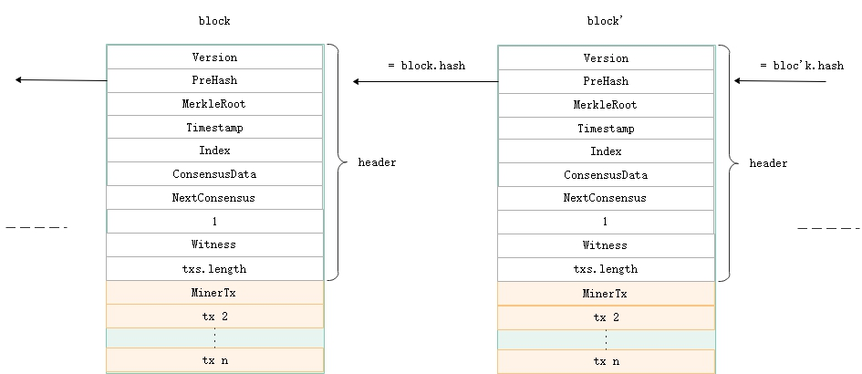

<h2>Block</h2>

<!-- &emsp;&emsp;在比特币系统中，可以存在多条链并存，即暂时分叉，但经过足够长的时间后最长的链条（提供了最多的工作量证明）成为确认的区块链。 Neo因为采用了dBFT共识算法，在系统正常运行时，不会同时出现一条以上的链。请参见`共识`部分。 -->
&emsp;&emsp; The Blockchain is a data structure. The block is composed of block header and block body. As each block has a crpytographic hash of the previous block, a timestamp, and transaction data (generally represented as a merkle tree root hash), a chain structure is formed.

&emsp;&emsp; The data structure of block as following:

| Size | Field | Name  | Type | Description |
|----|-----|-------|------|------|
| 4 | Version  | uint | Block version, current is `0` |
|32 | PrevHash  | UInt256 | The previous block's hash |
|32 | MerkleRoot | Uint256 |The merkle tree root of the block's transactions  |
| 4 | Timestamp  | uint |   |
| 4 | Index | uint |  Block height, and the Genesis Block's index is 0 |
| 8 | ConsensusData | Nonce | ulong | It's random value |
|20 | NextConsensus  | UInt160 |  The script hash of consensus nodes' multi-signature contract in the next round. |
| 1 | - | uint8 | it's fixed 1   |
| ? | Witness | |  Witness | The executable verification scripts|
| 1 | - | uint8 | it's fixed 1   |
|?*?| Transactions  |  Transaction[] | transaction list |

### **Block Header**

&emsp;&emsp; The block header contains the basic information of a block and provide verification of a block.  The first 10 attributes of the block constitute the header.

&emsp;&emsp;Block `hash` and `index` can be used to identify a block. The hash value is obtained by concatenating the first seven attributes of the block header and performing SHA256 operation twice. Normally, NEO has only one chain, and each block will be added to the blockchain after it is confirmed by more than two-thirds of all the consensus nodes. Therefore, the height of the each block is unique. Block height must be equal to the previous block height plus 1, and the Genesis Block's height is 0.

&emsp;&emsp;`Timestamp` is the block's timestamp, must be bigger than the previous block's timestamp. The interval between two blocks is about 15 seconds, which is defined by the variable `SecondsPerBlock` in configuration file `protocol.json`.

&emsp;&emsp;`NextConsensus` is a hash of multi-signature contract, which needs more than two-thirds of the signatures of all the consensus nodes as parameters. The example script is as below. Each block, with the `NextConsensus` field, locks the nodes participating in the next round of consensus activity. In the previous round of consensus activity, the Speaker calculated the consensus nodes of the next round based on the voting at that time, generated the multi-signature contract, and assigned the hash value of the contract to the block's `NextConsensus` field.

&emsp;&emsp;`Witness` is the verification script of the block, it contains `InvocationScript` and `VerificationScript`. The `InvocationScript` provides the parameters for the `VerificationScript` to execute.

### **Block Body**

&emsp;&emsp; The block body is a transaction list. In one round of consensus activity, the Speaker selects all the transactions in the memory pool, have them sorted and filtered by plugins, and then package them into a new proposal block. For more details about consensus, please read "Consensus Mechanism" section.

&emsp;&emsp; The first transaction of each block must be a `MinerTransaction`, which is used to record all transaction's network fee in the block. At present, a block can hold up to 500 transactions in total, including up to 20 free transactions and a MinerTransaction as the first transaction in the block.

> [!NOTE]
> When a block is persisted, it stores a hash list of transactions that belong to the block. And the transaction data is stored separately to facilitate query.
