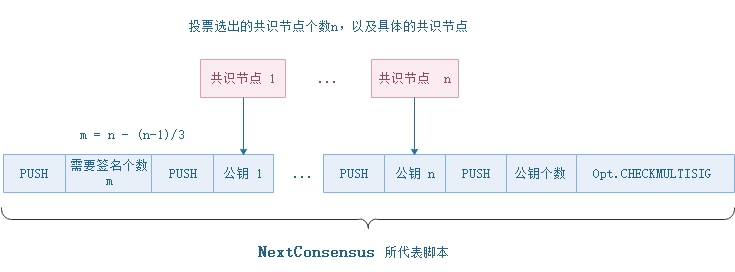

<h2>Neo区块链的数据结构</h2>

区块链（Blockchain）本身是一种数据结构。每个区块都有上一个区块的hash值，从而形成了一种链式结构。在比特币系统中，可以存在多条链并存，即暂时分叉，但经过足够长的时间后最长的链条（提供了最多的工作量证明）成为确认的区块链。 Neo因为采用了dBFT共识算法，在系统正常运行时，不会同时出现一条以上的链。请参见共识部分的黄皮书。

### **区块头Header** 

区块头包含了区块的基本信息。hash值是每个区块的唯一标识，是对区块头的前7个数据拼合在一起进行两次SHA256运算而得。同时，高度也是一个区块的标识。正常运行时，Neo只会有一条链，且每个区块均由共识节点三分之二以上的节点确认之后才被加入到区块链中，所以区块链上的每一个块的高度唯一。每个区块的时间戳，必须晚于其前一个区块的时间戳。两个块确认的时间间隔在15秒左右，由系统配置文件`protocol.json`中，变量`SecondsPerBlock`所设定。另外，区块高度必须等于前一个区块高度加1。

| 尺寸 | 字段 | 名称  | 类型 | 描述 |
|----|-----|-------|------|------|
|  4  | Version | 区块版本 | uint | 区块版本号，目前为 `0` |
|32   | PrevHash | 上一个区块Hash | UInt256 |  |
|  32  | MerkleRoot | Merkle树 | UInt256 | 该区块中所有交易的Merkle树的根 |
| 4  | Timestamp |  时间戳 | uint |  |
| 4   | Index | 区块高度 | uint |  创世块高度为0 |
|  8  | ConsensusData | Nonce | ulong | 随机值  |
| 20  | NextConsensus | 下一个共识地址 | UInt160 | 下一个出块的共识节点的三分之二签名脚本hash   |
| 1  | - | - | uint8 | 	固定为 1   |
|  ?  | Witness | 见证人 |  Witness | 验证脚本的执行封装：执行脚本（所需参数）+验证脚本（具体验证的脚本） |
| 1  | - | - | uint8 | 	固定为 0   |

`NextConsensus` 是一个多方签名脚本的hash值，脚本验证时，需要三分之二以上的共识节点的签名作为参数。示例脚本如下图。每一个区块，都会带有`NextConsensus`字段，锁定了参与下一轮共识的节点。在上一轮共识中，当时的议长节点根据当时的投票结果计算出了下一轮的共识节点，再生成多方签名合约，并将合约脚本hash值存入到提案块的`NextConsensus`字段中。若提案块最后达成共识，成为被确认的块，则本轮的共识验证人需是上一个被确认的块里的多方签名合约地址之一。

### **Block**

区块，区块链的核心数据结构，区块头附加具体的交易数据。因为每个区块都包含其前一个区块的hash值，形成一个链式结构，成为区块链。区块的数据结构见下：

| 尺寸 | 字段 | 名称  | 类型 | 描述 |
|----|-----|-------|------|------|
|  4  | Version | 区块版本 | uint | 区块版本号，目前为 `0` |
| 32   | PrevHash | 上一个区块Hash | UInt256 |  |
|  32  | MerkleRoot | Merkle树 | Uint256 | 该区块中所有交易的Merkle树的根 |
| 4  | Timestamp |  时间戳 | uint | 该区块生成的大致时间 |
| 4   | Index | 区块高度 | uint |  创世块的高度为0 |
|  8  | ConsensusData | Nonce | ulong | 为共识过程存放的一个随机数据，` ConsensusData = Nonce` |
| 20  | NextConsensus | 下一个共识地址 | UInt160 | 下一个出块的共识节点的三分之二签名脚本hash  |
| 1  | - | - | uint8 | 	固定为 1   |
|  ?   | Witness | 见证人 |  Witness | 验证脚本的执行封装：执行脚本（所需参数）+验证脚本（具体验证的脚本） |
|  ?*? | **Transactions** | 交易列表 |  Transaction[] | 对比区块头，这就是区块的主数据 |

计算Block的Hash时，只用到了区块的前7个字段。因 MerkleRoot 已经包含了所有交易的散列值信息，修改任意一条交易都会改变该区块的散列值。Block持久化时，存放的是交易hash列表，而交易数据另外单独存放，以方便查询。

