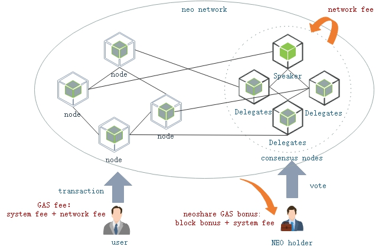

<h2>收费模型</h2>

网络手续费 = inputs 中的 GAS - outputs 中的 GAS - 系统手续费

### **系统费SystemFee**

### **网络交易费NetworkFee**
交易是可以收费的。在后面的交易类型中，可以看到进行一些特定的交易需要付很高的系统手续费。而默认情况下，交易手续费为0。用户可以自愿给一些交易费。在Neo GUI中可以设置。如下图。交易的输入=交易的输出+网络交易费。增发情况下，不一样。具体之后再看。

### **系统调用费**
虚拟机收费

