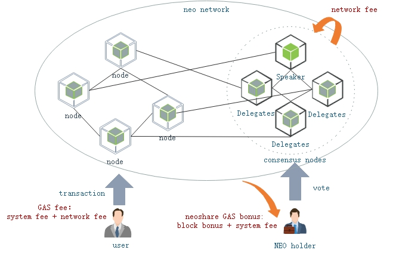

<h2>经济模型</h2>

&emsp;&emsp;NEO中原生定义了两种代币，NEO（缩写符号NEO）和NeoGas（缩写符号GAS）。

 </p

&emsp;&emsp;NEO 属于管理代币，总量1亿，最小单位为1NEO。在创世块中定义了NEO资产，并存放在备用共识节点地址的三分之二合约签名地址上。NEO属于权益类资产，持有NEO可以参与NEO网络的治理，包括投票选举共识节点，修改网络参数等，另外持有NEO将参与GAS的权益分红，根据持有NEO的数量和币龄，获得相应的GAS收益。

&emsp;&emsp;GAS 属于网络燃料代币，NEO网络上的各种交易操作，和共识节点激励均是GAS支付。GAS的总量也是1亿份，最小单位0.00000001, 但并非在创世块中创建， 而是由每个区块产生可以提取的GAS，再由持有NEO用户，通过`Claim`交易提取到持有NEO的分红GAS到账户上。 在NEO中，每200W个区块为一个GAS奖励调整周期（约一年），通过一个衰减的算法在约 22 年的时间内逐步生成1亿的GAS。

| 周期 |  区块高度范围 |   区块奖励GAS |
|------|-------------|---------------|
|  1   |  0 - (200W -1) |    8 |
|  2   |  200W ~~ (400W -1) |    7 |
|  3   |  400W ~~ (600W -1) |    6 |
|  4   |  600W ~~ (800W -1) |    5 |
|  5   |  800W ~~ (1000W -1) |    4 |
|  6   |  1000W ~~ (1200W -1) |    3 |
|  7   |  1200W ~~ (1400W -1) |    2 |
|  8   |  1400W ~~ (1600W -1) |    1 |
|  9   |  1600W ~~ (1800W -1) |    1 |
|  10   |  1800W ~~ (2000W -1) |    1 |
|  11   |  2000W ~~ (2200W -1) |    1 |
|  12   |  2200W ~~ (2400W -1) |    1 |
|  13   |  2400W ~~ (2600W -1) |    1 |
|  14   |  2600W ~~ (2800W -1) |    1 |
|  15   |  2800W ~~ (3000W -1) |    1 |
|  16   |  3000W ~~ (3200W -1) |    1 |
|  17   |  3200W ~~ (3400W -1) |    1 |
|  18   |  3400W ~~ (3600W -1) |    1 |
|  19   |  3600W ~~ (3800W -1) |    1 |
|  19   |  3800W ~~ (4000W -1) |    1 |
|  20   |  4000W ~~ (4200W -1) |    1 |
|  21   |  4200W ~~ (4400W -1) |    1 |
|  22   |  4400W ~~ (4600W -1) |    1 |
|  ~    |  4600W ~ |    0 |

