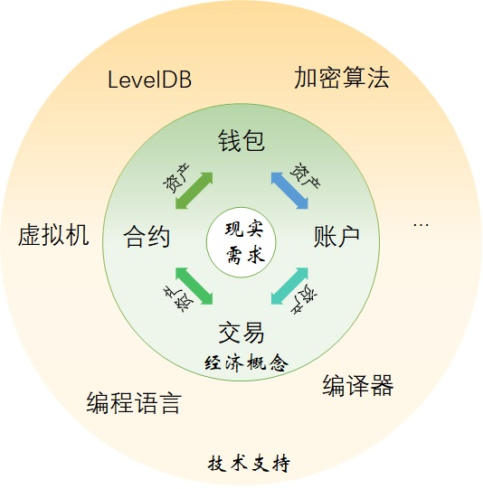
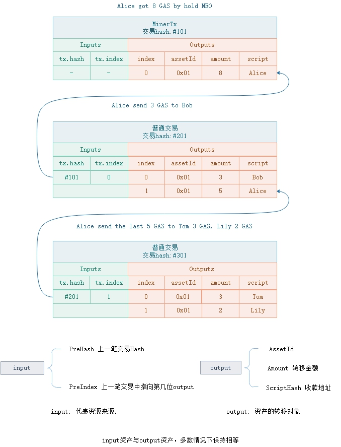
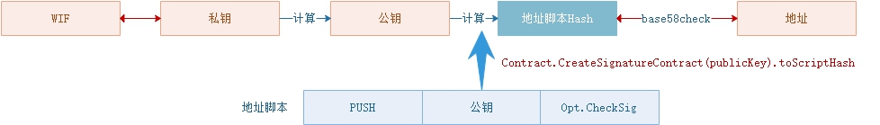

<h2>Neo区块链系统</h2>

　资产是 Neo 系统中的核心。交易、合约、账户和钱包这些的存在都是为了服务于资产的生成、流动和管理。我们把这种关系用下面这张图来描述了一下。

　区块链网络中，一切的事物操作都是通过交易完成的，包括转账、调用合约和提取分红的GAS等。而合约又承担了交易中签名验证的任务。合约可以简单理解成比特币的 Script 脚本的升级。比特币的 Script 脚本因为不是图灵完备的，虽然能够完成交易的签名验证，但是能做到的功能有限。因此比特币只有UTXO模型，关注的就是交易本身。

　编写 Neo 智能合约的语言，比如 C# 和 Python 等，都是图灵完备的，可以满足现实世界中的丰富多彩的需要。而现实世界广泛采用的是账户余额模型(account)。比特币采用 UTXO 模型，以太坊采用账户余额模型。在 Neo 中，UTXO 模型和账户余额模型同时存在。UTXO 模型主要用于全局资产，账户余额模型主要用于智能合约支持的 NEP-5 资产。

　Neo中的账户实际就是地址。这个地址可以是一个私钥对应的地址，用于 UTXO，也可以是智能合约的地址，用于调用执行智能合约。私钥对应的地址实际就是私钥通过一系列加密算法运算最后求得的一个 hash 值，过程见下图。智能合约的地址是如果算得得呢？也请见下图。

　在Neo钱包中存放了各种资产，包括 NEO、GAS和各种 NEP-5 资产。存放的形式其实就是 hash 地址。比如下图： 

### **UTXO模型**

　与账户余额模型不同的是，UTXO（Unspent Transaction Output）模型并不直接记录账户资产，而是通过未花费的`output`计算用户资产。每一笔 UTXO 类型的资产（如全局资产)，都是`input-output`关联模型，`input`指明了资金来源，`output`指明了所有资产的去向。如下图中，Alice 持有 NEO 分红得到 8 个 GAS，记录在交易 #101 的第一位output上。当 Alice 转账给 Bob 时，新交易的`input`指向资金来源是交易 #101 的 0 号位置上的 output 所代表的资产—— 8 个 GAS，并在交易 #201 中一笔 output 指向给 Bob 的3个GAS，另外一笔 output 指向 Alice 的5个GAS(找零)。

> [!IMPORTANT]
> 1. 当交易有手续费时，input.GAS > output.GAS
> 2. 当持有NEO提取GAS分红时 input.GAS < output.GAS
> 3. 当发行资产时，input.Asset < output. Asset

UTXO进行转账时，实际上是对能解锁`Output.scriptHash`的output进行消费，并在新交易的见证人上填充其签名参数。账户地址，实际上就是脚本hash的base58check处理，代表的是一段签名认证脚本，如下图。 [`Op.CheckSig`](../neo_vm.md#checksig) 执行需要公钥和签名两个参数，在地址脚本中，已经包含了公钥参数，故在交易中只需要补充签名参数。

 </p

### **账户模型**

在智能合约部分详述。这里需要讨论一下与以太坊的区别。

### **合约Contract**

这里介绍的是具体概念。设计的细节请见smart contract部分。

### **资产Asset**

这里仅描述资产。具体数据结构请见asset部分。

### **NEP5资产**

这里介绍NEP5资产。与智能合约的关系。NEP5资产的具体设计请见nep5asset部分，而如何生成一个NEP5资产见transaction部分举例(例2)。

