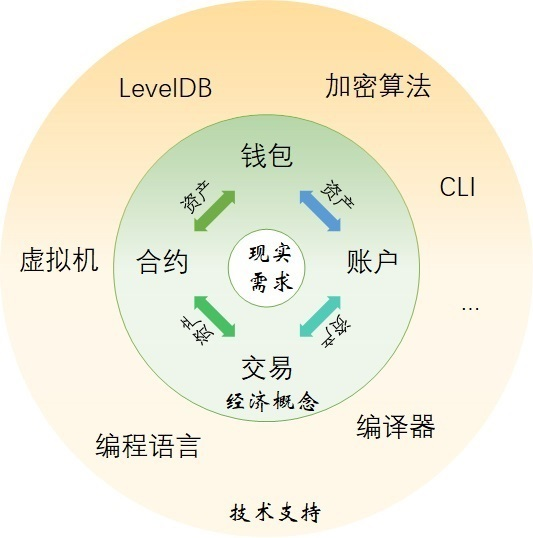

<h2>Neo区块链系统</h2>

　资产是 Neo 系统中的核心，为了实现现实世界中的各种需求。交易、合约、账户和钱包的存在都是为了服务于资产的生成、流动和管理。而各种技术，包括之前单独介绍过的Neo CLI、编译器、虚拟机等等，都是实现这些存在的手段。我们把这种关系用下图来描述：

　Neo区块链网络中，一切的事物操作都是通过交易完成的。资产可以在不同账户之间通过交易(`ContractTransaction`)进行转账。用户也可以通过交易（`ClaimTransaction`）来提取应得的分红GAS。合约最终也是完成特定交易（`InvocationTransaction`）才实现其调用。

　在比特币中，Script脚本承担了交易中签名验证的任务。在Neo系统中，由合约承担了此项任务。合约可以简单理解成比特币的 Script 脚本的升级。比特币的 Script 脚本因为不是图灵完备的，虽然能够完成交易的签名验证，但是能做到的功能有限。因此比特币只有UTXO模型，关注的就是交易本身。编写 Neo 智能合约的语言，比如 C# 和 Python 等，都是图灵完备的，可以满足现实世界中的丰富多彩的需要。而现实世界广泛采用的是账户余额模型(account)。以太坊就采用了账户余额模型。在 Neo系统中，UTXO 模型和账户余额模型同时存在：UTXO 模型主要用于全局资产，账户余额模型主要用于智能合约支持的 NEP-5 资产。

　在Neo钱包中以地址的形式存放了各种资产，包括 NEO、GAS和各种 NEP-5 资产。如下图： 

　上图中的地址也被称为“账户”。一个地址可以由一个私钥通过一系列加密算法和代码转换算得，用于 UTXO；也可以是智能合约的地址，用于调用执行智能合约。计算地址的方法请见`钱包`中的`地址`部分。

