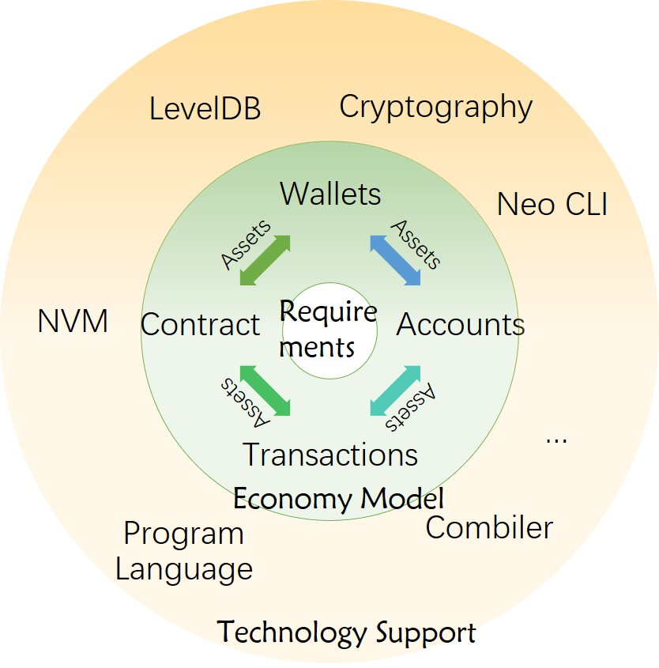


<h2>Neo Blockchain Model</h2>

&emsp;&emsp;Asset is the core of Neo system. Transaction, contract, account and walet serves asset registration, flowing & administration. Neo CLI, compiler & virtual machine, etc, are technical means for function realization. Their function is as follows:

&emsp;&emsp;All operations are accomplished by transaction in Neo blockchain network. Assets can be transferred between different accounts through `ContractTransaction`. Users can also extract deserved GAS through `ClaimTransaction`. Contracts are also invoked by `InvocationTransaction`.

&emsp;&emsp;In Bitcoin, Script is responsible for transaction signature verification. Contracts take corresponding responsibility in NEO. Contract can be simply regarded as an upgrade of Bitcoin Script. Bitcoin Script is not Turing complete: its functionality is limited even though able to complete transaction signature verification. Bitcoin has only UTXO model and concerns only transaction itself. Writing language for Neo smart contract like C# and Python, are all Turing-complete, and can satify varies needs in real world. In case of accounting method, Bitcoin uses UTXO model; Ethereum uses a widely-used model, account balance, or balance model. In Neo system, UTXO model and account balance model both exist. UTXO model is mainly used for global assets, while account balance model is mainly used for user-published NEP-5 assets like stock, token, etc.

&emsp;&emsp;In Neo system, assets exist in the token's form. There are many kinds of assets like NEO, GAS and NEP-5. There are also equity assets like stock. All assets, including NEP-5 assets, and corresponding transaction information of a specifed address can be shown in the following steps: open a wallet in Neo Tracker (https://neotracker.io/), and choose one `address`. Address is also called "account". An address can be computed from specified private key with encryption algotithm and code switching, and used directly in transaction settlement. It can also be smart contract address used during smart contract execution. Method computing address please refer to `Address` section in `Wallet` chapter.
<!--
Please translate the Chinese version below and compare it with the paragraph above
&emsp;&emsp;在比特币中，Script脚本承担了交易中签名验证的任务。在Neo系统中，由合约承担了此项任务。合约可以简单理解成比特币的 Script 脚本的升级。比特币的 Script 脚本不是图灵完备的，虽然能够完成交易的签名验证，但是能做到的功能有限。因此比特币只有UTXO模型，关注的就是交易本身。编写 Neo 智能合约的语言，比如 C# 和 Python 等，都是图灵完备的，可以满足现实世界中的丰富多彩的需要。而现实世界广泛采用的是账户余额(account balance)模型。以太坊就采用了账户余额模型。在 Neo系统中，UTXO 模型和账户余额模型同时存在：UTXO 模型主要用于NEO和GAS等原生代币，账户余额模型主要用于用户发行的NEP-5资产（如股权、代币等）。

&emsp;&emsp;在Neo系统中，资产都是以代币的形式存在。资产有很多种，可以是NEO、GAS和NEP-5等全局资产，也可以是股权等权益类资产。而存在钱包中的是并不是这些资产，而是存放这些资产的地址的私钥。在Neo Tracker（https://neotracker.io/）中打开一个钱包再选择其中的一个`地址`，就会列出这个地址上的包括NEP-5资产在内的所有资产和相关交易信息。地址也被称为“账户”。一个地址可以是由一个私钥通过一系列加密算法和代码转换算得，直接在交易结账中使用。也可以是智能合约的地址，在调用智能合约时使用。计算地址的方法请见`钱包`中的`地址`部分。
-->

> [!NOTE]
> In case of dead link, please contact <feedback@neo.org>

