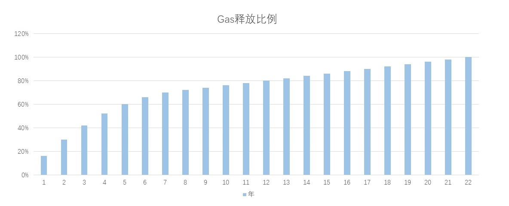

<h2>代币模型</h2>

### **原生代币**

&emsp;&emsp;Neo系统中原生定义了两种代币，NEO 和 NeoGas（缩写符号GAS）。NEO 是管理代币，总量1亿，最小单位为1NEO, 不可分割。在创世块中注册了NEO资产，并存放在备用共识节点（StandbyValidators）的多方签名合约地址上。持有NEO可以参与NEO网络的治理，包括投票选举共识节点和修改网络参数等。GAS是功能代币，也叫网络燃料代币。NEO网络上的各种交易操作和共识节点激励均是以GAS来支付。GAS的总量也是1亿，可分割。最小单位0.00000001。Gas在创始块中注册，但未分发，而是通过每个区块能提取的奖励分发。 经济模型如下图所示。

&emsp;&emsp;持有NEO的用户，具有投票和选举，参与NEO网络的治理。而NEO生态上的各参与方，在使用NEO网络时，需要支付网络费和手续费，网络费将作为选举的共识节点出块奖励， 手续费和GAS的区块奖励，将作为持有NEO的用户权益分红，可通过`ClaimTransaction`交易提取GAS到账户上。

&emsp;&emsp;在NEO中，每200万个区块作为一个GAS奖励调整周期（200万个区块*15秒/一个区块=1年），通过一个衰减的算法在约 22 年的时间内逐步生成1亿的GAS。

| 周期 |  区块高度范围 |   区块奖励GAS |
|------|-------------|---------------|
|  1   |  0 - (200W -1) |    8 |
|  2   |  200W ~ (400W -1) |    7 |
|  3   |  400W ~ (600W -1) |    6 |
|  4   |  600W ~ (800W -1) |    5 |
|  5   |  800W ~ (1000W -1) |    4 |
|  6   |  1000W ~ (1200W -1) |    3 |
|  7   |  1200W ~ (1400W -1) |    2 |
|  8~22   |  1400W ~ (4600W -1) |    1 |
|  23~    |  4600W ~ |    0 |

### **NEP5资产（代币）**

&emsp;&emsp;NEP5代币需要通过智能合约生成和管理，使用智能合约的存储区来存储信息，使用了账户模型。具体信息请见`智能合约`的`NEP5`部分。