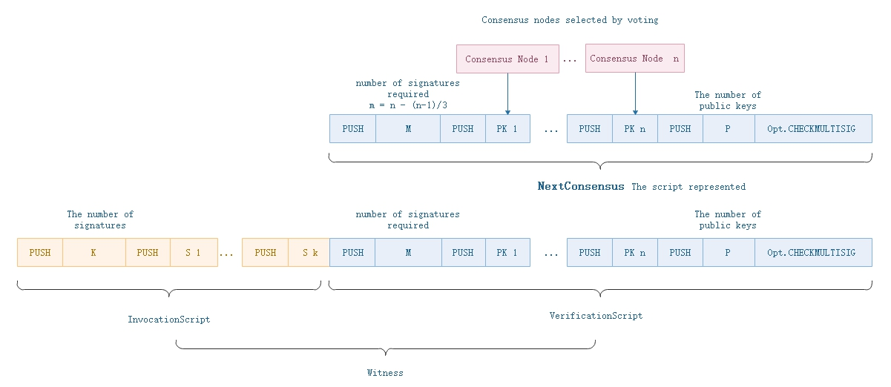

<h2>Transaction</h2>

&emsp;&emsp;Transaction is the basic operation model of the whole NEO network. Wallets, smart contracts and accounts interact with NEO network through transactions. The most basic function of transaction is transfer. Through different transaction types and transaction attributes, expands the application scenarios of transactions, such as deploying smart contracts, issuing assets, voting and so on.

## **Structure**

&emsp;&emsp;Neo区块去掉区块头部分就是一串交易构成的区块主体，因而交易是整个NEO系统的基础部件。钱包、智能合约、账户和交易相互作用但最终都转化成交易被记入区块链中。在Neo的P2P网络传输中，信息被打包成InvPayload信息包来传送（Inv即Inventory）。不同信息包有自己需要的特定数据，因此衍生出三种类型的数据包。`InventoryType = 0x01`来标定网络中的InvPayload信息包内装的是交易数据。除交易数据包之外，还有块数据包(`InventoryType = 0x02`)和共识数据包(`InventoryType = 0xe0`)。

&emsp;&emsp; The basic data structure of transaction as following:

| Size | Field | Type | Description |
|-----|-----|------|-------|
| 1   | Type    | byte | Type of transaction |
| 1 | Version | byte | Trading version, currently 0 |
| ? | - | - | Data specific to transaction types |
| ?*? | Attributes | tx_attr[] | Additional features that the transaction has |
| 34*? | Inputs | tx_in[] | Input |
| 60 * ? | Outputs | tx_out[] | Output |
| ?*? | Scripts | Witness[] | List of scripts used to validate the transaction |

### Input

&emsp;&emsp;Input specifies the source of assets. there may be serveral Inputs in each transaction, the Inputs of `MinerTransaction` is empty. The data structure of Input as follows: 

| Size | Field | Type | Description |
|---|-------|------|------|
| 32 | PrevHash | UInt256 | Previous transaction's hash |
| 2 | PrevIndex | ushort | Previous transaction's indexPrevious transaction's index | 

`PreHash` and `PreIndex` describle the previous transaction's output. Using the input-output model form the basis of UTXO. For more details, read "UTXO" section.

### Output

&emsp;&emsp;Each transaction can have outputs up to 65536, and the output representing the transfer of assets. The data structure of output as follows:

| Size | Field | Type | Description |
|---|-------|------|------|
| 32 | AssetId | UIntBase | 	Asset id |
| ?  | Value | BigDecimal | Value | 
| 20 | ScriptHash | UInt160 |	Address of remittee |

### Attribute

| Size | Field | Type | Description |
|---|-------|------|------|
| 1 | Usage | byte | Usage |
| 0|1 | length | uint8 | 	Length of data(Specific circumstances will be omitted) |
| ? | Data | byte[length] | External dataExternal data | 

&emsp;&emsp;TransactionAttributeUsage, each transaction attribute has different usages:

TransactionAttributeUsage，交易属性使用表数据结构如下：

| Field | Value | Description |
|-------|-----|----|
| ContractHash | 0x00 | Hash value of contract |
| ECDH02 | 0x02 | 	Public key for ECDH key exchange |
| ECDH03 | 0x03 | 	Public key for ECDH key exchange |
| Script | 0x20 |Additional validation of transactions |
| Vote | 0x30 | For voting  |
| DescriptionUrl | 0x81 | Url address of description |
| Description | 0x90 | Brief description |
| Hash1 - Hash15 | 0xa1-0xaf | 	Used to store custom hash values |
| Remark-Remark15 | 0xf0-0xff | Remarks |

&emsp;&emsp;For ContractHash, ECDH series, Hash series, data length is fixed to 32 bytes and length field is omitted;  
&emsp;&emsp; For DescriptionUrl, Description, Remark series, the data length must be clearly defined, and the length should not exceed 255;

### Witness

&emsp;&emsp;Before each transaction add in block, it needs to be digitally signed to ensure that it can be verified. NEO uses ECDSA digital signature method. The scriptHash of the transaction output is a public key used for ECDSA signature. NEO dose not use SegWit in Bitcoin. Each transaction contains its own `Script.Witness`, while the `Script.Witness` is a contract.

&emsp;&emsp; Witness is a executable verification script. The `InvocationScript` provides the parameters for the `VerificationScript` to execute.  Verification succeeds only when the script execution returns true.

| Size | Field | Type | Description |
|--|-------|------|------|
| ?  | InvocationScript | byte[] |Invocation script |
| ?  | VerificationScript | byte[] | Verificatoin script  | 

&emsp;&emsp; Invocation script performs stack operation instructions, provides parameters for verification script (eg, signaures). The script interpreter executes the invocation script code first, and then the verification script code.

&emsp;&emsp;`Block.NextConsensus` representing the script hash of multi-party signature contract ([`Opt.CHECKMULTISIG`](../neo_vm.md#checkmultisig)), which needs the signatures of the consensus nodes, shown in the following figure.  When executed in NVM internally, it completes the verification of signatures and public keys.

## **Transaction Type**

&emsp;&emsp; In NEO, there are 9 types of transaction, includes MinerTransaction, RegisterTransaction,IssueTransaction and ContractTransaction and so on.

| Index | Type | Value  | Fee | Usage |  Description  |
|------|--------|-----|----------|-------|----------|
|  1  | MinerTransaction | 0x00 | 0 | Assign byte fees |
|  2  | RegisterTransaction | 0x40 | 10000/0 | Assets register | Abort |
|  3  | IssueTransaction | 0x01 | 500/0 | Inssuance of asset |
|  4  | ClaimTransaction | 0x02 | 0 | Assign GAS | |
|  5  | StateTransaction | 0x90 | *  | Apply or vote validators | 
|  6  | EnrollmentTransaction | 0x20 | 1000 | Enrollment for validator | Abort |
|  7  | ContractTransaction | 0x80 | 0 | Contract transaction | The most commonly used transaction |
|  8  | PublishTransaction | 0xd0 | 500*n |(Not usable) Special Transactions for Smart Contracts | Abort |
|  9  | InvocationTransaction | 0xd1 | 0 | Special transactions for calling Smart Contracts |  | 

The details of transaction processing, please read "Transaction Execution" section.

## **How to use transaction**

<!-- 第二个例子是生成NEP5资产，展示了系统调用和合约的方式生成新资产。 -->

&emsp;&emsp;The following example of Genesis Block generation shows the usage of transaction.

### Eg-1. Create Genesis Block

&emsp;&emsp; Genesis Block is the first block in the blockchain by default in hard code, and the block index is 0. NEO and GAS assets are registered in Genesis Block, and NEO asset are distributed. Note that only NEO and GAS used `RegisterTransaction`, and the other global UTXO assets and NEP5 tokens are generated through `InvocationTransaction`.

The block heade of Genesis block as follows:

| Size | Field  | Type | Value  |
|----|-----|-------|------|
|  4  | Version  | uint | Version is `0` |
| 32   | PrevHash | UInt256 |  `0x0000000000000000000000000000000000000000000000000000000000000000` |
|  32  | MerkleRoot | uint256 |`0x803ff4abe3ea6533bcc0be574efa02f83ae8fdc651c879056b0d9be336c01bf4`  |
| 4  | Timestamp  | uint | `1531667301` |
| 4   | Index  | uint | `0` |
|  8  | ConsensusData  | ulong | `2083236893`, the nonce value of the Bitcoin Genesis Block, as a respect to Bitcoin  |
| 20  | NextConsensus  | UInt160 | The script hash of consensus nodes' multi-party signature contract in the next round.   |
| 1  | -- | uint8 | 	 It's fiex 1  |
|  ?   | Witness  |  Witness |  `0x51`, respresenting `OptCode.PUSHT`, always return TRUE. |
|  ?*? | **Transactions**  |  Transaction[] | It stored four txs as following. |

The first transaction of each block must be `MinerTransaction`, which is used for distribution of transaction's network fees in the block.

| Size | Field  | Type | Value  |
|----|-----|-------|------|------|
| 1   | Type    | uint8 | `0x00` |
| 1 | Version | uint8  | `0` |
| 8 | Nonce | ulong  | `2083236893` |
| ?*? | Attributes | tx_attr[] |    Empty |
| 34*? | Inputs | tx_in[]  | Empty |
| 60 * ? | Outputs | tx_out[]  | Empty |
| ?*? | Scripts | Witness[]  | Empty |

The second transaction is `RegisterTransaction`, registers NEO asset.

| Size | Field | Type | Value  |
|----|-----|-------|------|------|
| 1   | Type    | byte  | `0x40` |
| 1 | Version | byte  | `0` |
| 1 | AssetType | byte   | `0x00` |
| ? | Name | string   | The name of `NEO` |
| 8 | Amount | Fix8   | `100000000` |
| 1 | Precision | byte   | `0` |
| ? | Owner | ECPoint  |  |
| 32 | Admin | UInt160   | `0x51`.toScriptHash |
| ?*? | Attributes | tx_attr[]  |    Empty |
| 34*? | Inputs | tx_in[]  | Empty |
| 60 * ? | Outputs | tx_out[]  | Empty |
| ?*? | Scripts | Witness[]  | Empty |

The name of `NEO`  = `[{"lang":"zh-CN","name":"小蚁股"},{"lang":"en","name":"AntShare"}]`

The third transaction is `RegisterTransaction`, registers GAS asset.

| Size | Field  | Type | Value  |
|----|-----|-----|------|
| 1   | Type    | byte  | `0x40` |
| 1 | Version | byte | `0` |
| 1 | AssetType | byte  | `0x01` |
| ? | Name | string   | The name of`GAS` |
| 8 | Amount | Fix8   | `100000000` |
| 1 | Precision | byte   | `8` |
| ? | Owner | ECPoint   | |
| 32 | Admin | UInt160   | `0x00`.toScriptHash, representing `OpCode.PUSHF` script |
| ?*? | Attributes | tx_attr[]  |    Empty |
| 34*? | Inputs | tx_in[]  | Empty |
| 60 * ? | Outputs | tx_out[]  | Empty |
| ?*? | Scripts | Witness[]  | Empty |

The name of `GAS` =  `[{"lang":"zh-CN","name":"小蚁币"},{"lang":"en","name":"AntCoin"}]`

The fourth transaction is `IssueTransaction`, issues NEO to contract address.

| Size | Field  | Type | Value  |
|----|-----|-------|------|------|
| 1   | Type    | byte  | `0x01` |
| 1 | Version | byte  | `0` |
| ?*? | Attributes | tx_attr[] |    Empty |
| 34*? | Inputs | tx_in[]  | Empty |
| 60 * ? | Outputs | tx_out[] | has one output, see the below table |
| ?*? | Scripts | Witness[]  | `0x51`, representing `OpCode.PUSHT` |

TThe output defines the transfer of all NEO tokens to the multi-parity signature contract address of the standby consensus nodes. The scripts are empty, meaning that the transactions dose not need to be validated because it is a Genesis block transaction.

| Size | Field  | Type | Value  |
|----|-----|-------|------|
| 1   | AssetId    | byte  | `0x00`, representing `NEO` token. |
| 8 | Value | Fix8  | `100000000` |
| 20 | ScriptHash | UInt160 |   The script hash of standby consensus nodes' multi-party signature contract. |

<!-- ### 例2：生成NEP-5资产

&emsp;&emsp;ICO_template

&emsp;&emsp;应用合约触发器Application Trigger，就是通过
 -->
