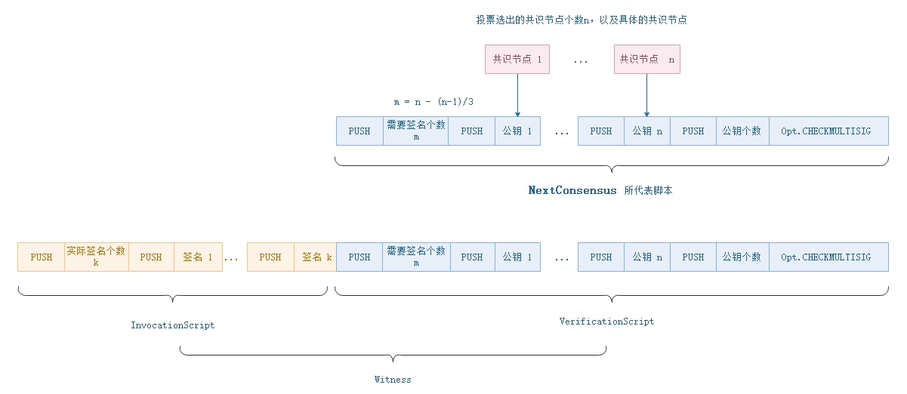
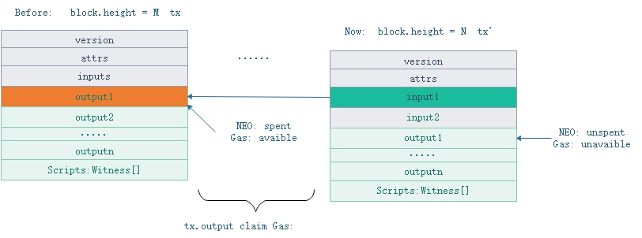

<h2>交易</h2>

我们已经知道Neo区块去掉区块头部分就是一串交易构成的区块主体。所以交易实际又是整个系统的基础。钱包、智能合约和账户和交易交互作用但最终都转化成了交易的形式才进入了区块链。在Neo系统中，信息被打包成InvPayload信息包来传送。Inv即Inventory。不同信息包有自己需要的特定数据，因此衍生出三种数据包。我们用`InventoryType = 0x01`来标定网络中的InvPayload信息包内装的是交易数据。除交易数据包之外，还有块数据包(`InventoryType = 0x02`)和共识数据包(`InventoryType = 0xe0`)。

### **交易的数据结构**

一个普通交易的数据结构如下：

| 尺寸 | 字段 | 类型 | 描述 |
|-----|-----|------|-------|
| 1   | Type    | byte | 交易类型 |
| 1 | Version | byte | 交易版本号，目前为0 |
| ? | - | - | 特定交易的数据 |
| ?*? | Attributes | tx_attr[] | 该交易所具备的额外特性 |
| 34*? | Inputs | tx_in[] | 输入 |
| 60 * ? | Outputs | tx_out[] | 输出 |
| ?*? | Scripts | Witness[] | 用于验证该交易的脚本列表 |

### 1. 交易的输入

Input数组中存放了每一个输入的信息。每个交易中可以有多个Input，也可能没有Input。在下面提到的MinerTransaction中Input就为空。Input的数据结构如下： 

| 尺寸 | 字段 | 类型 | 描述 |
|---|-------|------|------|
| 32 | PrevHash | UInt256 | 被引用交易的散列值 |
| 2 | PrevIndex | ushort | 被引用交易输出的索引 | 

PrevHash

### 2. 交易的输出

每个交易中最多只能包含 65536 个输出。Output的数据结构如下：

| 尺寸 | 字段 | 类型 | 描述 |
|---|-------|------|------|
| 32 | AssetId | UIntBase | 资产Id |
| ?  | Value | BigDecimal | 转账金额 | 
| 20 | ScriptHash | UInt160 | 地址，即账户地址或合约地址 |

### 3. Attribute交易的属性

| 尺寸 | 字段 | 类型 | 描述 |
|---|-------|------|------|
| 1 | Usage | byte | 属性类型 |
| 0|1 | length | uint8 | 	数据长度（特定情况下会省略） |
| ? | Data | byte[length] | 特定于用途的外部数据 | 

TransactionAttributeUsage，交易属性使用表数据结构如下：

| 字段 | 值 | 描述 |
|-------|-----|----|
| ContractHash | 0x00 | 外部合同的散列值 |
| ECDH02 | 0x02 | 用于ECDH密钥交换的公钥，该公钥的第一个字节为0x02 |
| ECDH03 | 0x03 | 用于ECDH密钥交换的公钥，该公钥的第一个字节为0x03 |
| Script | 0x20 | 用于对交易进行额外的验证, 如股权类转账，存放收款人的脚本hash |
| Vote | 0x30 |  |
| DescriptionUrl | 0x81 | 外部介绍信息地址 |
| Description | 0x90 | 简短的介绍信息 |
| Hash1 - Hash15 | 0xa1-0xaf | 用于存放自定义的散列值 |
| Remark-Remark15 | 0xf0-0xff | 备注 |

ContractHash、ECDH02-03、Vote和Hash1-15的数据长度固定为 32 字节，所以省略length字段。Script必须明确给出数据长度，且长度不能超过 65535。而DescriptionUrl、Description和Remark1-15必须明确给出数据长度，且长度不能超过 255。

### 4. Witness

每个交易(transaction，tx)对象在被放进block时，都是经过数字签名的，这样可以在后续传输和处理中随时验证tx是否经过篡改。Neo采用的数字签名是ECDSA。交易的转帐转出方地址，就是对该交易对象作ECDSA签名计算时所用的公钥publicKey。Neo系统没有使用比特币中的SegWit。每条交易都包含自己的Script.witness。而Script.witness使用的是智能合约。

见证人，实际上是可执行的验证脚本。`InvocationScript` 脚本传递了`VerificationScript`脚本需要的补充参数。只有当脚本执行返回真时，验证成功。

| 尺寸 | 字段 | 类型 | 描述 |
|--|-------|------|------|
| ?  | InvocationScript | byte[] |调用脚本，补全脚本参数 |
| ?  | VerificationScript | byte[] | 验证脚本  | 

调用脚本进行压栈操作相关的指令，用于向验证脚本传递参数（如签名等）。脚本解释器会先执行栈脚本代码，然后执行验证脚本代码。

`Block.NextConsensus`所代表的多方签名脚本，填充签名参数后的可执行脚本，如下图所示，[`Opt.CHECKMULTISIG`](../neo_vm.md#checkmultisig) 在NVM内部执行时，完成对签名以及公钥之间的多方签名校验。

### **交易类型**

Neo中一共定义了9种不同的交易，包括MinerTransaction、RegisterTransaction、IssueTransaction和ContractTransaction等。这9种交易的具体功能请见下图。 

| 编号 | 类型名 | 值  | 系统费用 |用途 |  解释  |
|------|--------|-----|----------|-------|----------|
|  1  | MinerTransaction | 0x00 | 0 | 创建“矿工”交易 | 块的第一条交易，用于分配字节费的交易 |
|  2  | RegisterTransaction | 0x40 | 10000/0 | 注册资产，仅用于NEO和GAS | 已弃用 |
|  3  | IssueTransaction | 0x01 | 500/0 | 分发资产 |
|  4  | ClaimTransaction | 0x02 | 0 | 提取GAS | 每个区块的奖励分发 |
|  5  | StateTransaction | 0x90 | *  | 验证人选举统计选票时使用 | 
|  6  | EnrollmentTransaction | 0x20 | 1000 | 报名成为验证人 | 已弃用 |
|  7  | ContractTransaction | 0x80 | 0 | 转账时用 | 最常用的交易类型 |
|  8  | PublishTransaction | 0xd0 | 500*n |应用合约发布交易 | 已弃用 |
|  9  | InvocationTransaction | 0xd1 | 0 | 合约调用交易 | 用来调用合约，部署合约后或生成新资产之后会使用 | 

### 1. MinerTransaction

| 尺寸 | 字段 | 名称  | 类型 | 描述 |
|----|-----|-------|------|------|
|  -  | - | - | -  | 	交易的公共字段  |
| 4 | Nonce | 交易nonce | uint | 创世区块的Nonce的值与比特币的创世区块相同，为2083236893，其他情况下为随机数值。 |
|  -  | - | - | -  | 	交易的公共字段  |

分配字节费的特殊交易, 非用户创建类型的交易。系统在创世块创建了第一个MinerTransaction，此后在创建新块的时候，由议长创建相应的MinerTransaction，将所有交易的网络费作为出块奖励。

**交易创建**

1. 共识阶段时，议长将内存池交易，进行第三方插件过滤和排序

2. 计算待打包交易的总网络费，作为 MinerTransaction 的output金额

3. 装填 MinerTransaction 的output的收款地址为当前议长地址，其他字段：inputs, attrs, witnesses 均设置为空。注意，MinerTransaction属于资产发行操作，input 与 output之间金额不一致。

4. 将上面交易打包到共识提案的block中，并进行广播。

后续处理流程，与一般流程一致。

### 2. RegisterTransaction (已弃用)

| 尺寸 | 字段 | 名称  | 类型 | 描述 |
|----|-----|-------|------|------|
|  -  | - | - | -  | 	交易的公共字段  |
| 1 | AssetType | 资产类型 | byte |  |
| ? | Name | 资产名字 | string |  |
| 8 | Amount | 资产总量 | Fixed8 |  |
| 1 | Precision | 精度 | byte |  |
| ? | Owner | 所有者公钥 | ECPoint |  |
| 20 | Admin | 管理员地址脚本hash | UInt160 |  |
|  -  | - | - | -  | 	交易的公共字段  |

 
资产登记交易。系统在创世区块调用RegisterTransaction发行了两种资产：NEO Coin（旧称小蚁股，AntShare，简称NEO）和NEO Gas（旧称小蚁币，AntCoin，简称GAS）。注意，用户在GUI创建资产种类时，实际调用的是InvocationTransaction。

Amount 为发行总量，共有2种模式：

   1. **限量模式**：当Amount为正数时，表示当前资产的最大总量为Amount，且不可修改（股权在未来可能会支持扩股或增发，会考虑需要公司签名或一定比例的股东签名认可）。

   2. **不限量模式**：当Amount等于-1时，表示当前资产可以由创建者无限量发行。这种模式的自由度最大，但是公信力最低，不建议使用。

处理流程与一般流程一致

### 3. IssueTransaction

分发资产的特殊交易。完成资产注册后，可在资产创设所设定的总量上限范围内，发行人分发该资产。分发后的资产可以用于转账和交易。分发资产需要消耗一定数量的 GAS 作为附加服务费，目前为1 GAS。

> [!NOTE]
> 1. 当版本大于等于1时，手续费为0。
> 2. 当输出列表中的资产种类为NEO或GAS时，手续费为0；否则手续费为500GAS。

**交易验证**

1. **合法性验证**
 
   1. 先进行一般交易的合法性验证

   2. 计算资产输入，输出差值变化情况

   3. 若资产变化增多情况等于0，则校验失败

   4. 若发行的资产不存在，则校验失败

   5. 若该交易的发行量加上内存池该资产的其他发行量，超过了发行总量，则校验失败

2. **脚本验证**

    1. 在进行一般交易的脚本验证时，会包含发行人的脚本验证

其他处理流程，与一般流程一致。

### 4. ClaimTransaction

| 尺寸 | 字段 | 名称  | 类型 | 描述 |
|----|-----|-------|------|------|
|  -  | - | - | -  | 	交易的公共字段  |
| 34*? | Claims | Claim已花费的交易 | CoinReference[] | 用于分配的 NEO |
|  -  | - | - | -  | 	交易的公共字段  |

 GAS是由持有NEO用户进行Claim操作，进行系统增发Gas（并非每出一个块就立马奖励Gas到账户上）。用户能够Claim到的Gas是与NEO资产的起始高度，截止高度，紧密相关。GAS总量上限是1亿，当区块高度到达 4600W后，每个区块不再有奖励。

每一个笔NEO 的交易都有两种状态：unspent 和 spent。每一个未提取的 GAS 也有两种状态，available 和 unavailable。一个 NEO 的生命周期以转入地址起始，转出地址截止，转入时状态变为 unspent，转出时状态变为 spent。当 NEO 处于 unspent 状态时，所产生的 Gas 为 unavailable 状态，即不可提取。当 NEO 处于 spent 状态时，期间所产生的 GAS 变为 available，用户可以提取。用户可通过转账的方式，将unspent的NEO变成spent状态的NEO，再进行Claim 提取GAS。

用户进行Claim时，实际上是找到已花费尚未Claim的NEO交易（系统维护了一份spentcoins集合——已花费尚未claim的交易），对其进行计算可以增发的Gas，并将Gas转账到用户钱包地址。

**交易创建**

1. 从spentcoins（已花费尚未claim的交易）中，选择要进行claim的output，并作为 ClaimTransaction的 claims值。

2. 计算出能提取到的Gas量，并作为 ClaimTransaction的output金额

3. 设置  ClaimTransaction的output收款人为当前账户，并设置 inputs, attrs 为空，构建出完整的交易。

4. 对交易进行签名并P2P广播

其中，**一笔有NEO的tx.output产生的Gas计算**

$$
Gas = \sum_{h=M+1}^{N} (BlockBonus(h) + SystemFee(h)) * \frac{tx.output.NEO}{10^8}
$$

- Gas： 一笔持有NEO的tx.output能提取到的Gas数量
- M: 交易的块高度， 起始高度
- N: 交易被花费的块高度，引用这笔tx.output的交易的所在块高度, 即截止高度
- `BlockBonus(h)`: 高度为h的区块所能得到的Gas奖励, 参考下表。
- `SystemFee(h)`: 高度为h的区块的系统手续费，等于该块下所有交易的系统手续费之和。`amount_sysfee = block.Transactions.Sum(p => p.SystemFee)`
- `tx.output.NEO`: 该交易的NEO数量
- 10^8: NEO的总量一亿

| 周期 |  区块高度范围 |   区块奖励GAS |
|------|-------------|---------------|
|  1   |  0 - (200W -1) |    8 |
|  2   |  200W ~~ (400W -1) |    7 |
|  3   |  400W ~~ (600W -1) |    6 |
|  4   |  600W ~~ (800W -1) |    5 |
|  5   |  800W ~~ (1000W -1) |    4 |
|  6   |  1000W ~~ (1200W -1) |    3 |
|  7   |  1200W ~~ (1400W -1) |    2 |
|  8~22   |  1400W ~~ (4600W -1) |    1 |
|  23~    |  4600W ~ |    0 |

> [!NOTE]
> 一笔交易产生的Gas，等于该交易从未花费到花费的区块高度差内，每个区块的奖励 + 区块系统手续费的之和 乘以该交易NEO的总量占比。

**交易验证**

1. **合法性验证**
   
   1. 先进行一般交易的合法性验证；

   2. 若Claims包含重复交易时，返回false；

   3. 若Claims与内存池交易存在重复时，返回false； 

   4. 若ClaimTransaction的GAS的资产减少或者没有变化时，返回false；

   5. 若根据Claims指向的交易，计算出可以提取的Gas不等于ClaimTransaction GAS的增发量时，返回false；

2. **脚本验证**

    1. 在进行一般交易的脚本验证时，会包含Claims交易的收款人地址脚本

后续处理流程，与一般流程一致。

### 5. EnrollmentTransaction (已弃用)

| 尺寸 | 字段 | 名称  | 类型 | 描述 |
|----|-----|-------|------|------|
|  -  | - | - | -  | 	交易的公共字段  |
| ? | PublicKey | 记账人的公钥 | ECPoint | 用于分配的 NEO |
|  -  | - | - | -  | 	交易的公共字段  |

报名成为验证人的特殊交易，具体操作请参阅[选举与投票](../../articles/consensus/vote_validator.md)。

### 6. StateTransaction

| 尺寸 | 字段 | 名称  | 类型 | 描述 |
|----|-----|-------|------|------|
|  -  | - | - | -  | 	交易的公共字段  |
| ?*? | Descriptors | 投票信息 | StateDescriptor[] |  |
|  -  | - | - | -  | 	交易的公共字段  |

申请验证人或共识节点投票的交易。用户可以在NEO GUI报名成为验证人，成为验证人后就可以根据投票数竞选成为共识节点。报名成为验证人需要花费手续费 1000 GAS。具体操作请参阅[选举与投票](../../articles/consensus/vote_validator.md)。

### 7. ContractTransaction

合约交易，最常用的一种交易，用于转账交易（NEO CLI, API 的send指令，以及GUI的send操作），处理流程与一般流程一致。

### 8. PublishTransaction (已弃用)

| 尺寸 | 字段 | 名称  | 类型 | 描述 |
|----|-----|-------|------|------|
|  -  | - | - | -  | 	交易的公共字段  |
| ? | Script | 合约的脚本 | byte[] |  |
| ? | ParameterList | 参数类型列表 | ContractParameterType |  |
| 1 | ReturnType | 返回类型 | ContractParameterType |  |
| 1 | NeedStorage | 是否需要存储空间 | bool |  |
| ? | Name | 合约名称 | string |  |
| ? | CodeVersion | 合约版本编号 | string |  |
| ? | Author | 合约作者姓名 | string |  |
| ? | Email | 电子邮箱 | string |  |
| ? | Description | 合约描述 | string |  |
|  -  | - | - | -  | 	交易的公共字段  |

智能合约发布的特殊交易，处理流程与一般流程一致。注意, 用户在GUI发布智能合约时，实际调用的是InvocationTransaction。

### 9. InvocationTransaction

| 尺寸 | 字段 | 名称  | 类型 | 描述 |
|----|-----|-------|------|------|
|  -  | - | - | -  | 	交易的公共字段  |
| ? | Script | 合约的脚本 | byte[] |  |
| 8 | Gas | 消耗的Gas | Fixed8 |  |
|  -  | - | - | -  | 	交易的公共字段  |

调用智能合约的特殊交易。用户可以通过NEO API的`invoke/invokefunction/invokescript`指令，或者NEO GUI，根据输入的智能合约信息创建InvocationTransaction对象并调用。注意，用户在GUI创建资产和发布智能合约时，实际调用的是InvocationTransaction。

| InvokeTX用途 | 调用脚本 | Attributes | 包含属性 |
|--------------|------------|--------------|
| 执行智能合约 | 调用合约的脚本  |  空 |   | 
| 发布合约 | Neo.Contract.Create  |   空  |   | 
| 资产注册 | Neo.Asset.Create |  非空 | TransactionAttributeUsage.Script,资产所有者的地址脚本hash，数目 1 |
| GUI 转账 | NEP-5资产时，调用合约transfer方法； 全局资产时，为空  |  非空 | TransactionAttributeUsage.Script，转账账户地址，数目若干   TransactionAttributeUsage.Remark，备注数据，数目 1 |
| CLI 非“sendall”转账 | 同上  |  非空 |  TransactionAttributeUsage.Script, 转账账户地址，数目 若干 |  

**交易创建**

1. 根据用途，构建相应的执行脚本，并赋值给 InvocationTransaction 的Script字段

2. 在本地NVM试运行（测试环境）上面脚本，计算需要消耗的GAS

3. 将 `Math.max(0, GasConsumed - 10).Ceiling()` 赋值给 InvocationTransaction的Gas字段，并作为交易的系统手续费。（注，系统减免了10GAS的消耗, 并取上整数的GAS）

4. 设置交易的其他字段，并进行签名和P2P广播。

**交易验证**

1. **合法性校验**

    1. 若消耗的GAS不能整除10^8, 则返回false（GAS必须是整数单位形式的Fixed8，不能包含有小数的GAS）

    2. 交易的一般性校验

后续处理流程，与一般流程一致。

NEO 智能合约在部署或者执行的时候都要缴纳一定的手续费，分为部署费用和执行费用。部署费用是指开发者将一个智能合约部署到区块链上需要向区块链系统支付一定的费用（目前是 500 Gas）。执行费用是指每执行一条智能合约的指令都会向 NEO 系统支付一定的执行费用。具体收费标准请参阅[智能合约费用](http://docs.neo.org/zh-cn/sc/systemfees.html)。

### **如何使用交易**

以上这9种交易并不能完成所有的功能实现，比如部署合约和生成NEO和GAS以外的NEP5新资产。这两种功能是通过系统调用来完成，但最后还是需要使用InvocationTransaction以交易的形式来将这个事情加入到区块链中。下面给出2个例子。第一个例子是生成创世块，展示了只使用提供的交易类型生成资产；第二个例子是生成NEP5资产，展示了系统调用和合约的方式生成新资产。

### 例1：生成创始块

创世块（GenesisBlock）是默认已经定义在代码中不可修改的区块链的第一个区块，高度为0。在创世块中生成了NEO和GAS资产，并分发了NEO资产。注意，只有NEO和GAS是使用MinerTransaction和RegisterTransaction生成了，其他的NEP5代币都是通过系统调用的方式生成的。

首先创始块的块头信息如下：

| 尺寸 | 字段 | 名称  | 类型 | 值 |
|----|-----|-------|------|------|
|  4  | Version | 区块版本 | uint | `0` |
| 32   | PrevHash | 上一个区块Hash | UInt256 |  `0x0000000000000000000000000000000000000000000000000000000000000000` |
|  32  | MerkleRoot | Merkle树Root | uint256 |`0x803ff4abe3ea6533bcc0be574efa02f83ae8fdc651c879056b0d9be336c01bf4`  |
| 4  | Timestamp |  创世时间 | uint | 创世时间为：`2016-07-15 | 23:08:21` |
| 4   | Index | 创世块高度 | uint | `0` |
|  8  | ConsensusData | Nonce | ulong | `2083236893`, 比特币创世块nonce值，向比特币致敬  |
| 20  | NextConsensus | 下一个共识地址 | UInt160 | 下一个出块的共识节点的三分之二签名脚本hash   |
| 1  | - | - | uint8 | 	固定为 1   |
|  ?   | Witness | 见证人 |  Witness |  `0x51`, 代表`PUSHT`指令，返回永真 |
|  ?*? | **Transactions** | 交易 |  Transaction[] | 目前存了4笔交易， 见后续表 |

第一笔交易是MinerTransaction，即“挖矿”交易。所有的block的第一笔交易，都必须是MinerTransaction。Neo中没有挖矿的概念。这里的MinerTransaction主要是在Outputs中记下所有的费用都归于哪里。

| 尺寸 | 字段 | 名称  | 类型 | 值 |
|----|-----|-------|------|------|
| 1   | Type    | uint8 | 交易类型 | `0x00` |
| 1 | Version | uint8 |  交易版本号 | `0` |
| 8 | Nonce | ulong | nonce  | `2083236893` |
| ?*? | Attributes | tx_attr[] | 该交易所具备的额外特性 |    空 |
| 34*? | Inputs | tx_in[] | 输入 | 空 |
| 60 * ? | Outputs | tx_out[] | 输出 | 空 |
| ?*? | Scripts | Witness[] | 用于验证该交易的脚本列表 | 空 |

第二笔交易是RegisterTransaction，用来注册NEO代币

| 尺寸 | 字段 | 名称  | 类型 | 值 |
|----|-----|-------|------|------|
| 1   | Type    | byte | 交易类型 | `0x00` |
| 1 | Version | byte |  交易版本号 | `0` |
| 1 | AssetType | byte | 资产类型  | `0x00` |
| ? | Name | string | 资产名字  | `NEO` |
| 8 | Amount | Fix8 | 总量  | `100000000` |
| 1 | Precision | byte | 精度  | `0` |
| ? | Owner | ECPoint | 所有者公钥  | todo |
| 32 | Admin | UInt160 | 管理者  | `0x51`.toScriptHash |
| ?*? | Attributes | tx_attr[] | 该交易所具备的额外特性 |    空 |
| 34*? | Inputs | tx_in[] | 输入 | 空 |
| 60 * ? | Outputs | tx_out[] | 输出 | 空 |
| ?*? | Scripts | Witness[] | 用于验证该交易的脚本列表 | 空 |

`NEO`名称定义 = `[{"lang":"zh-CN","name":"小蚁股"},{"lang":"en","name":"AntShare"}]`

第三笔交易也是RegisterTransaction，用来注册GAS代币

| 尺寸 | 字段 | 名称  | 类型 | 值 |
|----|-----|-------|------|------|
| 1   | Type    | byte | 交易类型 | `0x00` |
| 1 | Version | byte |  交易版本号 | `0` |
| 1 | AssetType | byte | 资产类型  | `0x01` |
| ? | Name | string | 资产名字  | `GAS` |
| 8 | Amount | Fix8 | 总量  | `100000000` |
| 1 | Precision | byte | 精度  | `8` |
| ? | Owner | ECPoint | 所有者公钥  | todo |
| 32 | Admin | UInt160 | 管理者  | `0x00`.toScriptHash, 即 `OpCode.PUSHF`指令脚本 |
| ?*? | Attributes | tx_attr[] | 该交易所具备的额外特性 |    空 |
| 34*? | Inputs | tx_in[] | 输入 | 空 |
| 60 * ? | Outputs | tx_out[] | 输出 | 空 |
| ?*? | Scripts | Witness[] | 用于验证该交易的脚本列表 | 空 |

`GAS`名称定义 =  `[{"lang":"zh-CN","name":"小蚁币"},{"lang":"en","name":"AntCoin"}]`

第四笔交易是IssueTransaction，用来把NEO发放到合约地址

| 尺寸 | 字段 | 名称  | 类型 | 值 |
|----|-----|-------|------|------|
| 1   | Type    | byte | 交易类型 | `0x00` |
| 1 | Version | byte |  交易版本号 | `0` |
| ?*? | Attributes | tx_attr[] | 该交易所具备的额外特性 |    空 |
| 34*? | Inputs | tx_in[] | 输入 | 空 |
| 60 * ? | Outputs | tx_out[] | 输出 | 有一笔output，见下表 |
| ?*? | Scripts | Witness[] | 用于验证该交易的脚本列表 | `0x51`, 代表 `OpCode.PUSHT` |

其中，Output定义了将所有的NEO代币，转移到共识节点多方签名地址上。而Scripts这里是空的，意思是这个交易因为是创世时做的，不需要验证了。

| 尺寸 | 字段 | 名称  | 类型 | 值 |
|----|-----|-------|------|------|
| 1   | AssetId    | byte | 资产类型 | `0x00`， 即NEO代币 |
| 8 | Value | Fix8 |  转账总量 | `100000000` |
| 20 | ScriptHash | UInt160 |  收款脚本hash |  备用共识节点的三分之二多方签名脚本hash |

### 例2：生成新资产，即NEP5资产
