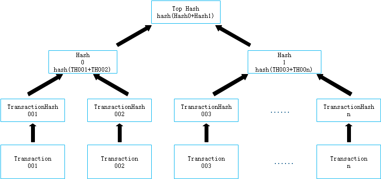

# 区块链范式

本章节会介绍NEO中所使用的相关算法

##  Base58

**摘要**

Base58是一种将非可视字符与可视化字符(ASCII化)相互转化的编解码方法

**详述**

Base58是一种将非可视字符与可视化字符(ASCII)相互转化的编解码方法。实现了数据的压缩、便于阅读，适用于抗自动监视的传输系统的底层编码机制，但缺乏效验机制，无法检测出传输过程中字符串的遗漏，需要配合改进算法Base58Check使用。

采用数字、大写字母、小写字母（去除歧义字符 0 (零), O (大写字母O), I (大写的字母i) and l (小写的字母L) ），总计58个字符作为编码的字母表。

neo使用的字母表为：**123456789ABCDEFGHJKLMNPQRSTUVWXYZabcdefghijkmnopqrstuvwxyz**

接口定义：

1、编码方法：把byte[]数据编码成Base58字符串String数据

~~~
string Encode(byte[] input)
~~~


2、解码方法：Base58字符串String解码成byte[]数据

~~~
byte[] Decode(string input)
~~~


编码步骤：

1、把byte[]数据前添加一个0x00，生成一个新的byte数组，并将新数组做倒序排序

2、把数组的数据转成10进制BigInteger数

3、把BigInteger数按字母表转换成58进制字符串

4、统计原byte[]数据中0x00的个数count，在字符串前补count个字母表游标为零所对应的字符

解码步骤：

1、倒序输入的字符串，将其按字母表转换成10进制Biginteger数

2、把Biginteger数转换成byte[]数据，并将byte[]数据倒序排序

3、统计原输入的字符串中字母表游标为零所对应的字符的个数count

4、若byte[]数据的长度大于1，且byte[0]等于0，byte[1]大于等于0x80,则从byte[1+count]开始截

取，否则从byte[count]开始截取,得到结果

Example:

| 字符串 | byte[] |
| --- | --- |
| AXaXZjZGA3qhQRTCsyG5uFKr9HeShgVhTF   |  [0x17,0xad,0x5c,0xac,0x59,0x6a,<br>0x1e,0xf6,0xc1,0x8a,<br>0xc1,0x74,0x6d,0xfd,0x30, <br>0x4f,0x93,0x96,0x43,0x54,0xb5,0x78,0xa5,0x83,0x22] |

应用场景：

1、为Base58Check编解码方法提供服务。


## Base58Check

**摘要**

Base58Check是基于Base58的改进型编解码方法

**详述**

Base58Check是基于Base58的改进型编解码方法.通过对原数据添加数据的哈希值作为盐，弥补了Base58缺少效验机制的缺点。。

接口定义：

1、编码方法：把byte[]数据编码成带效验功能Base58字符串String数据

```
string Base58CheckEncode(byte[] input)
```

2、解码方法：把带效验功能Base58字符串String解码成byte[]数据

```
byte[] Base58CheckDecode(string input)
```
编码步骤：

1、通过对原byte[]数据做两次sha256得到原数据的哈希，取其前4字节作为版本前缀checksum，添加到原byte[]  

​     数据的末尾

2、把添加了版本前缀的byte[]数据做Base58编码得到对应的字符串

解码步骤：

1、把输入的字符串做Base58解码，得到byte[]数据

2、取byte[]数据收字节到到数第4字节前的所有数据byte[] data

3、把data做两次sha256得到的哈希值的前4字节作为版本前缀checksum，与

byte[]数据的后4字节比较是否相同，相同则返回data,否则抛出异常


Example:

| 字符串 | byte[] |
| --- | --- |
| AXaXZjZGA3qhQRTCsyG5uFKr9HeShgVhTF   |  [0x17,0xad,0x5c,0xac,0x59,0x6a<br>0x1e,0xf6,0xc1,0x8a,0xc1,0x74,0x6d,0xfd,<br>0x30,0x4f,0x93,0x96,0x43,0x54,0xb5]|


应用场景：

1、导入、导出输出wif格式的密钥     

2、合约脚本哈希与地址字符串相互转换

3、导入、导出NEP2格式密钥


## ECC椭圆曲线加密

**摘要**

​     ECC椭圆曲线加密算法是一种基于离散对数问题的非对称加密算法

**详述**

​     ECC椭圆曲线加密算法是一种非对称加密算法。利用其K=k*G过程不可逆的特性（其中K为公钥，G为基点（常数点)),可以预防通过公钥暴力求解私钥。相较于RSA等其他加密算法，在相同密钥长度情况下，其具备更高的安全性，同时更节约算力。ECC结合其他算法广泛应用于签名等领域，例如ECDsa数字签名。

　NEO与比特币一样都采用ECC作为其公钥生成算法，NEO采用了secp256r1 标准所定义的⼀条特殊的椭圆曲线，使用的参数：

　素数Ｑ：00FFFFFFFF00000001000000000000000000000000FFFFFFFFFFFFFFFFFFFFFFFF

　椭圆曲线的系数Ａ：00FFFFFFFF00000001000000000000000000000000FFFFFFFFFFFFFFFFFFFFFFFC

　椭圆曲线的系数Ｂ：005AC635D8AA3A93E7B3EBBD55769886BC651D06B0CC53B0F63BCE3C3E27D2604B

　阶数Ｎ：00FFFFFFFF00000000FFFFFFFFFFFFFFFFBCE6FAADA7179E84F3B9CAC2FC632551

　基点G：(０ｘ6B17D1F2E12C4247F8BCE6E563A440F277037D812DEB33A0F4A13945D898C296，

　　　　　０ｘ4FE342E2FE1A7F9B8EE7EB4A7C0F9E162BCE33576B315ECECBB6406837BF51F5)


Example:

| 名称 | 数值 |
| --- | --- |
| 私钥   |  c7134d6fd8e73d819e82755c64c93788d8db0961929e025a53363c4cc02a6962|
| 公钥(压缩型) |  035a928f201639204e06b4368b1a93365462a8ebbff0b8818151b74faab3a2b61a|
| 公钥(非压缩型) |  045a928f201639204e06b4368b1a93365462a8ebbff0b8818151b74faab3a2b61a35dfab<br>cb79ac492a2a88588d2f2e73f045cd8af58059282e09d693dc340e113f|


应用场景：

1、私钥生成公钥

２、签名和验证签名

参考文献：

1、[一个关于椭圆曲线密码学的初级读本 ](https://arstechnica.com/information-technology/2013/10/a-relatively-easy-to-understand-primer-on-elliptic-curve-cryptography/)

> [!NOTE]
> 如果发现死链接，请联系 feedback@neo.org


## ECDSA 签名

**摘要**

​    椭圆曲线数字签名算法（ECDSA）是使用椭圆曲线密码（ECC）对数字签名算法（DSA）的模拟

**详述**

​     椭圆曲线数字签名算法（ECDSA）是使用椭圆曲线密码（ECC）对数字签名算法（DSA）的模拟。其优点是速度快，强度高，签名短。

其基本使用方法如下：

​     假设私钥、公钥、基点分别为k、K、G，根据ECC算法可知有K = k·G。

签名过程：

​       1、选择随机数r，计算点r·G(x, y)。

​       2、根据随机数r、消息M的哈希h、私钥k，计算s = (h + k·x)/r。

​       3、将消息M、和签名{r·G, s}发给接收方。

验证过程：

​       1、接收方收到消息M、以及签名{r·G=(x,y), s}。

​       2、根据消息求哈希h。

​       3、使用发送方公钥K计算：h·G/s + x·K/s，并与r·G比较，如相等即验签成功。

推导原理如下：

   h·G/s + x·K/s 

= h·G/s + x(k·G)/s

= (h+x·k)G/s

= r(h+x·k)G / (h+k·x) 

= r·G


应用场景：

1、交易的签名。

２、共识

## 哈希算法

​     哈希函数，又称散列算法，是一种从任何一种数据中创建数字“指纹”的方法。散列函数把消息或数据压缩成摘要，使得数据量变小，将数据的格式固定下来。该函数将数据打乱混合，重新创建一个叫做散列值（或哈希值）的指纹。散列值通常用一个短的随机字母和数字组成的字符串来代表。

###  RIPEMD160 

**摘要**

   RIPEMD160是一种加密哈希函数

**详述**

​     RIPEMD是一种加密哈希函数，由鲁汶大学 Hans Dobbertin, Antoon Bosselaers 和 Bart Prenee组成的COSIC 研究小组发布于1996年。 

​       RIPEMD160是基于RIPEMD改进的160位元版本，会产生一个160bit长的哈希值(可用16进制字符串表示)。其能表现出理想的雪崩效应(例如将d改成c，即微小的变化就能产生一个完全不同的哈希值)。

​       NEO使用RIPEMD160来生成合约脚本160bit的哈希值。


应用场景：

1、生成合约的哈希


### SHA256 

**摘要**

​     SHA256是一种哈希函数(散列算法)

**详述**

​      SHA256是SHA-2下细分出的一种算法。SHA-2 ，一种密码散列函数算法标准，由美国国家安全局研发，属于SHA算法之一，是SHA-1的后继者。SHA-2下又可再分为六个不同的算法标准，包括了：SHA-224、SHA-256、SHA-384、SHA-512、SHA-512/224、SHA-512/256。

​       对于任意长度的消息，SHA256都会产生一个256bit长的哈希值(可用16进制字符串表示)。

应用场景：

1、计算合约的哈希。

２、签名和确认签名

3、Base58Check编解码

4、dB3、NEP6钱包的密钥的存储、导出、验证


### Murmur3 

**摘要**

​      Murmur是一种非加密型哈希函数

**详述**

​         Murmur是一种非加密型哈希函数，适用于一般的哈希检索操作。由Austin Appleby在2008年发明，并出现了多个变种，都已经发布到了公有领域。与其它流行的哈希函数相比，对于规律性较强的key，Murmur的随机分布特征表现更良好.

其特点是：

​      1.碰撞率低

​      2.计算速度快

​      3.擅长大文件的哈希                                                              

应用场景：

1、布隆过滤器

2、leveldb存储

### Scrypt

**摘要**

​       Scrypt算法是基于PBKDF2-HMAC-SHA-256算法之上的安全加密算法。

**详述**

​       Scrypt算法是基于PBKDF2-HMAC-SHA-256算法之上的安全加密算法。由著名的FreeBSD黑客 Colin Percival为他的备份服务 Tarsnap开发的，当初的设计是为了降低CPU负荷，尽量少的依赖cpu计算，利用CPU闲置时间进行计算，因此scrypt不仅计算所需时间长，而且占用的内存也多，使得并行计算多个摘要异常困难，因此利用rainbow table进行暴力攻击更加困难。

​     Neo中使用主要使用SCRYPT算法来生成满足NEP2规范的加密型密钥，使用的参数为：

​     N（CPU/内存消耗指数，一般取值为2的若干次方）：16384

​     p（并行计算参数，理论上取值范围为1-255，参数值越大越依赖于并发计算）：8

​     r（表块大小，理论取值范围为1-255，同样越大越依赖内存与带宽  ）：  8                                                          
应用场景：

1、NEP2格式密钥的导出。

2、NEP6钱包的密码效验。

参考

1、RFC 7914《The scrypt Password-Based Key Derivation Function》


## MerkleTree

**摘要**

​     梅克尔树是一种二叉树,能快速检查和归纳大量数据,可用于验证区块中交易记录的完整性

**详述**

​    梅克尔树是一种二叉树,能快速检查和归纳大量数据,可用于验证区块中交易记录的完整性。NEO使用梅克尔树来构建区块模型。不同于比特币，NEO中每个区块的区块头都会保存一份该区块所有所有交易的梅克尔树根，区块的数据区存放的是交易数组。



   梅克尔树基本特点：

​           1、MT是一种树，大多数是二叉树（NEO采用二叉树形式），也可以多叉树，无论是几叉树，它都具有树结

​                 构的所有特点；

​            2、Merkle Tree的叶子节点的value是数据集合的单元数据或者单元数据HASH。

​            3、非叶子节点的value是根据它下面所有的叶子节点值，然后按照Hash算法计算而得出的

交易验证原理：

​      通过Transcation001、Transcation002、Hash1计算Top Hash 与原本的Top Hash比对，即可验证Transcation001的有效性。


应用场景：

1、构建区块头时会维护一个MerkleTree根

2、使用SPV钱包，验证区块数据

参考文献：

1、https://en.wikipedia.org/wiki/Merkle_tree
> [!NOTE]
> 如果发现死链接，请联系 feedback@neo.org

## AES加密
**摘要**

​    AES 是对称加密算法中的一种分组算法

**详述**

​     AES 是对称加密算法中的一种分组算法，分组长度为 128、192、256 位三种。AES 的优势在于处理速度快，整个过程可以数学化描述，目前尚未有有效的破解手段。

​    NEO中使用的是256位AES加密算法。加密模式为ECB模式，填充方式是NoPadding。

Example：

​    1、msg,key----->passphrase-protected msg

   （消息："Hello World"的256位哈希") +（密码："l love coding"的256位哈希)

="a591a6d40bf420404a011733cfb7b190d62c65bf0bcda32b57b277d9ad9f146e"

+"da04fe4405fc021e4ca5ca956b263828e99d4ce2a342b2cbdc919baddbe178ae"

-------->"a8158a64c1e9d776e12582d8c63553ee0c7687bd8e374f79c766e7459577f547"

​     2、passphrase-protected msg,key----->msg

​           加密密文 +（密码："l love coding"的256位哈希)

="a8158a64c1e9d776e12582d8c63553ee0c7687bd8e374f79c766e7459577f547"

+"da04fe4405fc021e4ca5ca956b263828e99d4ce2a342b2cbdc919baddbe178ae"

-------->"a591a6d40bf420404a011733cfb7b190d62c65bf0bcda32b57b277d9ad9f146e"

应用场景：
1、DB3钱包账户密码的存储、验证


## BloomFilter布隆过滤器

**摘要**

​    布隆过滤器（Bloom Filter）是1970年由布隆提出的。它实际上是一个很长的二进制向量和一系列随机映射函数。

**详述**

​         布隆过滤器（Bloom Filter）是1970年由布隆提出的。它实际上是一个很长的二进制向量和一系列随机映射函数。布隆过滤器可以用于检索一个元素是否在一个集合中。它的优点是空间效率和查询时间都比一般的算法要好的多，缺点是有一定的误识别率和删除困难。

​         NEO使用布隆过滤器为SPV钱包验证交易服务

使用方式：

​        1、SPV钱包向全节点发送布隆过滤器，并由全节点加载布隆过滤器

​        2、SPV钱包向全节点发送布隆过滤器参数，并由全节点加载相应布隆过滤器参数（可选）。

​        3、SPV钱包向全节点用区块hash查询交易数据，全节点使用布隆过滤器过滤后返回交易数据以及构建的梅克

​             尔树路径（待确认）

​        4、SPV钱包用梅克尔树路径验证交易数据有效性（待确认）

​        4、SPV钱包向全节点发送指令清除布隆过滤器，全节点清除过滤器。                                                          

应用场景：

1、SPV钱包验证交易数据