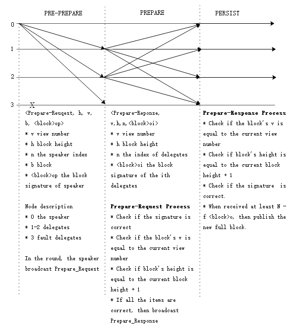
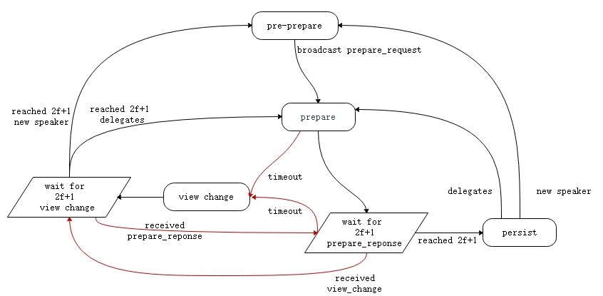

<h2> The dBFT Algorithm </h2>

&emsp;&emsp;dBFT(Delegated Byzantine Fault Tolerant) algorithm is based on PBFT(Practical Byzantine Fault Tolerance) algorithm, more suitable in blockchain. PBFT algorithm can solve distributed network consensus effectively, but the more nodes join, the faster the performance drops, as the time complexity is O(n2) . On this basis, NEO proposes a dBFT algorithm which combines the characteristics of PoS mode. By voting on the blockchain, it decides the next round of consensus nodes, namely authorizing a few nodes to create block, and the other nodes as ordinary nodes to receive and verify block.

### List of Terms

* **Consensus Node**: This node participates in the consensus activity, make a block proposal and vote.

* **Ordinary Node**: This node can transfer, make a transaction, but not participate in the consensus activity.

* **Speaker(One)**: The Speaker is responsible for transmitting a block proposal to the system.

* **Delegates(Multiple)**: Delegates are responsible for voting on the block proposal. The proposal will be accepted, if more than `2f+1` consensus nodes vote it.

* **Validator**: Nodes participating in elections, namely consensus candidate nodes.

* **View**: The dataset used during one consensus activity. The view number start from 0 in each round, and increase number when reach a consensus failed in one round.

### Algorithm Flow

 
**Symbolic Definition**

- N: The number of active consensus nodes.

- f：The maximum threshold of faulty consensus nodes in the system, no more than ⌊(N-1)/3⌋.

- v: The view number, start from 0.

- ℎ：The current block height during consensus activity.

- p: The index of Speaker in array. `p = (h - v) mod N`

- i：The index of consensus node in array. 

- t: The block time, config in `protocol.json/SecondsPerBlock`, default 15 seconds.

- 𝑏𝑙𝑜𝑐𝑘：The proposal block

- 〈𝑏𝑙𝑜𝑐𝑘〉𝜎𝑖: The block signature of the `i`th consensus node.

**General Procedures**

Assume the total number of active consensus nodes is `N`, up to `f` fault tolerance nodes. At the begin, the nodes have the same view number `v = 0`, and block height `h = current block height`. If not at the same height, it can be achieved by block synchronization between P2Ps. The process involved in the consensus algorithm is as follows:

1. Users initate a transaction through wallet, such as transfer, deploy intelligent contract, release assets, etc.

2. The wallet signs the transaction data, and broadcasts to the entire networks.

3. The consensus node received the transaction, and put into the memory pool.

4. In one consensus round, the Speaker package the transactions from the memory pool into a new block,  then broadcast the block proposal 〈𝑃𝑟𝑒𝑝𝑎𝑟𝑒𝑅𝑒𝑞𝑢𝑒𝑠𝑡,ℎ,𝑣,𝑝,𝑏𝑙𝑜𝑐𝑘,
〈𝑏𝑙𝑜𝑐𝑘〉𝜎𝑝〉. 

   1. Load all the transactions in the memory pool.

   2. Load [`IPolicyPlugin`](https://github.com/neo-project/neo-plugins) plugin, sort and filter the transaction.
   
   3. Calculate the network fee (`= inputs.GAS - outputs.GAS - transactions_system_fee `), and take it as the `MinerTransaction` award for the current Speaker.

   4. Combining the above transactions and the previous validators votes, calculate the next round consensus nodes, and assign the multi-party signature script hash to `block.NextConsensus`, locking the consensus nodes of the next block.

   5.  Set the timestamp of block to the current time and calculate the signature of the speaker.
   
   6. Broadcast `PrepareRequset` consensus messsage.

   7. Broadcast `inv` message, attached with transactions' hashs except `MinerTransaction`. (Notify the other nodes to synchronize the transactions to be packed)

5. Delegates recieved the block proposal, and verify the new block, then broadcast 〈𝑃𝑟𝑒𝑝𝑎𝑟𝑒𝑅𝑒𝑠𝑝𝑜𝑛𝑠𝑒,ℎ,𝑣,𝑖,〈𝑏𝑙𝑜𝑐𝑘〉𝜎𝑖〉 consensus message.

6. Any node, receiving at leat `n-f` 〈𝑏𝑙𝑜𝑐𝑘〉𝜎𝑖 , reaches a consensus and publishes the full block.

7. Any node, after receiving the full block, deletes all the full block's transactions in the memory pool. If the node is the consensus node, then enter the next round consensus.

 

The algorithm can be divided into three stages. 1) `PRE-PREPARE`, the speaker of this round is responsible for broadcasting `Prepare-request` message to the delegates and initiating the block proposal. 2) `PREPARE`, the delegates after receiving `PRE-PREPARE`, then broadcast `Prepare-Response` if the proposal verified successful. When a node receives at least `N-f` 〈𝑏𝑙𝑜𝑐𝑘〉𝜎𝑖, it enters the third stage. 3) `PERSIST`, the consensus node publishes the full node and enter the next consensus round.

> [!Note]
> 1. At the beigining of the blockchain network started, `StandbyValidators` are read from the configureation file `protocol.json` by default.
> 2. Unlike ordinary block, genesis block is the first block in the blockchain by default, which is not published by consensus nodes. The `NextConsensus` in the genesis block specifies the conosensus nodes of the next block as the `StandbyValidators` nodes.

**View Change**

In the process of consensus on a open p2p network environment, there may be network delay, evil node sending illegal data, etc. The consensus nodes can initiate a `ChangeView` proposal. They enter a new view with new speaker, and restart consensus, after receiving at least `N-f` `ChangeView` messages with the same view number.

 

The View Change will take place, when one consensus node could not reach a consensus in `2v+1 *t` time interval, or received illegal proposals such as contain invalid transactions.

1. Given 𝑘 = 1, 𝑣𝑘 = 𝑣 + 𝑘； 

2. The `𝑖`th node initiate a 〈𝐶ℎ𝑎𝑛𝑔𝑒𝑉𝑖𝑒𝑤,ℎ,𝑣,𝑖,𝑣𝑘〉 proposal.

3. When any one node received at least `N-f` `ChangeView` with the same 𝑣𝑘 from different consensus nodes, the View Change will be completed. Set 𝑣 = 𝑣𝑘 and start the consensus process.

4. If the View Change is not completed in `2𝑣𝑘 +1 ⋅ 𝑡` time interval, then increase k and back to step 2).

With the k increase, the overtime waiting time will increase exponentially, which can avoid frequent View Change and make the nodes reach agreement as soon as possible. The original view `v` is still valid until the completion of View Change, avoiding unnecessary View Change due to accidental network latency.

[1] [A Byzantine Fault Tolerance Algorithm for Blockchain](http://docs.neo.org/zh-cn/basic/consensus/whitepaper.html) 
[2] [Consensus Diagram](http://docs.neo.org/zh-cn/basic/consensus/consensus.html) 
[3] [Practical Byzantine Fault Tolerance](http://pmg.csail.mit.edu/papers/osdi99.pdf) 
[4] [The Byzantine Generals Problem](https://www.microsoft.com/en-us/research/wp-content/uploads/2016/12/The-Byzantine-Generals-Problem.pdf) 
