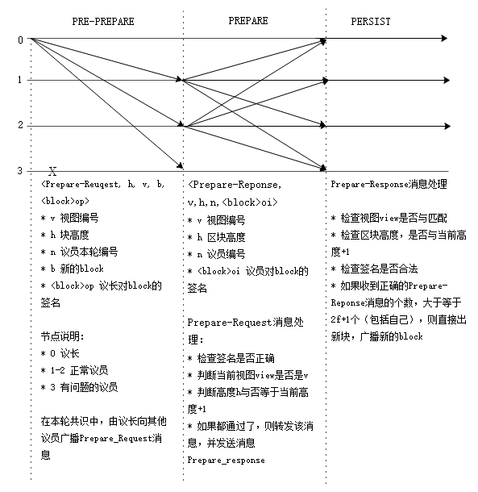

<h2> DBFT算法介绍 </h2>

&emsp;&emsp;dBFT[1]算法是在PBFT[3]算法上改良过来。PBFT算法能够有效解决分布式可信共识，但是当投票节点越来越多时，性能下降越厉害，其算法时间复杂度 O(n2), n是节点个数。 在此基础上，NEO提出结合POS模式特点的DBFT算法，利用区块链投票，决定下一轮共识节点，即授权少数节点出块，其他节点作为普通节点验证和接收区块信息。

### 基本概念

* 共识节点： 具有发起新块提案，和提案投票权限的节点。
* 普通节点： 具有转账，交易，全网账本，但不具有记录权限，不能发起区块提案与投票。
* 议员：参与共识出块的节点，负责对新块提案进行投票，当票数不少于2𝑓+1时，则提案通过。
* 议长：负责向其他节点，广播新块提案。
* 验证人： 被投票选举参与共识的节点
* 视图： 一轮共识从开始到结束所使用的数据集。视图编号 𝑣，从 0 开始，并逐渐递增，直到新的提案通过后清零。

### 算法流程

 
**符号定义**

- N: 本轮共识节点总个数
- f：最大容错节点个数， 不超过 └(N-1)/3┘。
- v: 视图编号，等于在查询本轮共识列表中的序号。
- ℎ： 当前共识的区块高度
- p: 议长编号，`p = (h - v) mod N`
- i：议员节点编号
- t: 出块时间。配置在文件`protocol.json`中的`SecondsPerBlock`值，默认15秒钟。
- 𝑏𝑙𝑜𝑐𝑘： 本轮正在进行共识的区块
- 〈𝑏𝑙𝑜𝑐𝑘〉𝜎𝑖: 第i个共识节点对𝑏𝑙𝑜𝑐𝑘的签名。

**一般流程**

假设当前共识节点总数N, 最多 f 个容错节点。 刚开始时，具有相同的视图编号v = 0, 区块高度 ℎ = 当前区块高度。（若没有处在同一高度，可通过P2P之间区块同步，最终达成一致），共识算法涉及到的流程如下：

1. 用户通过钱包发起一笔交易，如转账，发布智能合约，智能合约调用等。

2. 钱包会将改交易进行签名，并发给节点进行P2P广播；

3. 共识节点也收到该笔交易，存放到内存池；

4. 在某一轮共识，其议长将内存池交易，全部打包到新𝑏𝑙𝑜𝑐𝑘中，并广播 〈𝑃𝑟𝑒𝑝𝑎𝑟𝑒𝑅𝑒𝑞𝑢𝑒𝑠𝑡,ℎ,𝑣,𝑝,𝑏𝑙𝑜𝑐𝑘,
〈𝑏𝑙𝑜𝑐𝑘〉𝜎𝑝〉  新块提案；

5. 其他议员，在收到该提案与验证后，广播 〈𝑃𝑟𝑒𝑝𝑎𝑟𝑒𝑅𝑒𝑠𝑝𝑜𝑛𝑠𝑒,ℎ,𝑣,𝑖,〈𝑏𝑙𝑜𝑐𝑘〉𝜎𝑖〉 投票消息

6. 当任意一个议员（包括议长），在收到𝑃𝑟𝑒𝑝𝑎𝑟𝑒𝑅𝑒𝑠𝑝𝑜𝑛𝑠𝑒中的 2𝑓+1 个〈𝑏𝑙𝑜𝑐𝑘〉𝜎𝑖签名（包括自己的签名）后，即达成共识，开始发布新块，并广播；

7. 任意一个节点收到该新块后，将上面交易从内存池中删除，并记录该区块内容。 若是共识节点收到新区块后，则进入下一轮共识。

 

算法可以划分为三阶段。1）`PRE-PREPARE`预准备阶段，本轮的议长负责向其他议员广播`Prepare-Request`消息。 2）`PREPARE`准备阶段，负责向外广播`Prepare-Response`消息，当一个节点收到不少于`2f+1`个〈𝑏𝑙𝑜𝑐𝑘〉𝜎𝑖签名, 则进入第三阶段。3)`PERSIST`出块阶段， 负责向外广播新块，并进入下一轮共识。

> [!Note]
> 1. 刚启动区块链的时候，默认读取配置文件`protocol.json`的备用共识节点列表`StandbyValidators`.
> 2. 与普通块不一样，创世块并非共识节点出块，而是默认为区块链第一个区块。创世块中的`NextConsensus`指定了下一个块的共识节点为`StandbyValidators`的多方签名脚本hash。
> 3. 𝑃𝑟𝑒𝑝𝑎𝑟𝑒𝑅𝑒𝑞𝑢𝑒𝑠𝑡 消息中的𝑏𝑙𝑜𝑐𝑘，会带上决定下一个出块的共识节点的 `N - 1N/3`多方签名地址`NextConsensus`。 （结合之前所有投票记录，以及当前block中的投票交易，计算出决定下一个块的共识节点，和这些共识节点的多方签名脚本hash）

**视图更换**

开放的P2P网络环境共识过程中，可能会遇到网络延迟超时，恶意节点发送假数据等，议员可以发起更换视图消息，若收到不少于2f+1个更换视图消息时，则进入新的视图和新的议长，重新进行区块共识。

 

当节点 𝑖 在经过 2𝑣+1 ⋅ 𝑡 的时间间隔后仍未达成共识，或接收到包含非法交易的提案后，开始进入视图更换流程： 

1. 令 𝑘 = 1，𝑣𝑘 = 𝑣 + 𝑘； 

2. 节点 𝑖 发出视图更换请求 〈𝐶ℎ𝑎𝑛𝑔𝑒𝑉𝑖𝑒𝑤,ℎ,𝑣,𝑖,𝑣𝑘〉； 

3. 任意节点收到至少 𝑛 − 𝑓 个来自不同 𝑖 的相同 𝑣𝑘 后，视图更换达成，令 𝑣 = 𝑣𝑘 并开始共识；

4. 如果在经过 2𝑣+1 ⋅ 𝑡 的时间间隔后，视图更换仍未达成，则 𝑘 递增并回到第 2 步； 

随着 𝑘 的增加，超时的等待时间也会呈指数级增加，可以避免频繁的视图更换操作，并使各节点尽快对 𝑣 达成一致。 而在视图更换达成之前，原来的视图 𝑣 依然有效，由此避免了因偶然性的网络延迟超时而导致不必要的视图更换。 

[1] [一种用于区块链的拜占庭容错算法](http://docs.neo.org/zh-cn/basic/consensus/whitepaper.html) 
[2] [共识机制图解](http://docs.neo.org/zh-cn/basic/consensus/consensus.html) 
[3] [A Byzantine Fault Tolerance Algorithm for Blockchain](whitepaper.md) 
[4] [Practical Byzantine Fault Tolerance](http://pmg.csail.mit.edu/papers/osdi99.pdf) 
[5] [The Byzantine Generals Problem](https://www.microsoft.com/en-us/research/wp-content/uploads/2016/12/The-Byzantine-Generals-Problem.pdf) 
