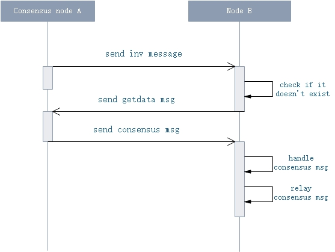

<h2>共识协议
</h2>

### 一、共识消息格式

1. **P2P消息格式**

| 尺寸 | 字段 | 类型  | 说明 |
|------|------|-------|------|
|  4    | Magic |  uint | 网络p2p协议魔法数，默认从配置文件`protocol.json`中的`ProtocolConfiguration.Magic`值，主网为 `7630401`, 测试网为`1953787457`   |
| 12   | Command | string | `consensus`，共识消息  |
| 4     | length    | uint32 | Payload长度|
| 4     | Checksum | uint | 校验码 |
| length   | Payload | byte[] | `ConsensusPayload` 共识消息内容 |

2. **ConsensusPayload** 

| 尺寸 | 字段 | 类型  | 说明 |
|----|------|-------|------|
| 4  | Version |  uint | 共识版本号， 目前为`0` |
| 32  | PrevHash | UInt256 | 指令 |
| 4 | BlockIndex |uint | 当前Block高度 |
| 2 | ValidatorIndex | ushort | 验证人的编号 |
| 4  | Timestamp | byte[] | 时间戳 |
| ?  |  Data | byte[] | 具体消息内容： `ChangeView`, `PrepareRequest`, `PrepareResponse` |
| 1 |  script_parameters_lenghth | byte | 验证人脚本参数个数|
| ? | Witness | Witness | 见证人 |

3. **Changeview** 消息格式

| 尺寸| 字段 | 类型 | 说明  |
|----|------|-----|-------|
| 1 | Type | ConsensusMessageType |  `0x00` |
| 1 | ViewNumber | byte | 当前视图编号 |
| 1 | NewViewNumber | byte |  新视图编号 |

4. **PrepareRequest** 消息格式

| 尺寸| 字段 | 类型 | 说明  |
|----|------|-----|-------|
| 1 | Type | ConsensusMessageType |  `0x20` |
| 1 | ViewNumber | byte | 当前视图编号 |
| 1 | Nonce | byte |  Block随机值 |
| 20  | NextConsensus | UInt160 |  下一轮共识节点地址的多方签名 |
| 4 + 32 * length   | TransactionHashes | UInt256[] |  打包的交易hash列表 |
| 78  | MinerTransaction | MinerTransaction |  矿工交易 |
|  64 | Signature | byte[] |  正在共识的Block的签名 |

5. **PrepareResponse** 消息格式

| 尺寸| 字段 | 类型 | 说明  |
|----|------|-----|-------|
|  1  | Type | ConsensusMessageType |  `0x21` |
|  1  | ViewNumber | byte | 当前视图编号 |
|  64  | Signature | byte[] | 正在共识的Block的签名 |

### 二、传输协议

共识消息包在P2P网络中，和其他数据也一样，进行广播传输，（因为共识节点之间并不知道对方的IP地址), 即普通都可能收到共识数据包。共识消息的广播流程如下图。

 

1) 在发送`consensus`消息之前，先发送`inv`消息，携带上`consensus`消息的`payload`的hash数据。 
2）若一个节点已经收到过该hash对应的数据，或在短时间内，已经重复获取该`inv`消息时，则不处理；否则，进入步骤三。 
3）向外广播`getdata`消息，附带上`inv`消息中的hash数据。 
4）共识节点收到`getdata`消息后，则发送`consenus`消息给对方。 
5）节点收到`consensus`消息后，则触发共识模块对消息处理。

1. `inv` 消息格式

| 尺寸 | 字段 | 类型  | 说明 |
|------|------|-------|------|
|  4    | Magic |  uint | 网络p2p协议魔法数|
| 12   | Command | string | `inv`  |
| 4     | length    | uint32 | Payload长度|
| 4     | Checksum | uint | 校验码 |
| length   | Payload | byte[] | `0xe0` + `0x00000001` + `ConsensusPayload.Hash` |

> [!Note] 
> Payload格式为： `inv.type + inv.payloads.length + inv.payload`
> `inv` 消息的payload，有三种类型:
> 1. `0x01`: 交易， inv.payload存放为交易hash列表
> 2. `0x02`：区块， inv.payload 存放共识消息`ConsensusPayload`的hash列表
> 3. `0xe0`: 共识， inv.payload 存放区块的hash列表

2. `getdata` 消息格式

| 尺寸 | 字段 | 类型  | 说明 |
|------|------|-------|------|
|  4    | Magic |  uint | 网络p2p协议魔法数|
| 12   | Command | string | `getdata`  |
| 4     | length    | uint32 | Payload长度|
| 4     | Checksum | uint | 校验码 |
| length   | Payload | byte[] | `0xe0` + `0x00000001` + `ConsensusPayload.Hash` |

> [!Note] 
> `getdata` 消息主要用来获取 `inv`消息附带hash列表对应的具体内容。
> Payload格式为： `inv.type + inv.payloads.length + inv.payload`

### 三、 共识消息处理

**校验**

1. 检查`ConsensusPayload.BlockIndex`。若小于或等于当前高度，则忽略该消息
2. 检查校验脚本是否通过，以及验证脚本的地址hash，是否等于`ConsensusPayload.ValidatorIndex`所在议员列表中，对应的地址签名脚本hash。
3. 检查`ConsensusPayload.ValidatorIndex`。若等于当前节点的共识列表序号，则忽略该消息
4. 检查共识版本号。若不等于当前共识协议版本号时，则忽略。
5. 检查`ConsensusPayload.PreHash` 和 `ConsensusPayload.BlockIndex`, 是否等于当前共识阶段上下文的`PreHash`与`BlockIndex`。 若不是，则忽略。
6. 检查`ConsensusPayload.ValidatorIndex`，若超过当前议员总数时，则忽略。
7. 检查`ConsensusMessage.ViewNumber`. 若不等于当前共识阶段上下文的`ViewNumber`且不是`ChangeView`消息时，则忽略

**处理**

1. **PrepareRequest** 消息处理

`PrepareRequest`消息，是由一轮共识的议长发出的消息，其中附带了`block`相关的数据。

   1. 检查节点自身，是否在本轮共识中，是议员。如果不是议员，则忽略该消息。或者`PrepareRequest`已接收过。
   2. 根据`ConsensusPayload.ValidatorIndex` 确定对方是不是本轮的议长，若不是，则忽略。 
   3. 检查 `ConsensusPayload.Timestamp`， 若小于等于上一个区块的时间戳，或者超过了当前时间10分钟以上，则认为消息过期，忽略。
   4. 检查对block的签名是否对
   5. 检查内存池已经包含的block所需的交易。若交易已经在区块链中，或者第三方过滤插件校验失败，则认为交易数据不对，发起`ChangeView`消息。
   6. 检查block中第一笔交易，即挖矿交易，同步骤5检查，并进行交易本身验证。若验证失败，忽略该消息。
   7. 收集签名，并将缺少的交易。
   8. 若缺少交易时，发送`getdata`消息，附带缺少交易的hash列表。
   9. 若交易齐全时，首先校验`PrepareRequest.NextConsensus` 是否等于 结合了最新交易的下一个区块共识节点的多方签名脚本hash。若不是，则发起`ChangeView`消息；若是，则发起`PrepareResponse`消息。

2. **PrepareResponse** 消息处理

`PrepareResponse`消息，是议员对议长发的`PrepareRequest`消息中的`block`进行签名消息。
  
   1. 若当前议员已经出新块了，则忽略消息
   2. 若对方签名已经收到过，则忽略
   3. 校验对方的签名，若通过，则收下签名，否则忽略。
   4. 检查签名数，若已经满足`2f+1`个签名，则出新块，向网络广播`block`.

3. **Changeview** 消息处理

议员或者议长，在遇到超时（议长第一次超时例外，用来发送`PrepareRequest`消息），或者错误数据时，则发起`ChangeView`消息。议员在收到`ChangeView`消息做如下处理：

   1. 若新视图编号，小于该议员之前的视图编号，则忽略
   2. 若新视图编号，小于当前议员的视图编号，则忽略
   3. 若有不少于`2f+1`个议员的视图编号等于新视图编号时，则切换视图成功，当前议员重置共识流程，视图编号为新的视图编号。

4. **onTimeout** 消息处理

   1. 若是议长超时，第一次超时发送`PrepareRequest`消息，后续则发起`ChangeView`消息。
   2. 若是议员超时，则直接发送`ChangeView`消息

5. **NewBlock** 事件处理
 
   1. 重置共识过程

6. **New Tx** 事件处理

    1. 若是挖矿交易，则忽略
    2. 若是节点是议长，已经发送了`PrepareRequset`消息，已经发送过`PrepareResponse`消息，或者 正在切换视图中，则忽略该交易
    3. 若已经收到过该交易，则忽略
    4. 若交易不在待打包block里面的，则忽略
    5. 将交易收下，放到待打包的里面
