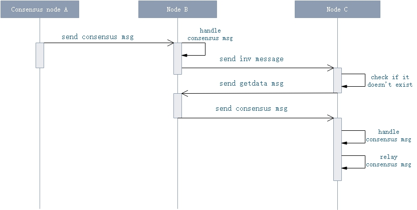

<h2>Consensus Protocol
</h2>

## Consensus Message Format

### P2p message format

| Size | Field | Type  | Description |
|------|------|-------|------|
|  4    | Magic |  uint | Protocol ID, defined in the configuration file `protocol.json`, mainnet is `7630401`, testnet is `1953787457`   |
| 12   | Command | string | Command, all consensus messages' command is `consensus`  |
| 4     | Length    | uint32 | Length of payload|
| 4     | Checksum | uint | Checksum |
| Length  | Payload | byte[] | Content of message, all consensus messages' payload is `ConsensusPayload`  |

### ConsensusPayload

| Size | Field | Type  | Description |
|----|------|-------|------|
| 4  | Version |  uint | 	Version of protocol, 0 for now |
| 32  | PrevHash | UInt256 | Previous block's hash |
| 4 | BlockIndex |uint | Height of the block |
| 2 | ValidatorIndex | ushort | The index of the current consensus node in validators array |
| 4  | Timestamp | uint | Timestamp |
| ?  |  Data | byte[] | Includes `ChangeView`, `PrepareRequest` and `PrepareResponse` |
| 1 |  - | uint8 | It's fixed to 1 |
| ? | Witness | Witness | Witness contains invocation script and verificatioin script |

### ChangeView

| Size | Field | Type  | Description |
|----|------|-----|-------|
| 1 | Type | ConsensusMessageType |  `0x00` |
| 1 | ViewNumber | byte | Current view number |
| 1 | NewViewNumber | byte |  New view number |

### PrepareRequest

| Size | Field | Type  | Description |
|----|------|-----|-------|
| 1 | Type | ConsensusMessageType |  `0x20` |
| 1 | ViewNumber | byte | Current view number |
| 8 | Nonce | ulong |  block nonce |
| 20  | NextConsensus | UInt160 |  The script hash of the next round consensus nodes' multi-signature contract  |
| 4 + 32 * length   | TransactionHashes | UInt256[] |  The proposal block's transaction hashes |
| 78  | MinerTransaction | MinerTransaction |  It is used to sum all the transaction fees of the current block as a reward for the speaker. |
|  64 | Signature | byte[] |  Block signature |

### PrepareResponse

| Size | Field | Type | Description |
|----|------|-----|-------|
| 1 | Type | ConsensusMessageType | `0x21` |
| 1 | ViewNumber | byte | Current view number |
| 64 | Signature | byte[] | Block signature |

## Transport Protocol

When a consensus message enters the P2P network, it's broadcasted and transmitted like other messages. That is because consensus nodes do not have IP address of other consensus nodes. Consensus nodes are not directly connected. That is to say, ordinary nodes can receive consensus message. The broadcast flow of consensus messages is as follows.

  1. Consensus node A will directly broadcast 'consensus' message to connected nodes(e.g. node B).

  2. After receiving the `consensus` message, node B firstly process the received consensus message and then forwards it. Before forwarding the consensus message, it sends an `inv` message which carries the hash data of the `payload` of the `consensus` message (to node C).

  3. If the node C has already known the data corresponding to the hash, it does not process the inv message. Otherwise, it proceeds to step 4.

  4. Node C sends a `getdata` message to node B, with the hash data in the `inv` message.

  5. After receiving the `getdata` message, node B sends a `consensus` message to node C.

  6. After receiving the `consensus` message, the node C triggers the consensus module to process the message, and forwards the consensus message, and then returns to step 2.

### Inv message format

| Size | Field | Type  | Description |
|------|------|-------|------|
| 4    | Magic |  uint | Protocol ID |
| 12   | Command | string | `inv`  |
| 4    | Length    | uint32 | Length of payload|
| 4    | Checksum | uint | Checksum |
| Length | Payload | byte[] | Format: `0xe0` + `0x00000001` + `ConsensusPayload.Hash` |

> [!Note] 
> Payload's format： `inv.type + inv.payloads.length + inv.payload`
> `inv` message's payload has three types as follow:
> 1. `0x01`: Transaction. inv.payload is assigned to transaction's hash.
> 2. `0x02`: Block.  inv.payload is assigned to `ConsensusPayload` message's hash.
> 3. `0xe0`: Consensus. inv.payload is assigned to block's hash.

### Getdata message format

| Size | Field | Type  | Description |
|------|------|-------|------|
| 4    | Magic |  uint | Protocol ID |
| 12   | Command | string | `getdata` |
| 4    | Length | uint32 | Length of payload |
| 4    | Checksum | uint | Checksum |
| Length | Payload | byte[] | Format: `0xe0` + `0x00000001` + `ConsensusPayload.Hash` |

> [!Note]
> The `getdata` message is mainly used to get the specific content in `inv` message.

## Consensus Message Process

###  Verification

1. Ignore the message if the `ConsensusPayload.BlockIndex` is no more than current block height.

2. Ignore the message if the verification script failed or the script hash does not equal to `ConsensusPayload.ValidatorIndex` address's script hash.

3. Ignore the message if the `ConsensusPayload.ValidatorIndex` equals to current node index.

4. Ignore the message if the `ConsensusPayload.Version` does not equal to current consensus version.

5. Ignore the message if the `ConsensusPayload.PrevHash` and `ConsensusPayload.BlockIndex` do not equal to the values in current node's context.

6. Ignore the message if the `ConsensusPayload.ValidatorIndex` is out of index of the current consensus nodes array.

7. Ignore the message if the `ConsensusMessage.ViewNumber` does not equal to the value in current node's context except that the consensus message is a `ChangeView`.

### Process

1. On receiving a **PrepareRequest** sent by speaker, attached with proposal block data.

   1. Ignore if the `PrepareRequest` has already been received.

   2. Ignore if the `ConsensusPayload.ValidatorIndex` is not the index of the current round speaker.

   3. Ignore if the `ConsensusPayload.Timestamp` is not more than the timestamp of the previous block, or is more than 10 minutes above current time.

   4. Ignore if the signature of the message is incorrect.

   5. If transantions in the received message are already in the blockchain, or it failed to pass verification provided by plugins, the transaction data will be considered incorrect and the current node will initiate `ChangeView`.

   6. Check the first transaction in block -- `MinerTransaction`, like step 5). If validation fails, then ignore

   7. Reserve the signature in the `PrepareRequest` message.

   8. If there is a lack of transactions in `block`, send the `getdata` message with the hashes of those transactions. 

   9. If the block's transactions all received, then check the `PrepareRequest.NextConsensus` is equal to the script hash of the next round consensus nodes' multi-signature contract. If it is, then broadcast `PrepareResponse` with block signature. If not, then initiate `ChangeView` message.

2. **PrepareResponse** is the Delegates' answer to the `PrepareRequest` message sent by the Speaker attached with block signture.

   1. If the current node has published the new full block, then ignore.

   2. If the block signature has collected already, then ignore.

   3. Check the signature is correct. If not, then ingore, else reserve.

   4. If there are at least `N+f` signatures, then publish the new full block.

3. **Changeview** was send by consensus node, when timeout occured or received illegal data

   1. If the view number less than the  sender view number, then ignore.
   
   2. If the new view number less than current node view number, then ignore.

   3. If received at least `N-f` `ChangeView` messages with the same new view number, then the View Change completed. The current node reset the consensus process with the new view number.

4. **onTimeout** 

   1. If the Speaker timeout, the `PrepareRequeset` message will be sent for the first time, and the `ChangeView` message will be luanched subsequently.

   2. If Delegates timeout, then broadcast `ChangeView` message directly.

5. **New Block** 
 
   1. resetting consensus process

6. **New Transaction** 

    1. If the transaction is the `MinerTransaction`, then ignore. As the `PrepareRequest` contains the `MinerTransaction`.

    2. If the current node is the Speaker, or the node has sent `PrepareRequest` or `PrepareResponse` messages, or in switching view process, then ignore.

    3. If the transaction has received before, then ignore.

    4. If the transacion isn't in the propoal block, then ignore.

    5. Reserve the transaction.

<a name="6_tx_handler"/>
