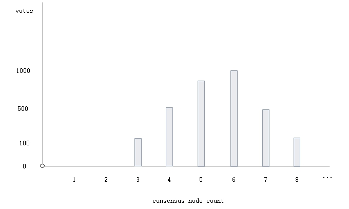
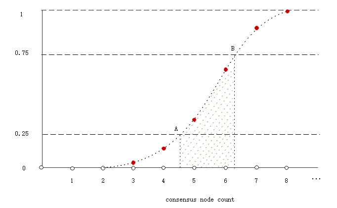

<h2>Voting, Validator, Delegates, Speaker</h2>

&emsp;&emsp; The PoS model of NEO is embodied in: (1) Anyone can initiate a transaction to become a validator. (2) Anyone who hold the NEO coin, can vote on the validators and decide the consensus nodes at anytime. The consensus nodes are calculated by this algorithm introduced in this chapter combining with the voting.  And voting is a dynamic and continuous process. If the NEO asset of the voting account changed, the number of votes at the previous voting address will also change, and consensus nodes will change accordingly.

&emsp;&emsp; At the same time, each block contains `NextConsensus` field, which points to the next consensus activity nodes. That is to say, the current transaction determines the consensus nodes in the next round. 

## Voting

&emsp;&emsp; In NEO, voting can be initiated through two special types of transactions. First, `EnrollmentTransaction` can be used for applying for validator. Second, `StateTransaction` can be used for voting or validator. When the user chooses the validator to vote, it actually includes two parts: one is the number of consensus nodes, the other is the validator.

### EnrollmentTransaction

##### **Structure**

| Size | Field | Type  | Description |
|-----|------|------|------|
| 1 | Type | uint8 | transaction type: `0x20` |
| 1 | Version | uint8 | 	transaction version, current is `0` |
| ? | PublicKey | ECPoint |  public key of validator |
| ?*? | Attributes | tx_attr[]| Additional features that the transaction has |
| 34*? | Inputs |  tx_in[] | tx input |
| 60 * ? | Outputs | tx_out[] | tx output |
| ?*? | Scripts | script[] | List of scripts used to validate the transaction |

##### **Verification**

1. This transaction can't be accepted any more, as the verification is set to constant `false`.
2. The validator need to sign the transaction, as the verification script contains the validator's address.

##### **Process**

1. Register the validator information.

> [!Warning]
> Abandoned, replaced by `StateTransanction`, but the transaction processing is reserved for compatibility with the previous transactins.

### StateTransaction

##### **Structure**

| Size | Field | Type  | Description |
|-----|------|------|------|
| 1 | Type | uint8 | transaction type: `0x90` |
| 1 | Version | uint8 | transaction version, current is `0`  |
| ?*?   | Descriptors | StateDescriptor[] | voting information  |
| ?*? | Attributes | tx_attr[]| Additional features that the transaction has |
| 34*? | Inputs |  tx_in[] |  tx input |
| 60 * ? | Outputs | tx_out[] | tx output |
| ?*? | Scripts | script[] | List of scripts used to validate the transaction |

**StateDescriptor Structure**

| Size | Field | Type  | Description |
|-------|---------|------|-------|
| 1  | Type |  StateType | `0x40`--voting, `0x48`-- validator |
| 20/30 |  Key | byte[] |  if `Field = "Votes"`,deposit the script hash the voter; if `Field = "Registered"`, deposit the publicKey of the validator; | 
| ? | Field | string |  if `Type = 0x40`, `Field = "Votes"`;  if `Type = 0x48`, `Field = "Registered"`; |
| ? | Value | byte[] | if `Type = 0x40`, deposit the address of the voted validator;   if `Type = 0x48`, deposit boolean value, true -- apply for validator, false -- cancel the application. |

#####  **Verification**

1. Verify `StateDescriptor`：
   1. Check `StateDescriptor.Type` matching with  `StateDescriptor.Field`.
  
   2. When `StateDescriptor.Type = 0x40`, means voting.
       1. Check whether the voter account is not frozen and the amount of NEO is more than zero. 
       
       2. The voted validator address is not in the `StandbyValidators` and must be registered.

2. Basic validation of transactions contains: legality and verification scripts. The verification scripts contain the `StateDescriptor.Key`, which requires the signature of the voter or the validator. (Note, when `StateDescriptor.Field = "Votes"`, the `StateDescriptor.Key` field must be transfered from public key to script hash.）

#####  **Process**

1. When `StateDescriptor.Type = 0x48`, according to the `StateDescriptor.Value`, cancel or apply for validator. 

2. When `StateDescriptor.Type = 0x40`, the following are processed:
    1. If the voter has voted before, the number of votes of the original will be reduced the amount of NEO asset held by the voter.

    2. The voted validator will be counted as the amount of NEO asset held by the voter.

    3. If the number of validators who have voted before is not consistent with the current, the votes of the number of consensus nodes will change similarly.

> [!Warning]
> When the NEO asset of the voter change, the number of votes will change accordingly.

## From validator to delegates

From voting to consensus nodes, need 2 steps: one is to calculate the number of consensus nodes, the other is to calculate the specific consensus nodes.

### The number of consensus nodes

According to the voting above, we can get the votes diagram of the number of consensus nodes like the following figure.

By using the following formula, get the probability distribution funnction F(discrete function), in which the probability of the `i`th consensus node equals its proportion of votes.

$$
F_i = \frac{\sum_{j = 1}^i Vote_j }{\sum_{k = 1}^N Vote_k}
$$

In the probability distribution function, we calculate the expected value from the points which are covered by the range [0.25, 0.75], then obtain the maximum value by comparing with the number of `StandbyValidators`.  The formula is as follows:

$$
Count = max( \sum_{i = \lceil A \rceil}^{\lceil B \rceil} i *  \frac{ min(0.75, F_i) - max( F_{i - 1}, 0.25 ) }{ 0.5 }, StandbyValidators.Length)
$$

- `⌈A⌉` represents the first Fi >= 0.25 point. 
- `⌈B⌉` represents the first  Fi >= 0.75 point.
- min(0.75, Fi) - max( Fi - 1, 0.25 )  the shadow part.
- `StandbyValidators` standby validators

> [!Note]
> We only consider the middle part in the voting diagram, filter out too large or too small points which may have great impact on the mean.

### Consensus Nodes

In the above steps, we calcuate the number of consensus nodes `Count`, and take the first `Count` validators from the validators ranked by votes in descending order. It will be supplemented from `StandbyValidators`, if the applicant is insufficient. Finally, the consensus nodes are selected.

## From Delegates to Speaker

The list of consesus nodes is obtained from the above method, and the Speaker is determined by the formula `p = (h - v) mod N` in the dBFT algorithm. while, `h` - the proposal block height, `v` - view number, start from 0, `N` - the number of consensus nodes.

During the consensus phase, the Speaker will send `PrepareRequest` message with `NextConsensus`, which determines the next block consensus nodes. The Speaker calculates the next round of conosensus nodes by combining the proposal block's transactions with the previous votes, and assign the script hash of 2/3 multi-signs contract to `NextConsensus`. There are transactions that may affect the number of votes, first, there may be a `StateTransaction`, second, there may be a transfer change in voter's NEO assets.