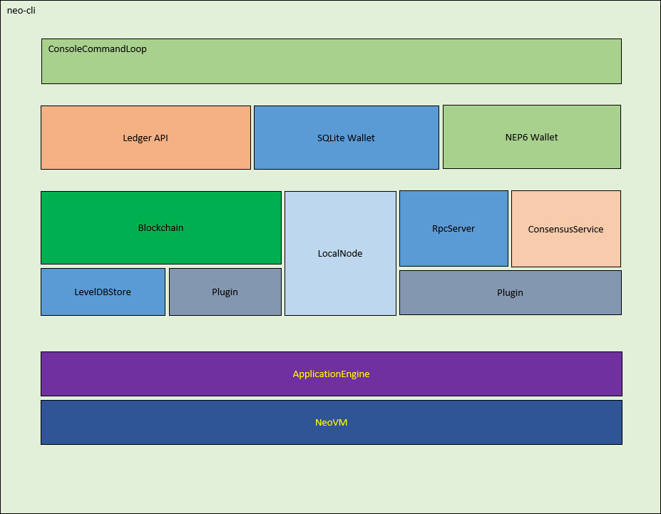

# Neo-cli 的结构

---

## 认识 neo-cli

neo 是一个基于点对点网络的区块链系统。它提供基于 UTXO 模型的数字资产记账功能，以及一个基于 neo 虚拟机的智能合约的执行环境。
这里描述这个网络中节点程序 neo-cli 的整体结构和基本行为。

---

## 整体结构
neo 的整体结构如下图。（由于版本升级，部分结构可能会有变化。）



### neo-cli命令行
neo-cli 是一个命令行程序。通过命令行控制台提供与区块链交互的基本功能。可以通过下述链接找到 neo-cli 的命令的详细说明。

<http://docs.neo.org/en-us/node/cli/cli.html>

(如果发现有死链接，请联系 <feedback@neo.org>)

### 账本 API
账本API定义了UTXO模型的基本数据类型，包括交易，区块，记账人等基础数据结构，细节在后续章节中介绍。或者请查看API文档了解细节。

### 钱包
neo的官方实现提供两种格式的钱包，其中一种是sqlite数据库格式的钱包。另一种是NEP-6钱包。sqlite格式钱包的优点是性能相对较好，缺点是适用的平台不如 NEP-6 钱包更广泛。

### LevelDBBlockchain
基于leveldb实现的区块链数据管理模块。向其它部分提供区块链数据的存储和查询服务。

### LocalNode
节点的网络通信的模块。负责与网络中的其它节点交换信息。细节将在后续章节中介绍。

### RpcServer
一个向外提供 RPC 调用接口的模块。可以通过下述链接查看 RPC 编程接口的细节。

<http://docs.neo.org/en-us/node/cli/2.9.0/api.html>

(如果发现有死链接，请联系 <feedback@neo.org>)

### ConsensusService
在 neo 的网络中，只有共识节点需要启动共识服务。共识节点通过点对点网络与其它共识节点交换信息，完成区块链中生成新的区块的过程。
细节将在后续章节中介绍。

### Plugin
通过插件的形式实现区块链中一些特定模块的逻辑，方便特定功能的定制和调试。包括下述四个种类。
 - ILogPlugin : 智能合约的执行结果存储插件。
 - IPolicyPlugin : 生成新区块时交易的排序策略插件。
 - IRpcPlugin : 执行RPC调用的插件。
 - IPersistencePlugin : TODO

### NeoVM
Neo 实现的虚拟机。用来执行验证脚本和智能合约。细节将在后续章节中介绍。
ApplicationEngine 是对 Neo VM 的一层封装。Neo VM 被设计成一个独立的模块。可以在区块链之外部署。而 ApplicationEngine 与区块链本身的联系更加紧密。

---

## 配置文件和其它文件
### config.json
```code
{
  "ApplicationConfiguration": {
    "Paths": {
      "Chain": "Chain_{0}",
      "Index": "Index_{0}"
    },
    "P2P": {
      "Port": 10333,
      "WsPort": 10334
    },
    "RPC": {
      "BindAddress": "127.0.0.1",
      "Port": 10332,
      "SslCert": "",
      "SslCertPassword": ""
    },
    "UnlockWallet": {
      "Path": "",
      "Password": "",
      "StartConsensus": false,
      "IsActive": false
    }
  }
}
```
属性说明：

 - **Paths/Chain** : 区块链数据库的存储目录前缀。存储目录的后缀是Magic数的8位16进制表示。Magic数将在后续提及。
 - **Paths/Index** : 钱包索引的存储目录前缀。
 - **P2P/Port** : 网络节点之间 TCP/IP 协议连接的监听端口号。
 - **P2P/WsPort** : 网络节点之间 WebSocket 协议连接的监听端口号。
 - **RPC/BindAddress** : JSON-RPC 服务的监听 IP 地址。
 - **RPC/Port** : JSON-RPC 服务的监听端口号。
 - **RPC/SslCert** : JSON-RPC 服务的安全连接的认证。默认为空时，不使用安全连接。
 - **RPC/SslCertPassword** : JSON-RPC 服务的安全连接的密码。默认为空时，不使用安全连接。
 - **UnlockWallet/IsActive** : 启动网络节点时是否自动解锁钱包。
 - **UnlockWallet/Path** : 启动网络节点时解锁钱包的钱包文件地址。
 - **UnlockWallet/Password** : 启动网络节点时解锁钱包的密码。
 - **UnlockWallet/StartConsensus** : 启动网络节点时是否自动开始共识。自动开始共识依赖于自动解锁钱包。

config.mainnet.json 和 config.testnet.json 是两个备份文件，分别存放主网和测试网的配置文件。


### protocol.json


### peers.dat


### error.log

---

## 启动的基本过程


