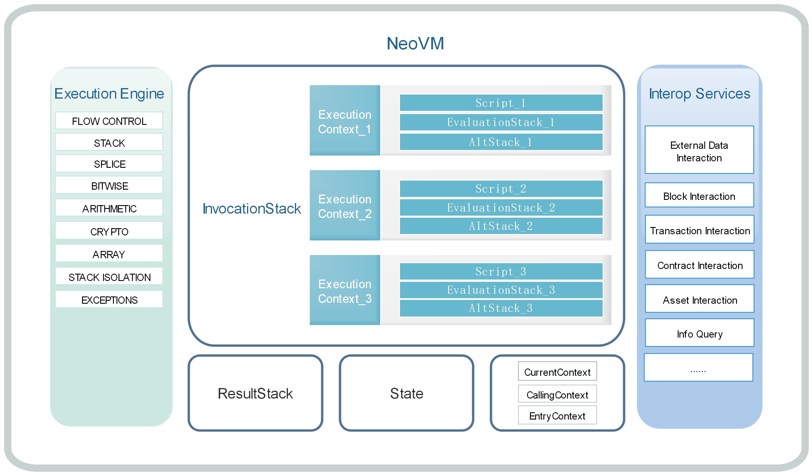

<center> <h2> Neo Virtual Machine</h2> </center>

&emsp;&emsp;NeoVM is a lightweight, general-purpose virtual machine which executes NEO smart contract code. The concept of virtual machine described in this paper is relatively narrow, it's not a simulation of physical machine by operating system. Unlike VMware or Hyper-V, it's mainly aimed at specific language.

&emsp;&emsp;For example, in JVM or CLR of .Net, the source code will be compiled into related bytecodes, and be executed on the corrresponding virtual machine. JVM or CLR will read instructions, decode, execute and write results back. Those steps are very similar to the concepts on real physical machines. However, the binary instructions are still running on the physical machine. It takes instructions from memory and transmits them to the CPU through the bus, then decodes, executes and stores the results.

# Virtual Device
[](../images/neo_vm/nvm.jpg)

The above figure is the system architecture of NeoVM, which includes execution engine, memory, interoperable services.

A complete operation process is as follows:

1. Compile the samrt contract source codes into bytecodes.

2. Push the bytecodes and related parameters as a running context into the `InvocationStack`.

3. Each time, the execution engine will the take the current context instruction, executes it, and stores the data in the evaluation stack (`EvaluationStack`) and temporary stack (`AltStack`) of the current context.

4. If need to access external data, call the interoperable service.

5. After all scripts executed, the results will be saved in the `ResultStack`. 

## Execution Engine

The left part is the virtual machine execution engine(equivalent to CPU), which can execute common instructions such as process control, stack operation, bit operation, arithmetic operation, logical operation, cryptography, etc. It can also interact with the interoperable services through system call. NeoVM has four states: `NONE`, `HALT`, `FAULT`, `BREAK`.

* `NONE` is normal state.

* `HALT` is a stop satte. When the `InvocationStack` is empty, namely all scripts are executed, the virtual machine state will be set to `HALT`.

* `FAULT` is an error state. When the operation is wrong, the virtual machine state will be set to `FAULT`.

* `BREAK` is an interrupt state and used in the debugging process of smart contracts generally.

Each time before the virtual machine start, the execution engine will detect the virtual machine state, and only when the state is `NONE`, can it start running.


## Memory

NeoVM has four memorys: `InvocationStack`, `EvaluationStack`, `AltStack` and `ResultStack`.

* `InvocationStack` is mainly used to store the running context data. Each running context has its own scripts, `EvaluationStack` and `AltStack`. Stacks are isolated from each other between different running contexts. Context switching is completed by relying on the `CurrentContext`, `CallingContext` and `EntryContext`. The `CurrentContext` points to the top element of the `InvocationStack`, which corresponds to `ExecutionContext_1` in the system architecture diagram. The `CallingContext` points to the second element of the `InvocationStack`, which corresponds to `ExecutionContext_2`. And the `EntryContext` points to the tail element of the `InvocationStack`, which corresponds to `ExecutionContext_3`.

* Each running context has its own `EvaluationStack` and `AltStack`. `EvaluationStack` is mainly used to execute corresponding operations according to instructions, and `AltStack` is used to save temporary data in computing process.

* After all scripts executed, the results will be saved in the `ResultStack`. 


# InteropService

右侧部分是虚拟机的互操作服务层（相当于外设）。目前互操作服务层提供了智能合约所能访问区块链数据的一些 API，利用这些 API，可以访问区块信息、交易信息、合约信息、资产信息等。

除此之外互操作服务层还为每个合约提供了一个持久化存储区的功能。NEO 的每个智能合约在创建的时候都可选地启用一个私有存储区，存储区是 key-value 形式的，NEO 智能合约由合约的被调用者决定持久化存储区的上下文，而非调用者来决定。当然，调用者需要将自己的存储上下文传给被调用者（即完成授权）后，被调用者才可以执行读写操作。

关于互操作服务的详细介绍在智能合约部分。


# Built-in data types

NeoVM内置的数据类型一共有7种：


| 类型 | 描述 |
|------|------|
| Boolean |  布尔类型，实现为一个bool值和两个字节数组TRUE和FALSE。|
| Integer | 整型，实现为一个BigInteger值。 |
| ByteArray | 字节数组，实现为一个byte[]。  |
| Array |  数组，实现为一个List<StackItem>，StackItem是一个抽象类，NeoVM内置的数据类型均继承自StackItem。 |
| Struct | 结构体，继承自Array。结构与Array相同，只是添加了Clone方法和重写了Equals方法。 |
| Map |  实现为一个键值对为StackItem的字典类型Dictionary<StackItem, StackItem> 。 |
| InteropInterface |  互操作接口 |


```c#
// boolean 类型
private static readonly byte[] TRUE = { 1 };
private static readonly byte[] FALSE = new byte[0];

private bool value;
```


# Instructions

Neo.VM虚拟机一共实现了113个指令（另外有4个被注释未实现指令），类别如下：

| 常数 | 流程控制 | 栈操作 | 字符串操作 | 逻辑运算 | 算术运算 | 密码学 | 高级数据结构 |栈隔离| 异常处理 |
| ---- | -------- | ------ | ------ | -------- | -------- | ------ | -------- | ------ | ---- |
| 25 | 9| 16| 5 | 5 | 25 | 7  | 14 | 5 | 2 |

下面将分别介绍各个指令的详细内容。


## 1.常数

常数部分指令主要完成向计算栈中压入常数或者数组的功能。

### PUSH0

| Instruction   | PUSH0                                 |
|--------|----------|
| Bytecode: | 0x00                                  |
| Alias: | PUSHF是PUSH0的别名                    |
| Function: | 向计算栈中压入一个长度为0的字节数组。 |

### PUSHBYTES

| Instruction   | PUSHBYTES1\~PUSHBYTES75                                    |
|----------|-----------------------------|
| Bytecode: | 0x01\~0x4B                                                 |
| Function:   | 向计算栈中压入一个字节数组，其长度等于本指令字节码的数值。 |

### PUSHDATA

| Instruction   | PUSHDATA1, PUSHDATA2, PUSHDATA4                                   |
|----------|---------------------------------------|
| Bytecode: | 0x4C, 0x4D, 0x4E                                                  |
| Function:   | 向计算栈中压入一个字节数组，其长度由本指令后的 1\|2\|4 字节指定。 |

### PUSHM1
------

| Instruction   | PUSHM1                                   |
|----------|------------------------------------------|
| Bytecode: | 0x4F                                     |
| Function:   | 向计算栈中压入一个大整数，其数值等于-1。 |

### PUSHN
-----

| Instruction   | PUSH1\~PUSH16                               |
|----------|---------------------------------------------|
| Bytecode: | 0x51\~0x60                                  |
| 别名：   | PUSHT是PUSH1的别名                          |
| Function:   | 向计算栈中压入一个大整数，其数值等于1\~16。 |

## 2.流程控制
用于控制的虚拟机运行流程，包括跳转、调用等指令。

### NOP

| Instruction   | NOP                                         |
|----------|---------------------------------------------|
| Bytecode: | 0x61                                        |
| Function:   | 空操作，但是会使指令计步器加1。 |

### JMP

| Instruction   | JMP                                                     |
|----------|---------------------------------------------------------|
| Bytecode: | 0x62                                                    |
| Function:   | 无条件跳转到指定偏移位置，偏移量由本指令后的2字节指定。 |

### JMPIF

| Instruction   | JMPIF                                                                                                                |
|----------|----------------------------------------------------------------------------------------------------------------------|
| Bytecode: | 0x63                                                                                                                 |
| Function:   | 当计算栈栈顶元素不等于0时，跳转到指定偏移位置，</br>偏移量由本指令后的2字节指定。不论条件判断成功与否，栈顶元素将被移除。 |

### JMPIFNOT

| Instruction   | JMPIFNOT                                                           |
|----------|--------------------------------------------------------------------|
| Bytecode: | 0x64                                                               |
| Function:   | 当计算栈栈顶元素等于0时，跳转到指定偏移位置，偏移量由本指令后的2字节指定 |

### CALL

| Instruction   | CALL                                                  |
|----------|-------------------------------------------------------|
| Bytecode: | 0x65                                                  |
| Function:   | 调用指定偏移位置的函数，偏移量由本指令后的2字节指定。 |

### RET

| Instruction   | RET                                                                                              |
|----------|--------------------------------------------------------------------------------------------------|
| Bytecode: | 0x66                                                                                             |
| Function:   | 移除调用栈的顶部元素，并使程序在调用栈的下一帧中继续执行。</br>如果调用栈为空，则虚拟机进入停机状态。 |

### APPCALL

| Instruction   | APPCALL                                              |
|----------|------------------------------------------------------|
| Bytecode: | 0x67                                                 |
| Function:   | 调用指定地址的函数，函数地址由本指令后的20字节指定。 |

### SYSCALL

| Instruction   | SYSCALL                                                |
|----------|--------------------------------------------------------|
| Bytecode: | 0x68                                                   |
| Function:   | 调用指定的互操作函数，函数名称由本指令后的字符串指定。 |

### TAILCALL

| Instruction   | TAILCALL                                                                                             |
|----------|------------------------------------------------------------------------------------------------------|
| Bytecode: | 0x69                                                                                                 |
| Function:   | 以尾调用的方式(调用完后不再返回当前执行环境)，</br>调用指定的互操作函数，函数名称由本指令后的字符串指定。 |

## 3.栈操作
实现对栈的元素做复制、移除、交换等功能。

### DUPFROMALTSTACK

| 指令   | DUPFROMALTSTACK                          |
|--------|------------------------------------------|
| 字节码 | 0x6A                                     |
| 功能   | 复制备用栈栈顶的元素，并将其压入计算栈。 |

### TOALTSTACK

| Instruction   | TOALTSTACK                               |
|----------|------------------------------------------|
| Bytecode: | 0x6B                                     |
| Function:   | 移除计算栈栈顶的元素，并将其压入备用栈。 |

### FROMALTSTACK

| Instruction   | FROMALTSTACK                             |
|----------|------------------------------------------|
| Bytecode: | 0x6C                                     |
| Function:   | 移除备用栈栈顶的元素，并将其压入计算栈。 |

### XDROP

| Instruction   | XDROP                                              |
|----------|----------------------------------------------------|
| Bytecode: | 0x6D                                               |
| Function:   | 移除计算栈栈顶的元素n，并移除剩余的索引为n的元素。 |
| Input:   | Xn Xn-1 ... X2 X1 X0 n                             |
| Output:   | Xn-1 ... X2 X1 X0                                  |

### XSWAP

| Instruction   | XSWAP                                                                   |
|----------|-------------------------------------------------------------------------|
| Bytecode: | 0x72                                                                    |
| Function:   | 移除计算栈栈顶的元素n，并将剩余的索引为0的元素和索引为n的元素交换位置。 |
| Input:   | Xn Xn-1 ... X2 X1 X0 n                                                  |
| Output:   | X0 Xn-1 ... X2 X1 Xn                                                    |

### XTUCK

| Instruction   | XTUCK                                                                     |
|----------|---------------------------------------------------------------------------|
| Bytecode: | 0x73                                                                      |
| Function:   | 移除计算栈栈顶的元素n，并将剩余的索引为0的元素复制并插入到索引为n的位置。 |
| Input:   | Xn Xn-1 ... X2 X1 X0 n                                                    |
| Output:   | Xn X0 Xn-1 ... X2 X1 X0                                                   |

### DEPTH

| Instruction   | DEPTH                                  |
|----------|----------------------------------------|
| Bytecode: | 0x74                                   |
| Function:   | 将当前计算栈中的元素数量压入计算栈顶。 |

### DROP

| Instruction   | DROP                   |
|----------|------------------------|
| Bytecode: | 0x75                   |
| Function:   | 移除计算栈栈顶的元素。 |

### DUP

| Instruction   | DUP                    |
|----------|------------------------|
| Bytecode: | 0x76                   |
| Function:   | 复制计算栈栈顶的元素。 |
| Input:   | X                      |
| Output:   | X X                    |

### NIP

| Instruction   | NIP                         |
|----------|-----------------------------|
| Bytecode: | 0x77                        |
| Function:   | 移除计算栈栈顶的第2个元素。 |
| Input:   | X1 X0                       |
| Output:   | X0                          |

### OVER 

| Instruction   | OVER                                     |
|----------|------------------------------------------|
| Bytecode: | 0x78                                     |
| Function:   | 复制计算栈栈顶的第二个元素，并压入栈顶。 |
| Input:   | X1 X0                                    |
| Output:   | X1 X0 X1                                 |

### PICK 

| Instruction   | PICK                                                       |
|----------|------------------------------------------------------------|
| Bytecode: | 0x79                                                       |
| Function:   | 移除计算栈栈顶的元素n，并将剩余的索引为n的元素复制到栈顶。 |
| Input:   | Xn Xn-1 ... X2 X1 X0 n                                     |
| Output:   | Xn Xn-1 ... X2 X1 X0 Xn                                    |

### ROLL 

| Instruction   | ROLL                                                       |
|----------|------------------------------------------------------------|
| Bytecode: | 0x7A                                                       |
| Function:   | 移除计算栈栈顶的元素n，并将剩余的索引为n的元素移动到栈顶。 |
| Input:   | Xn Xn-1 ... X2 X1 X0 n                                     |
| Output:   | Xn-1 ... X2 X1 X0 Xn                                       |

### ROT 

| Instruction   | ROT                                         |
|----------|---------------------------------------------|
| Bytecode: | 0x7B                                        |
| Function:   | 移除计算栈栈顶的第3个元素，并将其压入栈顶。 |
| Input:   | X2 X1 X0                                    |
| Output:   | X1 X0 X2                                    |

### SWAP 

| Instruction   | SWAP                           |
|----------|--------------------------------|
| Bytecode: | 0x7C                           |
| Function:   | 交换计算栈栈顶两个元素的位置。 |
| Input:   | X1 X0                          |
| Output:   | X0 X1                          |

### TUCK 

| Instruction   | TUCK                                  |
|----------|---------------------------------------|
| Bytecode: | 0x7D                                  |
| Function:   | 复制计算栈栈顶的元素到索引为2的位置。 |
| Input:   | X1 X0                                 |
| Output:   | X0 X1 X0                              |

## 4.字符串操作

### CAT

| Instruction   | CAT                                              |
|----------|--------------------------------------------------|
| Bytecode: | 0x7E                                             |
| Function:   | 移除计算栈栈顶的两个元素，并将其拼接后压入栈顶。 |
| Input:   | X1 X0                                            |
| Output:   | Concat(X1,X0)                                    |

### SUBSTR

| Instruction   | SUBSTR                                       |
|----------|----------------------------------------------|
| Bytecode: | 0x7F                                         |
| Function:   | 移除计算栈栈顶的三个元素，取子串后压入栈顶。 |
| Input:   | X index len                                  |
| Output:   | SubString(X,index,len)                       |

### LEFT

| Instruction   | LEFT                                         |
|----------|----------------------------------------------|
| Bytecode: | 0x80                                         |
| Function:   | 移除计算栈栈顶的两个元素，取子串后压入栈顶。 |
| Input:   | X len                                        |
| Output:   | Left(X,len)                                  |

### RIGHT

| Instruction   | RIGHT                                        |
|----------|----------------------------------------------|
| Bytecode: | 0x81                                         |
| Function:   | 移除计算栈栈顶的两个元素，取子串后压入栈顶。 |
| Input:   | X len                                        |
| Output:   | Right(X,len)                                 |

### SIZE

| Instruction   | SIZE                             |
|----------|----------------------------------|
| Bytecode: | 0x82                             |
| Function:   | 将计算栈栈顶元素的长度压入栈顶。 |
| Input:   | X                                |
| Output:   | X len(X)                         |

## 5.逻辑运算

### INVERT

| Instruction   | INVERT                       |
|----------|------------------------------|
| Bytecode: | 0x83                         |
| Function:   | 对计算栈栈顶的元素按位取反。 |
| Input:   | X                            |
| Output:   | \~X                          |

### AND

| Instruction   | AND                                    |
|----------|----------------------------------------|
| Bytecode: | 0x84                                   |
| Function:   | 对计算栈栈顶的两个元素执行按位与运算。 |
| Input:   | AB                                     |
| Output:   | A&B                                    |

### OR

| Instruction   | OR                                     |
|----------|----------------------------------------|
| Bytecode: | 0x85                                   |
| Function:   | 对计算栈栈顶的两个元素执行按位或运算。 |
| Input:   | AB                                     |
| Output:   | A\|B                                   |

### XOR

| Instruction   | XOR                                      |
|----------|------------------------------------------|
| Bytecode: | 0x86                                     |
| Function:   | 对计算栈栈顶的两个元素执行按位异或运算。 |
| Input:   | AB                                       |
| Output:   | A\^B                                     |

### EQUAL

| Instruction   | EQUAL                                        |
|----------|----------------------------------------------|
| Bytecode: | 0x87                                         |
| Function:   | 对计算栈栈顶的两个元素执行逐字节的相等判断。 |
| Input:   | AB                                           |
| Output:   | Equals(A,B)                                  |

## 6.算术运算

### INC

| Instruction   | INC                                |
|----------|------------------------------------|
| Bytecode: | 0x8B                               |
| Function:   | 对计算栈栈顶的大整数执行递增运算。 |
| Input:   | X                                  |
| Output:   | X+1                                |

### DEC

| Instruction   | DEC                                |
|----------|------------------------------------|
| Bytecode: | 0x8C                               |
| Function:   | 对计算栈栈顶的大整数执行递减运算。 |
| Input:   | X                                  |
| Output:   | X-1                                |

### SIGN

| Instruction   | SIGN                                         |
|----------|----------------------------------------------|
| Bytecode: | 0x8D                                         |
| Function:   | 获取计算栈栈顶的大整数的符号（负、正或零）。 |
| Input:   | X                                            |
| Output:   | X.Sign()                                     |

### NEGATE

| Instruction   | NEGATE                         |
|----------|--------------------------------|
| Bytecode: | 0x8F                           |
| Function:   | 求计算栈栈顶的大整数的相反数。 |
| Input:   | X                              |
| Output:   | \-X                            |

### ABS

| Instruction   | ABS                            |
|----------|--------------------------------|
| Bytecode: | 0x90                           |
| Function:   | 求计算栈栈顶的大整数的绝对值。 |
| Input:   | X                              |
| Output:   | Abs(X)                         |

### NOT

| Instruction   | NOT                                |
|----------|------------------------------------|
| Bytecode: | 0x91                               |
| Function:   | 对计算栈栈顶的元素执行逻辑非运算。 |
| Input:   | X                                  |
| Output:   | !X                                 |

### NZ

| Instruction   | NZ                                  |
|----------|-------------------------------------|
| Bytecode: | 0x92                                |
| Function:   | 判断计算栈栈顶的大整数是否为非0值。 |
| Input:   | X                                   |
| Output:   | X!=0                                |

### ADD

| Instruction   | ADD                                    |
|----------|----------------------------------------|
| Bytecode: | 0x93                                   |
| Function:   | 对计算栈栈顶的两个大整数执行加法运算。 |
| Input:   | AB                                     |
| Output:   | A+B                                    |

### SUB

| Instruction   | SUB                                    |
|----------|----------------------------------------|
| Bytecode: | 0x94                                   |
| Function:   | 对计算栈栈顶的两个大整数执行减法运算。 |
| Input:   | AB                                     |
| Output:   | A-B                                    |

### MUL

| Instruction   | MUL                                    |
|----------|----------------------------------------|
| Bytecode: | 0x95                                   |
| Function:   | 对计算栈栈顶的两个大整数执行乘法运算。 |
| Input:   | AB                                     |
| Output:   | A\*B                                   |

### DIV

| Instruction   | DIV                                    |
|----------|----------------------------------------|
| Bytecode: | 0x96                                   |
| Function:   | 对计算栈栈顶的两个大整数执行除法运算。 |
| Input:   | AB                                     |
| Output:   | A/B                                    |

### MOD

| Instruction   | MOD                                    |
|----------|----------------------------------------|
| Bytecode: | 0x97                                   |
| Function:   | 对计算栈栈顶的两个大整数执行求余运算。 |
| Input:   | AB                                     |
| Output:   | A%B                                    |

### SHL

| Instruction   | SHL                              |
|----------|----------------------------------|
| Bytecode: | 0x98                             |
| Function:   | 对计算栈中的大整数执行左移运算。 |
| Instruction   | Xn                               |
| Bytecode: | X\<\<n                           |

### SHR

| Instruction   | SHR                              |
|----------|----------------------------------|
| Bytecode: | 0x99                             |
| Function:   | 对计算栈中的大整数执行右移运算。 |
| Input:   | Xn                               |
| Output:   | X\>\>n                           |

### BOOLAND

| Instruction   | BOOLAND                                |
|----------|----------------------------------------|
| Bytecode: | 0x9A                                   |
| Function:   | 对计算栈栈顶的两个元素执行逻辑与运算。 |
| Input:   | AB                                     |
| Output:   | A&&B                                   |

### BOOLOR

| Instruction   | BOOLOR                                 |
|----------|----------------------------------------|
| Bytecode: | 0x9D                                   |
| Function:   | 对计算栈栈顶的两个元素执行逻辑或运算。 |
| Input:   | AB                                     |
| Output:   | A\|\|B                                 |

### NUMEQUAL

| Instruction   | NUMEQUAL                               |
|----------|----------------------------------------|
| Bytecode: | 0x9C                                   |
| Function:   | 对计算栈栈顶的两个大整数执行相等判断。 |
| Input:   | AB                                     |
| Output:   | A==B                                   |

### NUMNOTEQUAL

| Instruction   | NUMNOTEQUAL                              |
|----------|------------------------------------------|
| Bytecode: | 0x9E                                     |
| Function:   | 对计算栈栈顶的两个大整数执行不相等判断。 |
| Input:   | AB                                       |
| Output:   | A!=B                                     |

### LT 

| Instruction   | LT                                     |
|----------|----------------------------------------|
| Bytecode: | 0x9F                                   |
| Function:   | 对计算栈栈顶的两个大整数执行小于判断。 |
| Input:   | AB                                     |
| Output:   | A\<B                                   |

### GT

| Instruction   | GT                                     |
|----------|----------------------------------------|
| Bytecode: | 0xA0                                   |
| Function:   | 对计算栈栈顶的两个大整数执行大于判断。 |
| Input:   | AB                                     |
| Output:   | A\>B                                   |

### LTE

| Instruction   | LTE                                        |
|----------|--------------------------------------------|
| Bytecode: | 0xA1                                       |
| Function:   | 对计算栈栈顶的两个大整数执行小于等于判断。 |
| Input:   | AB                                         |
| Output:   | A\<=B                                      |

### GTE

| Instruction   | GTE                                        |
|----------|--------------------------------------------|
| Bytecode: | 0xA2                                       |
| Function:   | 对计算栈栈顶的两个大整数执行大于等于判断。 |
| Input:   | AB                                         |
| Output:   | A\>=B                                      |

### MIN

| Instruction   | MIN                                    |
|----------|----------------------------------------|
| Bytecode: | 0xA3                                   |
| Function:   | 取出计算栈栈顶的两个大整数中的最小值。 |
| Input:   | AB                                     |
| Output:   | Min(A,B)                               |

### MAX

| Instruction   | MAX                                    |
|----------|----------------------------------------|
| Bytecode: | 0xA4                                   |
| Function:   | 取出计算栈栈顶的两个大整数中的最大值。 |
| Input:   | AB                                     |
| Output:   | Max(A,B)                               |

### WITHIN

| Instruction   | WITHIN                                       |
|----------|----------------------------------------------|
| Bytecode: | 0xA5                                         |
| Function:   | 判断计算栈中的大整数是否在指定的数值范围内。 |
| Input:   | XAB                                          |
| Output:   | A\<=X&&X\<B                                  |

## 7.密码学
实现了常用的哈希运算以及签名验证等。

### SHA1 

| Instruction   | SHA1                             |
|----------|----------------------------------|
| Bytecode: | 0xA7                             |
| Function:   | 对计算栈栈顶的元素执行SHA1运算。 |
| Input:   | X                                |
| Output:   | SHA1(X)                          |

### SHA256

| Instruction   | SHA256                             |
|----------|------------------------------------|
| Bytecode: | 0xA8                               |
| Function:   | 对计算栈栈顶的元素执行SHA256运算。 |
| Input:   | X                                  |
| Output:   | SHA256(X)                          |

### HASH160

| Instruction   | HASH160                                     |
|----------|---------------------------------------------|
| Bytecode: | 0xA9                                        |
| Function:   | 对计算栈栈顶的元素执行内置的160位散列运算。 |
| Input:   | X                                           |
| Output:   | HASH160(X)                                  |

### HASH256

| Instruction   | HASH256                                     |
|----------|---------------------------------------------|
| Bytecode: | 0xAA                                        |
| Function:   | 对计算栈栈顶的元素执行内置的256位散列运算。 |
| Input:   | X                                           |
| Output:   | HASH256(X)                                  |

### CHECKSIG

| Instruction   | CHECKSIG                                                                       |
|----------|--------------------------------------------------------------------------------|
| Bytecode: | 0xAC                                                                           |
| Function:   | 利用计算栈栈顶元素中的签名和公钥，对当前验证对象执行内置的非对称签名验证操作。 |
| Input:   | SK                                                                             |
| Output:   | Verify(S,K)                                                                    |

### VERIFY

| Instruction   | VERIFY                                                                     |
|----------|----------------------------------------------------------------------------|
| Bytecode: | 0xAD                                                                       |
| Function:   | 利用计算栈栈顶元素中的签名、公钥和验证对象，执行内置的非对称签名验证操作。 |
| Input:   | MSK                                                                        |
| Output:   | Verify(M,S,K)                                                              |

### CHECKMULTISIG

| Instruction   | CHECKMULTISIG                                                                                  |
|----------|------------------------------------------------------------------------------------------------|
| Bytecode: | 0xAE                                                                                           |
| Function:   | 利用计算栈栈顶元素中的多个签名和公钥，对当前验证对象执行内置的非对称多重签名验证操作。         |
| Input:   | Sm-1 ... S2 S1 S0 m Kn-1 ... K2 K1 K0 n                                                        |
| Output:   | V                                                                                              |
| 备注：   | 对于任意的𝑆𝑖∈{𝑆0,…, 𝑆𝑚−1}，存在一个𝐾𝑗∈{𝐾0, … , 𝐾𝑛−1}</br>使得Verify(𝑆𝑖, 𝐾𝑗) ==1，则V=1；否则，V=0。 |

## 8.高级数据结构
实现对Array、Map、Struct等的常用操作。

### ARRAYSIZE

| Instruction   | ARRAYSIZE                        |
|----------|----------------------------------|
| Bytecode: | 0xC0                             |
| Function:   | 获取计算栈栈顶的数组的元素数量。 |
| Input:   | [X0 X1 X2 ... Xn-1]              |
| Output:   | n                                |

### PACK

| Instruction   | PACK                              |
|----------|-----------------------------------|
| Bytecode: | 0xC1                              |
| Function:   | 将计算栈栈顶的n个元素打包成数组。 |
| Input:   | Xn-1 ... X2 X1 X0 n               |
| Output:   | [X0 X1 X2 ... Xn-1]               |

### UNPACK

| Instruction   | UNPACK                             |
|----------|------------------------------------|
| Bytecode: | 0xC2                               |
| Function:   | 将计算栈栈顶的数组拆包成元素序列。 |
| Input:   | [X0 X1 X2 ... Xn-1]                |
| Output:   | Xn-1 ... X2 X1 X0 n                |

### PICKITEM

| Instruction   | PICKITEM                           |
|----------|------------------------------------|
| Bytecode: | 0xC3                               |
| Function:   | 获取计算栈栈顶的数组中的指定元素。 |
| Input:   | [X0 X1 X2 ... Xn-1] i              |
| Output:   | Xi                                 |

### SETITEM\*

| Instruction   | SETITEM                                  |
|----------|------------------------------------------|
| Bytecode: | 0xC4                                     |
| Function:   | 对计算栈栈顶的数组中的指定位置元素赋值。 |
| Input:   | [X0 X1 X2 ... Xn-1] I V                  |
| Output:   | [X0 X1 X2 Xi-1 V X i+1 ... Xn-1]         |

### NEWARRAY

| Instruction   | NEWARRAY                           |
|----------|------------------------------------|
| Bytecode: | 0xC5                               |
| Function:   | 在计算栈栈顶新建一个大小为n的Array |
| Input:   | n                                  |
| Output:   | Array(n)值全为fasle的Array         |

### NEWSTRUCT

| Instruction   | NEWSTRUCT                           |
|----------|-------------------------------------|
| Bytecode: | 0xC6                                |
| Function:   | 在计算栈栈顶新建一个大小为n的Struct |
| Input:   | n                                   |
| Output:   | Struct(n)值全为fasle的Struct        |

### NEWMAP

| Instruction   | NEWMAP                  |
|----------|-------------------------|
| Bytecode: | 0xC7                    |
| Function:   | 在计算栈栈顶新建一个Map |
| Input:   | 无                      |
| Output:   | Map()                   |

### APPEND\*

| Instruction   | APPEND                |
|----------|-----------------------|
| Bytecode: | 0xC8                  |
| Function:   | 向Array中添加一个新项 |
| Input:   | Array item            |
| Output:   | Array.add(item)       |

### REVERSE\*

| Instruction   | REVERSE             |
|----------|---------------------|
| Bytecode: | 0xC9                |
| Function:   | 将Array元素倒序排列 |
| Input:   | [X0 X1 X2 ... Xn-1] |
| Output:   | [Xn-1 ... X2 X1 X0] |

### REMOVE\*

| Instruction   | REMOVE                            |
|----------|-----------------------------------|
| Bytecode: | 0xCA                              |
| Function:   | 从Array或Map中移除指定元素        |
| Input:   | [X0 X1 X2 ... Xn-1] m             |
| Output:   | [X0 X1 X2 ... Xm-1 Xm+1 ... Xn-1] |

### HASKEY

| Instruction   | HASKEY                              |
|----------|-------------------------------------|
| Bytecode: | 0xCB                                |
| Function:   | 判断Array或Map中是否包含Key指定元素 |
| Input:   | [X0 X1 X2 ... Xn-1] key             |
| Output:   | true 或 false                       |

### KEYS

| Instruction   | KEYS                                |
|----------|-------------------------------------|
| Bytecode: | 0xCC                                |
| Function:   | 获取Map的所有Key，并放入新的Array中 |
| Input:   | Map                                 |
| Output:   | [key1 key2 ... key n]               |

### VALUES

| Instruction   | VALUES                                  |
|----------|-----------------------------------------|
| Bytecode: | 0xCD                                    |
| Function:   | 获取Array或Map所有值，并放入新的Array中 |
| Input:   | Map或Array                              |
| Output:   | [Value1 Value2... Value n]              |

## 9.异常处理

### THROW

| Instruction   | THROW                 |
|----------|-----------------------|
| Bytecode: | 0xF0                  |
| Function:   | 将虚拟机状态置为FAULT |

### THROWIFNOT

| Instruction   | THROWIFNOT                                                       |
|----------|------------------------------------------------------------------|
| Bytecode: | 0xF1                                                             |
| Function:   | 从计算栈栈顶读取一个布尔值，如果为False，则将虚拟机状态置为FAULT |

注：带\*操作码表示该操作码的操作结果并未使用PUSH()放回计算栈。