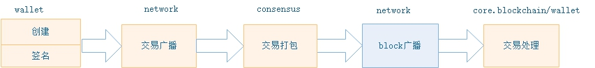

<center><h2> 交易流程 </h2></center>

&emsp;&emsp;交易，是区块链网络的交互操作的唯一方式，包括发布资产，转账，发布智能合约，合约调用等等，都是基于交易的方式进行操作处理。
NEO中的交易，也是采用比特币类似交易的设计，每一笔交易都包含三个重要部分：input, output, scripts。 input代表资金来源，output代表资金流出，scripts是对input所引用交易的output的验证解锁，通过这种 input-output 组合方式，将资产的每一笔流动都形成了一条链条结构。

&nbsp;
&nbsp;

## 交易类型

NEO中定义的交易类型如下所示：

| 名称 | 交易手续费(单位GAS) | 描述 |
| --------   | :-----:   | :----: |
| MinerTransaction | 0 | 用于分配字节费的交易 |
| RegisterTransaction | 10000/0 | (已弃用) 用于资产登记的交易
| IssueTransaction | 500/0 | 用于分发资产的交易
| ClaimTransaction | 0 | 用于分配 NeoGas 的交易
| EnrollmentTransaction | 1000 | (已弃用) 用于报名成为共识候选人的特殊交易
| StateTransaction | 1000/0 | 申请见证人或共识节点投票
| ContractTransaction | 0 | 合约交易，这是最常用的一种交易
| PublishTransaction | 500*n | (已弃用) 智能合约发布的特殊交易
| InvocationTransaction | 0 | 调用智能合约的特殊交易

&nbsp;


### 共同特征

所有的交易类型均派生自Neo.Core.Transaction类型。在该类型里，提供了一些共有的功能和特征，如：

* **交易属性**

交易的属性列表和最大属性数量 = 16，交易类型（如前文所示），版本（默认为1），等等


* **交易的功能性**

 输入/输出列表，验证该交易的脚本列表，网络/系统费用，每一个交易输入所引用的交易输出，获取需要校验的脚本散列值，获取交易后各资产的变化量，交易验证，等等

其中，网络费用的计算方法如下：
        
每一个交易输入所引用的交易输出中，资产种类为GAS的，计算其资产值之和input，并计算输出列表中，资产种类为GAS的资产之和output，则 `网络费 = input - output - 系统费`。

* **交易的读写操作**

ReflectionCache，Size，序列化/反序列化，等等

* **TransactionAttribute**

Attributes 是Transaction类别的一个变量，表示该交易所具备的额外特性。数据结构如下：

| 尺寸 | 字段 | 类型 | 描述 |
|---|-------|------|------|
| 1 | Usage | TransactionAttributeUsage | 属性类型 |
| 0|1 | length | uint8 | 	数据长度（特定情况下会省略） |
| ? | Data | byte[length] | 特定于用途的外部数据 | 

TransactionAttributeUsage，表示交易属性，数据结构如下：

| 字段 | 值 | 描述 |
|-------|-----|----|
| ContractHash | 0x00 | 外部合同的散列值 |
| ECDH02 | 0x02 | 用于ECDH密钥交换的公钥，该公钥的第一个字节为0x02 |
| ECDH03 | 0x03 | 用于ECDH密钥交换的公钥，该公钥的第一个字节为0x03 |
| Script | 0x20 | 用于对交易进行额外的验证, 如股权类转账，存放收款人的脚本hash |
| Vote | 0x30 | 投票 |
| DescriptionUrl | 0x81 | 外部介绍信息地址 |
| Description | 0x90 | 简短的介绍信息 |
| Hash1 - Hash15 | 0xa1-0xaf | 用于存放自定义的散列值 |
| Remark-Remark15 | 0xf0-0xff | 备注 |


目前实际使用到的TransactionAttributeUsage 有两个，TransactionAttributeUsage.Script（脚本）和TransactionAttributeUsage.Remark（备注），均用于InvocationTransaction。 因InvocationTransaction肩负资产注册，发布合约，以及部份转账的功能，需要TransactionAttribute作为补充信息。


### MinerTransaction


| 尺寸 | 字段 | 名称  | 类型 | 描述 |
|----|-----|-------|------|------|
|  -  | - | - | -  | 	交易的公共字段  |
| 4 | Nonce | 交易nonce | uint | 创世区块的Nonce的值与比特币的创世区块相同，为2083236893，而其他情况下为随机数值。 |
|  -  | - | - | -  | 	交易的公共字段  |

分配字节费的特殊交易。系统在创世块创建了第一个MinerTransaction，此后在创建新块的时候，由议长创建相应的MinerTransaction。


### RegisterTransaction


| 尺寸 | 字段 | 名称  | 类型 | 描述 |
|----|-----|-------|------|------|
|  -  | - | - | -  | 	交易的公共字段  |
| 1 | AssetType | 资产类型 | byte |  |
| ? | Name | 资产名字 | string |  |
| 8 | Amount | 资产总量 | Fixed8 |  |
| 1 | Precision | 精度 | byte |  |
| ? | Owner | 所有者公钥 | ECPoint |  |
| 20 | Admin | 管理员地址脚本hash | UInt160 |  |
|  -  | - | - | -  | 	交易的公共字段  |

 
资产登记交易。系统在创世区块调用RegisterTransaction发行了两个资产种类：NEO Coin（旧称小蚁股，AntShare）和NEO Gas（旧称小蚁币，AntCoin）。注意，用户在GUI创建资产种类时，实际调用的是InvocationTransaction。


Amount 为发行总量，共有2种模式：

   1. **限量模式**：当Amount为正数时，表示当前资产的最大总量为Amount，且不可修改（股权在未来可能会支持扩股或增发，会考虑需要公司签名或一定比例的股东签名认可）。

   2. **不限量模式**：当Amount等于-1时，表示当前资产可以由创建者无限量发行。这种模式的自由度最大，但是公信力最低，不建议使用。

### IssueTransaction


分发资产的特殊交易。完成资产注册后，就可以在资产创设所设定的总量上限范围内，向发行人指定的地址中发放该资产。分发后的资产可以用于转账和交易。分发资产需要消耗一定数量的 GAS 作为附加服务费，目前为1 GAS。

注意，1） 当版本大于等于1时，手续费为0；2） 当输出列表中的元素的资产种类为NEO或GAS时，手续费为0；否则手续费为500GAS。


### ClaimTransaction

| 尺寸 | 字段 | 名称  | 类型 | 描述 |
|----|-----|-------|------|------|
|  -  | - | - | -  | 	交易的公共字段  |
| 34*? | Claims | Claim已花费的交易 | CoinReference[] | 用于分配的 NEO |
|  -  | - | - | -  | 	交易的公共字段  |


提取NeoGas 的交易。可以通过CLI的claim gas指令或者在NEO GUI的提取GAS功能，调用ClaimTransaction完成提取GAS的操作。


### EnrollmentTransaction


| 尺寸 | 字段 | 名称  | 类型 | 描述 |
|----|-----|-------|------|------|
|  -  | - | - | -  | 	交易的公共字段  |
| ? | PublicKey | 记账人的公钥 | ECPoint | 用于分配的 NEO |
|  -  | - | - | -  | 	交易的公共字段  |

报名成为共识候选人的特殊交易

### StateTransaction

| 尺寸 | 字段 | 名称  | 类型 | 描述 |
|----|-----|-------|------|------|
|  -  | - | - | -  | 	交易的公共字段  |
| ?*? | Descriptors | 投票信息 | StateDescriptor[] |  |
|  -  | - | - | -  | 	交易的公共字段  |

申请见证人或共识节点投票的交易。用户可以在NEO GUI报名成为候选人，成为候选人后就可以根据投票数竞选成为共识节点。报名成为候选人需要花费手续费 1000 GAS。具体操作请参阅[选举与投票](./consensus/vote_validator.md)。


### ContractTransaction

合约交易，最常用的一种交易。ContractTransaction用于转账交易（NEO CLI, API 的send指令，以及GUI的send操作）。


### PublishTransaction

| 尺寸 | 字段 | 名称  | 类型 | 描述 |
|----|-----|-------|------|------|
|  -  | - | - | -  | 	交易的公共字段  |
| ? | Script | 合约的脚本 | byte[] |  |
| ? | ParameterList | 参数类型列表 | ContractParameterType |  |
| 1 | ReturnType | 返回类型 | ContractParameterType |  |
| 1 | NeedStorage | 是否需要存储空间 | bool |  |
| ? | Name | 合约名称 | string |  |
| ? | CodeVersion | 合约版本编号 | string |  |
| ? | Author | 合约作者姓名 | string |  |
| ? | Email | 电子邮箱 | string |  |
| ? | Description | 合约描述 | string |  |
|  -  | - | - | -  | 	交易的公共字段  |


智能合约发布的特殊交易。注意, 用户在GUI发布智能合约时，实际调用的是InvocationTransaction。

### InvocationTransaction


| 尺寸 | 字段 | 名称  | 类型 | 描述 |
|----|-----|-------|------|------|
|  -  | - | - | -  | 	交易的公共字段  |
| ? | Script | 合约的脚本 | byte[] |  |
| 8 | Gas | 消耗的Gas | Fixed8 |  |
|  -  | - | - | -  | 	交易的公共字段  |

调用智能合约的特殊交易。用户可以通过NEO API的`invoke/invokefunction/invokescript`指令，或者NEO GUI，根据输入的智能合约信息创建InvocationTransaction对象并调用。z注，用户在GUI创建资产种类和发布智能合约时，实际调用的是InvocationTransaction。

| InvokeTX用途 | 调用脚本 | Attributes | 包含属性 |
|--------------|------------|--------------|
| 执行智能合约 | 调用合约的脚本  |  空 |   | 
| 发布合约 | Neo.Contract.Create  |   空  |   | 
| 资产注册 | Neo.Asset.Create |  非空 | TransactionAttributeUsage.Script,资产所有者的地址脚本hash，数目 1 |
| GUI 转账 | NEP-5资产时，调用合约transfer方法；<br/>全局资产时，空，走UTXO方式  |  非空 | TransactionAttributeUsage.Script，转账账户地址，数目若干 <br/> TransactionAttributeUsage.Remark，备注数据，数目 1 |
| CLI 非“sendall”转账 | 同上  |  非空 |  TransactionAttributeUsage.Script, 转账账户地址，数目 若干 |  


NEO 智能合约在部署或者执行的时候都要缴纳一定的手续费，分为部署费用和执行费用。部署费用是指开发者将一个智能合约部署到区块链上需要向区块链系统支付一定的费用（目前是 500 Gas）。执行费用是指每执行一条智能合约的指令都会向 NEO 系统支付一定的执行费用。具体收费标准请参阅[智能合约费用](http://docs.neo.org/zh-cn/sc/systemfees.html)。

关于智能合约的相关信息，请查阅[智能合约介绍](http://docs.neo.org/zh-cn/sc/introduction.html)。

&nbsp;
&nbsp;

-------------------

## 交易流程

<p align="center"><br></p>


一笔交易，在Neo-Cli, Neo-RPC, 或 NEO-GUI 被创建，经钱包验证与签名，构建出完整的交易数据，并通过节点进行全网广播。
共识节点收到该笔交易后，进行校验并放入到内存池，在某次共识阶段，打包该交易到新块中。最后，伴随着新块的全网广播，该交易被全网节点执行处理。 整个流程可以看简化成如下图：

<p align="center"><br></p>


1. 交易构建： 用户发起一笔交易

2. 交易签名： 完成对交易签名，解锁交易输入

3. 交易广播： 广播交易

4. 交易打包： 共识议长打包交易到新块中

5. 交易处理： 经共识出块广播，交易被全网节点执行处理


### （1）创建交易


用户可用通过Neo-CLI, NEO-RPC, 或NEO-GUI 创建交易，最后经钱包，构建出完整的交易。


1. 通过CLI指令

```bash
send <id|alias> <address> <value>|all [fee=0]
```

其中

 - id|alias：资产ID或名称
 - address：对方地址
 - value: 转账金额，也可以用all表示所有资产
 - fee：手续费，缺省值为0


2. 通过RPC调用


+ sendfrom：从指定地址，向指定地址转账。

+ sendtoaddress：向指定地址转账。

+ sendmany：批量转账命令，并且可以指定找零地址。

具体用法请参照[NEO Documentation: API 参考](http://docs.neo.org/zh-cn/node/cli/apigen.html)。 


3. 通过GUI界面

具体操作请参照[NEO Documentation: NEO GUI 交易](http://docs.neo.org/zh-cn/node/gui/transc.html)。


钱包构建完整交易接口定义：


```c#
public Transaction MakeTransaction(List<TransactionAttribute> attributes, IEnumerable<TransferOutput> outputs, UInt160 from, UInt160 change_address, Fixed8 fee);
```

其中
   - attributes：交易特性
   - outputs：处理的转账信息
   - from：转账的付款账户
   - change_address：找零地址
   - fee：系统费


生成交易步骤：

1. 统计交易：将转账信息列表各对象按照其每个成员对象的（资产ID，地址）组合进行分组，每个分组即为一个独立的收款方；并求出每个分组的成员的Value之和。

2. 账户信息：获取钱包中，非Lock且非WatchOnly状态的账户的余额信息

3. 生成交易：

     1. 对于每个收款方，若其数额小于当前钱包各账户余额之和，返回；否则，按照“使用账户数目最少”规则生成交易：

     2. 若存在余额大于转账金额的账户，则从满足条件的账户中余额最小的账户转账；否则，使用贪心法：将钱包各账户按照余额由高到低排序，依次调用各账户：
     
     3. 若当前账户余额小于等于当前转账金额，将当前账户加入返回结果，并从转账金额中扣除当前账户的余额；
      
     4. 否则，若此时转账金额不为零，则从剩下的账户中，选择余额大于等于当前转账金额的账户中，余额最小的账户加入返回结果；为零则直接返回。


### （2）签名验证


进行签名，加入到未处理队列，以及交易验证

```c#
public bool Sign(ContractParametersContext context);
```

其中

   - context：将上一步生成的交易转换为ContractParametersContext类型，包含了交易的所有信息。


**签名步骤**：

1. 对于输入脚本的ScriptHashes的每个对象，取得相应的账户，若对应帐户为空，或该账户没有密钥串，则跳过；

2. 否则，获取密钥串后，用该密钥串对输入协议的Verifiable签名，获取返回的byte数组；

3. 进行加签，具体步骤如下：

      1. 若输入脚本是多重签名，则根据输入的contract创建ContextItem。若创建失败或显示已经加签过，返回false；
 
      2. 否则，对contract.Script的内容，从第二字节跳过第一字节的数值个字节后，开始按照34byte的间隔依次解码生成List<ECPoint> points：每次检查当前字节是否为33，若是则读取下33字节进行解码操作，若非则退出循环。
      
      3. 若points中包含pubkey则返回false，否则将(pubkey, signature)键值对加入item.Signatures。
        
      4. 若创建的ContextItem的Signatures.Count == contract.ParameterList.Length，对于points中的每个点，以及ContextItem中的每个对象作join并按照PublicKey倒序排序，得到的二维字节数组包含了按照索引排序的签名。将这些签名以此添加到contract对应的Parameters中。

      5. 若输入脚本不是多重签名，判断contract.ParameterList中是否存在唯一的0x00（类型ContractParameterType.Signature）：

      6. 若不存在，返回false；

      7. 若存在多个抛异常；否则记下这个位置index，将contract的Parameters的index位置赋值为signature

4. 对输入脚本的ScriptHashes的加签结果取或，并返回，作为加签成功与否的结果。


**交易验证**

1. **合法性验证**

   1. 交易收入是否存在重复引用

   2. 是否多重支付

   3. 资产是否存在，是否过期

   4. 支付金额是否正确， intputs 金额 与 outputs金额关系对应。

   5. 资产类型与金额是否匹配，资产增发的只能是 MinerTransaction/ClaimTransaction Gas， IssueTransaction 非Gas资产。

   6. 交易手续费是否足够

   7. 交易属性是否匹配


2. **交易脚本校验**

   1. 获取交易中待校验脚本的hash列表，包括如下脚本：
    
      1. input中的tx的output的scriptHash（收款人地址），即解锁UTXO。

      2. output中涉及到的特殊资产`AssetType.DutyFlag`的收款人地址。

      3. Attributes中涉及到的`TransactionAttributeUsage.Script`脚本。

   2. 获取交易的见证人列表。若对应脚本hash的见证人不存在，则hash指向的就是脚本地址，创建临时的`Opt.APPCALL hash` 脚本指令。

   3. 分别加载校验脚本，执行脚本，通过NVM进行执行，若执行返回False，则校验失败


需要对交易进行验证地方：

1. 节点收到一笔交易： LocalNode 从 AddTransactionLoop 收到新的交易时候，验证每一笔交易。

2. 节点产生/转发一笔交易： LocalNode 从 Relay(tx) 的时候，验证一笔交易。

3. 节点持久化block后对剩余待验证交易的验证： LocalNode：从 Blockchain_PersistCompleted 持久化block的后，验证每一笔内存池中待剩余验证的交易。

4. 共识过程中的新交易： ConsensusService 共识的过程中，对需要打包 AddTransaction 的新交易的验证。


> [!NOTE]
> 1. 对需要验证的脚本，提供好参数，最后通过NVM进行执行，是否都返回 True , 则脚本验证通过。
> 2. 每一个地址，都是一个签名验证checksig代码段，执行的时候，都需要签名参数。类似的多签合约地址，调用的是 Opt.CHECKMULTISIG 方法，需要指定数量的签名参数。
> 3. 每一笔交易的待验证脚本包括： tx_in所指向的tx.output.scriptHash 脚本（input的tx的收款人脚本)，这样确保了，只有对应的钱包才能使用该笔UTXO。
> 4. 当遇到自定义的地址脚本时，需要按照对方的脚本形参，提前准备好参数（不一定是签名参数）进行验证。


### （3）广播推送

钱包所在节点，将进行P2P广播该交易。

**广播步骤**：

1. 调用 LocalNode.relay(tx) 方法，进行交易的验证 与 p2p广播

     1. 若输入inventory为 `MinerTransaction` 返回false；

     2. 否则若inventory的哈希并未过期不需更新，返回false；

     3. 否则，触发LocalNode_InventoryReceiving事件后，验证并添加inventory，向远端节点推送inventory后，触发LocalNode_InventoryReceived事件并返回推送结果

2. 本地的 LocalNode 会调用 RemoteNode.relay 进行实际的广播交易

3. 远程节点在 StartProtocol 中，监听收到的新消息，首先会调用 OnMessageReceived(msg) 进行消息区分。

4. 远程节点识别到后，调用 OnInvMessageReceived(msg) 进行处理，识别到一条新消息时候，会向本地接节点发送 getdata 事件。

5. 本地的 RemoteNode 识别到是 getdata 消息收，以及是要发送的 tx.hash ，将完整的 tx 数据，发送给远程。

6. 远程节点的 RemoteLocal 收到新消息是 tx 类型时，会在 OnMessageReceived 中，调用 OnInventoryReceived 进行处理。

7. 远程节点的 RemoteLocal 在 OnInventoryReceived 中检测消息的时效性，并触发 LocalNode 的 RemoteNode_InventoryReceived 的操作。

8. 远程节点的 LocalNode，在 RemoteNode_InventoryReceived 中，将收到的交易，先存放到临时交易池 temp_pool 中，并触发一个新交易事件 new_tx_event 。

9. AddTransactionLoop 收到交易事件触发后，从临时交易池 temp_pool 中取出交易，进行验证，并将严格合格的交易，放入到内存池中 mem_pool 中。最后，该节点进行p2p的交易广播。


### （4）交易打包

共识过程中，议长将打包该交易进行提案投票，最后将新块广播到网络上。

1. 议长将内存池交易全部取出，并进行插件过滤和排序

2. 将过滤后的交易，打包到新的提案块中，进行共识投票

3. 若有超过 `N-f` 个节点投票赞同，则新块完成出块，进行广播新块


### （5）交易处理

节点接收到新块后，验证块，最后进行持久化块操。其中，对不同的交易进行不同的处理，比如投票类，执行合约交易，发布资产类等等。

* **Core.Blockchain 对block的处理**

随着对block的persist操作，每种交易的最终处理，也在该过程进行处理:

1. 交易涉及到的 account进行更新操作（增，减）

2. 账户有参与见证人投票的话，更新 validators , validators_count

3. 添加 inputs 涉及到的交易到 spentcoins 列表中。 outputs 涉及到的交易到unspentcoins 列表中。

4. 若是 `RegisterTransaction`, 则登记发布的新资产

5. 若是 `IssueTransaction`, 则发行新资产

6. 若是 `ClaimTransaction`, 则更新 spentcoins 已花费且claim的output记录

7. 若是`EnrollmentTransaction`, 则更新验证人信息

8. 若是 `StateTransaction`， 则根据类别，进行投票或申请验证人，更新 validators , validators_count

9. 若是 `PublishTransaction`, 则创建新的智能合约

10. 若是 `InvocationTransaction`， 则执行脚本或调用智能合约

11. 删除非冻结用户且资产为零，非验证人的账户信息

12. 持久化各数据


* **Wallet 对 Block中的交易处理**

钱包对收到的新块，更新相关资产变动账户，交易状态，以及未确认交易队列。钱包会启动一个线程，监听新来的block，并对block的交易进行如下处理：

1. 处理 outputs, 更新交易状态， 和账户变动；

2. 处理 intputs, 移除跟踪的地址，与交易；

3. 移除ClaimTx中的跟踪地址与交易；

4. 触发 资产变动事件。
 
    1. 从未确认队列中，移除确认的新交易


> [!NOTE]
> 如果发现有死链接，请联系 <feedback@neo.org>


