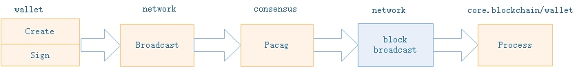
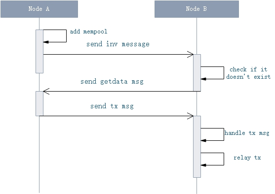

<center><h2> Transaction Execution </h2></center>

&emsp;&emsp;Transaction is the only designed method for interaction process within block chain network. Actions like asset registration, transferring, deploying & invoking smart contract, etc, are all proceesed based on transaction in NEO.
NEO transaction, similiar to the designing in Bitcoin, includes 3 important parts: input, output, scripts. These items stand for asset income, outflow & verification for UTXO (Unspent Transaction Output) within input, respectively. The input-output combinition is the basis of asset flow's chain structure.


## General Process

[](../images/tx_execution/tx_flow_graph.jpg)
A transaction is created using NEO-Cli, Neo-RPC, or NEO-GUI. Fulfiled transaction data is constructed utilizing wallet signing, and verified & broadcasted over the whole network.
Consensus nodes will verify this new transaction and put it into memory pool upon receiving. A specified speaker node will pack the transaction into a new block. Finally, this transaction is processed over the whole network after new block's broadcasting. Over process is breifly shown as follows:

[](../images/tx_execution/tx_process_flow_en.jpg)

1. Transaction construction: some user creates a transaction

2. Transaction signing: accomplish transaction signing & unlock transaction input

3. Transaction broadcasting: broadcast a transaction over the whole network

4. Transaction packing: packed into a new block by the consensus speaker

5. Transaction processing: the new block is broadcasted & processed over the whole network


### (1) Transaction construction


Transaction can be constructed via Neo-CLI, NEO-RPC, or NEO-GUI, and completed by wallet.


1. Via NEO-CLI commands

```bash
send <id|alias> <address> <value>|all [fee=0]
```

&emsp;&emsp;where

 - id|alias：asset id or alias
 - address：receiver's address
 - value: transfering amount or `all` for the whole amount
 - fee：transfer charge, default value = 0


2、via NEO-RPC calling


+ sendfrom: transferring from a specified address to another specified one.

+ sendtoaddress: transferring to a specified address.

+ sendmany：bulk transferring order

    
&emsp;&emsp;Detailed info can be found at [NEO Documentation: API Reference](http://docs.neo.org/en-us/node/cli/apigen.html)。 


3、via NEO-GUI
    
&emsp;&emsp;Detailed info can be found at [NEO Documentation: NEO GUI Transactions](http://docs.neo.org/en-us/node/gui/transc.html)。


Transaction construction interface by wallet:


```c#
public Transaction MakeTransaction(List<TransactionAttribute> attributes, IEnumerable<TransferOutput> outputs, UInt160 from, UInt160 change_address, Fixed8 fee);
```

where, 
   - attributes: transaction attributes
   - outputs: transferring list
   - from: transferring payer
   - change_address: address to whom small change is sent to
   - fee: system fee


**Transaction construction steps by wallet**:

1. If non-Global & NEP-5 asset is involved, `transfer` function of `InvocationTransaction` is used for asset transferring.

2. Compute overall GAS consumption，including network fee & system fee.

3. Automatically complete UTXO(Unspent Transaction Output) needed by inputs

    1. Group outputs with <assetId, amount>

    2. Computing the minimum needed UTXO。Transferring will fail if balace is not enough.

        1. If input account is assigned, compute the minimum available UTXO under this account.

        2. Otherwise, search for the minimum available UTXO from all unlocked & non-watch only accounts within wallet.

4. If small change exists, create corresponding output.


### (2) Signing verification


It has been mentioned in previous chapters that, an account address, actually stands for a piece of `OpCode.CHECKSIG` or `OpCode.CHECKMULTISIG`[contract code](./blockchain/wallets.md#3_address), and signature parameters are needed upon execution. A classic UTXO transferring transaction is actually unlocking input address script. Unlocking successfully means transaction introducing is successfully accomplished. Upon NEO transaction verification, corresponding scripts need to be verified as well. Therefore, corresponding script parameters, such as transaction signature parameters, are needed for script execution. These parameters as well as related scripts are eventually encapsulated into transaction's [Witness](./blockchain/transaction.md#4_witness) list.

Transaction signature is actually, adding address scripts' singature parameters, to construct completed executable witness. Steps are as follows:

**Signature Steps**：

1. Encapsulate transaction to `ContractParametersContext` object (`ContractParametersContext` encapsulates signature verification objects and is responsible for adding contract script parameters & contructing completed witness).

2. Get corresponding account for every ScriptHash of to be verified transaction scripts. Skip if corresponding account is null or doesn't have key pair.

3. Use the keypair to sign unsigned serialized data of transaction, with `ECDsa` method.

4. Add signature parameters to corresponding position in parameter list as follows:

    1. If input script is multi-signature, construct corresponding `ContextItem` object according to input script contract (`ContextItem` is an encapsultion of script contract parameters).
        
        1. Check to be verified address public key in address script byte code. If signature address in not included, signature fails.

        2. Save the signature.

        3. If least signature amount is satisfied, insert signature parameters according to the order-preserving mapping relationship (If address A is ahead of address B in script, then signature parameters of A should be ahead of that of B) of signature-related public keys within script (Need to sign other corresponding account addresses & supplement signature parameters in case of multi-signature).
        
    2. Otherwise, if there exists the only 0x00 (which stands for ContractParameterType.Signature) in contract.ParameterList:

        1. If no one exists, return false.

        2. If multiple ones exist, throw exception.
        
        3. contract.Parameters[index] = signature.

5. If all script parameters are completed, so is the transaction's witness list (Need to sign other corresponding account addresses & supplement signature parameters in case of multi-signature).


**Transaction Verification**

1. **Legality Verification**

   1. Whether duplicated referrences exist in transaction input.

   2. Whether transaction input is mutiply spent.

   3. Whether asset exists & has expired.

   4. Whether transferring amont is correct & comparation between input amount and output amount.
      
       1. If transferring fee exists, input.GAS > output.GAS

       2. In case of extracting GAS from NEO, input.GAS < output.GAS

       3. In case of distrubuting assets，input.Asset < output. Asset

   5. Whether asset type suits amount. Asset increasing scenarios can only be MinerTransaction/ClaimTransaction + Gas, or IssueTransaction + non-GAS assets.

   6. Whether transaction transferring fee is enough

   7. Whether transaction attributes suit.
    
      1. If transaction attrbiute includes `TransactionAttributeUsage.ECDH02` or `TransactionAttributeUsage.ECDH03`, verification fails.


2. **Transaction script verification**

   1. Obtain hash list of to be verified transaction script, including following script:

      1. scriptHash of output within transactions of input, unlocking UTXO.

      2. The payee address scripthash of special assets which have flag `AssetType.DutyFlag` within output.

      3. Scripts whose usage is `TransactionAttributeUsage.Script` in Attributes.

   2. Obtain witness list of transactions. If witness corresponding to scripthash does not exist, use the scripthash to create temporate `Opt.APPCALL hash` script.

   3. Load in verification script respectively & execute the script with NVM. If returns false, verification fails.


Occasions where transaction verification is needed:

1. When node receives a transaction.

2. When node create / relay a transaction.

3. When node verifies to be verified transactions after block persisting.

4. When node verifies to be encapsulated transactions during consensus process.


> [!NOTE]
> 1. Provide parameters for to be verified scripts & execute with NVM. Script passes verification is true is returned.
> 2. Every address is one `OptCode.CHECKSIG` code fragment, so signature parameters are needed upon execution. Similiarly, muti-signed address uses `OptCode.CHECKMULTISIG` method as well as specified quantity of signature parameters.
> 3. Every to-be-verified script within transactions contains tx.output.scriptHash (payee's address script of input transaction) pointed by input. This ensures only corresponding wallet is able to use this UTXO.
> 4. For customised scripthash, need to provide parameters accordingly beforehand for verification.


### (3) Broadcasting

Node where the wallet is located, will P2P broadcast the transaction.

[](../images/tx_execution/tx_p2p_flow.jpg)


**Broadcasting Steps**：


1. If consensus module is started by local node, run [New tranasction event in consensus module](./consensus/consensus_protocol.md#6_tx_handler).

2. Node will verify the transaction & add into memory pool before broadcasting.

    1. Verification fails if the transaction is `MinerTransaction`.

    2. Verification fails if the transaction already exists in memory pool or blockchain.

    3. Transaction checking, including legality checking & verification script execution.

    4. Load [plug-in](https://github.com/neo-project/neo-plugins/blob/master/SimplePolicy/SimplePolicyPlugin.cs#L18) to filter.

    5. Add the transaction into memory pool if the above verification passes.

3. Local node sends `inv` message along with transaction's hash data.

4. Will do nothing if remote node has already receives data corresponding to the hash, or has received the inv message repleatedly in short period. Otherwise proceed to next step.

5. Remote node broadcast `getdata` message along with hash data within inv message.

6. Local node will send `tx` message along with transaction data upon receiving `getdata` message.

7. Remote node will go to step 1 & relaying process upon receiving transaction data.


### (4) Transaction Encapsulation

During consensus process, speaker raise a proposal about transaction encapsulation, and finally broadcast new block to network.

1. Speaker takes out all memory pool transactions & processes plug-in filtering and ranking.

2. Speaker encapsultes transactions into new proposal block & raises consensus voting.

3. If more than `N-f` nodes endorse, new block will be generated & boradcasted.


### (5) Transaction Processing

Node will verify & persist new blocks upon receiving. Transaction processing methods varies by transaction type, i.e. voting transaction, contract execution transaction, asset registration transaction, etc.

* **BLock processing by Core.Blockchain**

Trasanction processing method in block persist process:

1. In asset tranasferring cases, renew asset changes for corresponding accounts.

2. In validator voting case, renew validators & validators_count.

3. Renew UTXO & spent+unclaimed Output record.

4. In case `RegisterTransaction`, record new registered asset.

5. In case `IssueTransaction`, renew asset's total circulation record.

6. In case `ClaimTransaction`, renew spent+unclaimed Output record.

7. In case `EnrollmentTransaction`, renew validator record.

8. In case `StateTransaction`, votes or validator enrollment according to transaction type, and renew validators & validators_count.

9. In case `PublishTransaction`, create new smart contract.

10. In case `InvocationTransaction`, run script or smart contract.

11. Delete unfrozen && non-validator && balance of all assets = 0 users.

12. Persist data.


* **BLock processing by Wallet**

Wallet starts a thread listening to new blocks. It will renew transaction status, unconfirmed transaction list and account data according to asset changes as follows:

1. Outputs processing, renew corresponding transaction status & account changes.

2. Intputs processing, remove tracked addresses & transactions.

3. Remove ClaimTransactions & tracked addresses & transactions.

4. Trigger asset changing event.
 
    1. Remove confirmed new transactions from unconfirmed transaction list.


&nbsp;
&nbsp;

-------------------


## Transaction Type

NEO transanction is defined as follows：

| Name | Transaction fee (unit: GAS) | Description |
| --------   | :-----:   | :----: |
| MinerTransaction | 0 | used for collected system fee distribution |
| RegisterTransaction | 10000/0 | (Aborted) used for asset registration |
| IssueTransaction | 500/0 | used for asset distribution |
| ClaimTransaction | 0 | used for NeoGas distribution |
| EnrollmentTransaction | 1000 | (Aborted) used for consensus candidate enrollmment |
| StateTransaction | 1000/0 | used for witness enrollment or consensus node voting |
| ContractTransaction | 0 | used for contract transaction, a most common transaction category |
| PublishTransaction | 500*n | (Aborted) used for smart contract publishing |
| InvocationTransaction | used for GAS consumption & calling smart contract |


> [!NOTE]
> **Transaction system fee**: Different transactions are with different fee standard, which is set in configuration file `protocol.json`. Collected system fee is distributed to NEO holders。
>
> **Transaction network fee**： `NetworkFee = tx.inputs.GAS - tx.outputs.GAS - tx.SystemFee`， 共识过程中，对议长打包交易的奖励，存于共识新块的第一笔交易`MinerTransaction`中。交易的网络费设置的越高，越容易被打包。

&nbsp;


### Common attributes

All transaction types inherit from type Neo.Core.Transaction. Shared functions & attributes are available is this type, such as:

* **Transaction attributes**

Transaction's attribute list & maximum attribute amount = 16, transaction type (as shown above), version (default value = 1), etc.
 

* **Transaction functions**

Input / output list, transaction verification script - Witness list, Network / System Fee, transaction references, GetScriptHashesForVerifying，GetTransactionResults，Transaction verification, etc.

* **Transaction IO **

ReflectionCache, Size, Serialize / Deserialize, etc

* **TransactionAttribute**

Attributes is a variable of type Transaction, which stands for transaction's extra attributes. It's data structure is as follows:

| Size | Name | Type | Description |
|---|-------|------|------|
| 1 | Usage | TransactionAttributeUsage | Specified transaction attribute's usage   |
| 0|1 | length | uint8 | 	data length (left out in some occasions) |
| ? | Data | byte[length] | external data for specified usage | 

All types of TransactionAttributeUsage is shown as follows：

| Name | Value | Description |
|-------|-----|----|
| ContractHash | 0x00 | Hash of external contract |
| ECDH02 | 0x02 | Public key used for ECDH private key exchange, first byte of this public key is 0x02 |
| ECDH03 | 0x03 | Public key used for ECDH private key exchange, first byte of this public key is 0x03 |
| Script | 0x20 | Used for extra verification of transaction, i.e. stock transferring, payee's script hash, etc |
| Vote | 0x30 | Voting |
| DescriptionUrl | 0x81 | External description URL |
| Description | 0x90 | Brief description |
| Hash1 - Hash15 | 0xa1-0xaf | customed hash value |
| Remark-Remark15 | 0xf0-0xff | Remark |


Currently two kinds of TransactionAttributeUsage are in use: TransactionAttributeUsage.Script and TransactionAttributeUsage.Remark, which are both used by InvocationTransaction. As InvocationTransaction is used for asset registration, contract publishing and partial transferring, TransactionAttribute is used to store extra information.


### MinerTransaction


| Size | Name | Type | Description |
|----|-------|------|------|
|  -  | - | -  | common attributes |
| 4 | Nonce | uint | Genesis Block's nonce value is 2083236893, same as that of Bitcoin's genesis block. In other cases, nonce value is randomly generated. |
|  -  | - | -  | common attributes |

Special transaction used for distributing block fee & not user-customised transaction type. The first MinerTransaction is created by system in the Genesis block. Afterwards upon creating new blocks, corresponding MinerTransaction is created by speaker to distribute transaction network fee as new block award.

**Creating Transaction**

1. On consensus step, speaker filters & ranks memory transactions.

2. Computing overall network fee of to be encapsulated trasactions, as the output amount of MinerTransaction

3. Set the payee of MinerTransaction's output as current speaker. Other attributes such as inputs, attrs, witnesses would be null. Here input's and output's amount is different as MinerTransaction distributes assets.

4. Encapsulte the transaction above into consensus proposal block & broadcast.


Following steps is the same as basic transaction.


### RegisterTransaction (Aborted)


| Size | Name | Type | Description |
|----|-----|------|------|
|  -  | - | - | common attributes  |
| 1 | AssetType | byte | asset's type |
| ? | Name | string | assets's name |
| 8 | Amount | Fixed8 | asset's overall amount |
| 1 | Precision | byte | asset's precision |
| ? | Owner | ECPoint | public key of asset's owner |
| 20 | Admin | UInt160 | administrator's address script hash |
|  -  | - | - | common attributes  |

 
Asset registration transaction. System registered two kinds of assets with RegisterTransaction in Genisis Block: NEO Coin (or Ant Share, NEO) and NEO Gas (or Ant Coin, GAS). RegisterTransaction is not utilized in current system. InvocationTransaction is actually used in asset registration in GUI.


Amount is distribution amount & has 2 modes:

   1. **Limited mode**: If amount is above 0, the maximum distribution amount is set to this value & cannot be modified (It's possible stock supports amount increasing, i.e. based on company signature or certain proportion of stockholder's signatures).

   2. **Unlimited mode**：If amount = -1, current asset can be issued by created unlimitedly. This mode has maximum variance but minimum credibility, and is not encouraged.

Other processing steps are the same as basic transaction.


### IssueTransaction


Special transaction to issue assets. Assets can be issued by registrator within its overall amount after asset registration. Issued asset can be used for transferring & transaction. Asset issueing consumes an amount of GAS as extra service fee (Currently 1 GAS).


> [!NOTE]
> 1. If version >= 1, system fee is 0.
> 2. If the assset type in output list is NEO or GAS, system fee is 0. Otherwise is 500GAS as defined in `protocol.json`.


**Transaction Verification**

1. **Legality Verification**
 
   1. Common legality verification.

   2. Compute change between asset input and output.

   3. If situations where asset decrease don't exist, verification fails.

   4. If asset doesn't exist, verification fails.

   5. If issueing amount + other issueing amounts of this asset in memory pool > total registered amount, verification fails.

2. **Script Verification**

    1. Registrtor's hash will be verified in common script verification steps.

Other processing steps are the same as basic transaction.


### ClaimTransaction

| Size | Name | Type | Description |
|----|-------|------|------|
|  -  | - | -  | common attributes  |
| 34*n | Claims | CoinReference[] | Reference of NEO asset which has collectable GAS |
|  -  | - | -  | common attributes  |


New GAS is obtained by NEO holder's claiming operation rather than issued automatically to NEO holder's account upon every new block. The amount of claimable GAS is related to corresponding NEO asset's start and end height. The total amount of GAS is 100 million. No new GAS will be claimable after block height reaches 46 million.

Every NEO transaction has 2 states: unspent & spent, respectively. Every unclaimed GAS also has 2 states: available and unavailable. Life cycle of an NEO starts from transferring in and ends at transferring out. It's original state is unspent upon transferred in, and switches to spent when transferred out. For an NEO whose state is unspent, its generated GAS is unclaimable. Otherwise, when its state is spent, its generated GAS is claimable. User can switch the state of a certain NEO from unspent to spent to claim generated GAS by transferring.

Therefore, claiming GAS is actually: (1) looking for spent but unclaimed NEO transaction (Such transaction list is maintained by system), (2) computing corresponding claimable GAS, (3) transferring GAS to user wallet address.


**Transaction creating**

1. From spentcoins (spent & unclaimed NEO), select output to claim as the value of ClaimTransaction.Claims.

2. Compute the amount of claimable GAS as ClaimTransaction.Output.Value.

3. Set payee of ClaimTransaction.Output as current account's address scripthash, and set inputs, attrs to be null.

4. Sign & P2P broadcast this transaction.


Here, **amount of GAS of an NEO tx.output**

[](../images/tx_execution/tx_claim_gas.jpg)

<script type="text/javascript" src="http://cdn.mathjax.org/mathjax/latest/MathJax.js?config=default"></script>

$$
Gas = \sum_{h=M+1}^{N} (BlockBonus(h) + SystemFee(h)) * \frac{tx.output.NEO}{10^8}
$$

- Gas: An NEO transaction's claimable GAS amount.
- M: input transaction's block height, or start height.
- N: output transaction's height, or end height.
- `BlockBonus(h)`: Gas reward of block at height h, as shown below.
- `SystemFee(h)`: System fee of block at height h, which equals sum of fees of all transaction within this block: `amount_sysfee = block.Transactions.Sum(p => p.SystemFee)`
- `tx.output.NEO`: transaction NEO amount
- 10^8: NEO's total amount 100 million


| Cycle | Block height | Block reward GAS amount |
|------|-------------|---------------|
|  1   |  0 - (200W -1) |    8 |
|  2   |  200W ~~ (400W -1) |    7 |
|  3   |  400W ~~ (600W -1) |    6 |
|  4   |  600W ~~ (800W -1) |    5 |
|  5   |  800W ~~ (1000W -1) |    4 |
|  6   |  1000W ~~ (1200W -1) |    3 |
|  7   |  1200W ~~ (1400W -1) |    2 |
|  8~22   |  1400W ~~ (4600W -1) |    1 |
|  23~    |  4600W ~ |    0 |


> [!NOTE]
> Rewarded Gas of an NEO transaction, equals (block Gas reward + block system fee) * percentage of transaction NEO in the block, for all blocks within unspent height interval.


**Transaction verification**

1. **Legality Verification**
   
   1. Common legality verification.

   2. If find duplicated transactions within Claims, return false.

   3. If find duplicate transactions between Claims & memory transactions, return false.

   4. If ClaimTransaction's Gas decreases or stay the same as before, return false.

   5. If computed claimable Gas result according to transaction in Claims, doesn't equal ClaimTransaction's Gas amount, return false.


2. **Script Verification**

    1. Transaction payee's hash within Claims will be verified in common script verification steps.

Other processing steps are the same as basic transaction.


### EnrollmentTransaction (Aborted)


| Size | Name | Type | Description |
|----|-------|------|------|
|  -  | - | -  | common attributes  |
| ? | PublicKey | ECPoint | Validator's public key |
|  -  | - | -  | common attributes  |

Special transaction of validator voting, for detailed information please refer to [Election and Voting](./consensus/vote_validator.md)。

### StateTransaction

| Size | Name | Type | Description |
|----|-------|------|------|
|  -  | - | -  | common attributes  |
| ?*? | Descriptors | StateDescriptor[] | Voting information |
|  -  | - | -  | common attributes  |

Special transaction for validator / consensus node voting. Validator candidate registration costs 1000 GAS. For detailed information please refer to [Election and Voting](./consensus/vote_validator.md).


### ContractTransaction

Contract transaction is the most commonly used transaction. It's used for transferring (send command in NEO CLI, API, and send option in NEO GUI). Processing steps are the same as basic transaction.


### PublishTransaction (Aborted)

| Size | Name | Type | Description |
|----|-------|------|------|
|  -  | - | -  | common attributes  |
| ? | Script | byte[] | Contract script |
| ? | ParameterList | ContractParameterType | parameter type list |
| 1 | ReturnType | ContractParameterType | return type |
| 1 | NeedStorage | bool | whether storage is needed |
| ? | Name | string | contract name |
| ? | CodeVersion | string | contract version code |
| ? | Author | string | contract author's name |
| ? | Email | string | contract author's email address |
| ? | Description | string | contract description |
|  -  | - | - | -  | common attributes  |

Special transaction for smart contract publishing. Processing steps are the same as basic transaction. Note that InvocationTransaction is actually used in GUI smart contract publishing.


### InvocationTransaction


| Size | Name | Type | Description |
|----|-------|------|------|
|  -  | - | -  | common attributes  |
| ? | Script | byte[] | Contract script |
| 8 | Gas | Fixed8 | Consumed Gas |
|  -  | - | - | -  | common attributes  |

Special transaction for smart contract invocation. With `invoke/invokefunction/invokescript` command in NEO API or NEO GUI, user can create InvocationTransaction object according to input smart contract information. Note, InvocationTransaction is actually used for GUI asset creation & smart contract publishing.

| InvokeTransaction Usage | Script | Attributes | Attribute content |
|--------------|------------|--------------|
| Invoking smart contract | contract script | null |   | 
| Publishing smart contract | Neo.Contract.Create  | null |   | 
| Asset Registration | Neo.Asset.Create | not null | TransactionAttributeUsage.Script, Asset holder's address scripthash * 1 |
| GUI transferring | NEP-5 asset: transaferring script <br/>Global asset: null  | not null | TransactionAttributeUsage.Script，transferring payee address * n <br/> TransactionAttributeUsage.Remark, remark data * 1 |
| CLI "non-sendall" transferring | same as above | not null |  TransactionAttributeUsage.Script, transferring account address * n |  


**Transaction creating**

1. Contruct corresponding execution script according to usage, and assign to InvocationTransaction.Script.

2. Run the script above in local NVM environment to calculate consumed Gas.

3. Assign `Math.max(0, GasConsumed - 10).Ceiling()` to InvocationTransaction.Gas as transaction's system fee. Note that system exempts 10 Gas.

4. Setting other transaction attributes & Signing & P2P broadcasting.


**Transaction Verification**

1. **Legality verification**

    1. If consumed Gas cannot be divided by 10^8, return false (In other words Gas amount must be integer format Fixed8. Decimal value is invalid).

    2. Common verification

Other processing steps are the same as basic transaction.


NEO smart contract requires certain system fee upon publishing & execution. Publishing fee is the amount of system fee needed to publish a smart contract onto block chain (Currently 500 Gas). Execution fee is the amount of system fee needed every time a smart contract is executed. Detailed information please refer to [Smart Contract System Fee](http://docs.neo.org/en-us/sc/systemfees.html)。


> [!NOTE]
> In case of dead links, please contact <feedback@neo.org>


