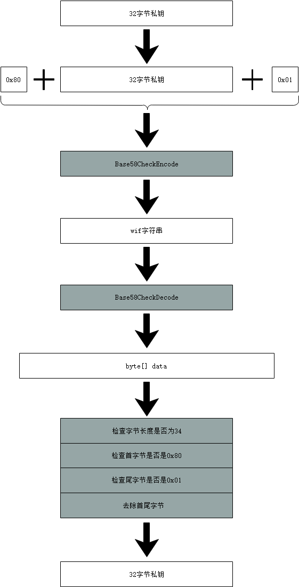

# 钱包
##  格式
  1、私钥
​    私钥是一个随机生成的位于1和n-1之间的任何数字（n是⼀个常数（n略小于2的256次方),由所使⽤的椭圆曲线的阶所定义），一般用一个256bit(32字节)数表示。

​    在NEO中私钥主要采用两种两种编码格式表示：
  a) HexString格式
​      使用16进制字符表示。
​      Example: 
   1、byte[]----->String
[0xc7,0x13,0x4d,0x6f,0xd8,0xe7,0x3d,0x81,0x9e,0x82,0x75,0x5c,0x64,0xc9,0x37,0x88,0xd8,0xdb,0x09,0x61,0x92,0x9e,0x02,0x5a,0x53,0x36,0x3c,0x4c,0xc0,0x2a,0x69,0x62]
------>c7134d6fd8e73d819e82755c64c93788d8db0961929e025a53363c4cc02a6962

  b) wif格式
​       wif格式是在原有32字节数据前后添加前缀0x80和后缀0x01,并做Base58Check编码的字符串

 Example: 
   1、byte[]----->String
[0xc7,0x13,0x4d,0x6f,0xd8,0xe7,0x3d,0x81,0x9e,0x82,0x75,0x5c,0x64,0xc9,0x37,0x88,0xd8,0xdb,0x09,0x61,0x92,0x9e,0x02,0x5a,0x53,0x36,0x3c,0x4c,0xc0,0x2a,0x69,0x62]
------>L3tgppXLgdaeqSGSFw1Go3skBiy8vQAM7YMXvTHsKQtE16Dw58cV

   2、String-----> byte[]

L3tgppXLgdaeqSGSFw1Go3skBiy8vQAM7YMXvTHsKQtE16Dw58cV------>[0xc7,0x13,0x4d,0x6f,0xd8,0xe7,0x3d,0x81,0x9e,0x82,0x75,0x5c,0x64,0xc9,0x37,0x88,0xd8,0xdb,0x09,0x61,0x92,0x9e,0x02,0x5a,0x53,0x36,0x3c,0x4c,0xc0,0x2a,0x69,0x62]

2、公钥

​     公钥是通过ECC算法将私钥运算得到的一个点（x,y）。该点的x、y坐标都可以用32字节表示

​    在neo中公钥有两种编码格式：

   a)非压缩型

​      0x04+x坐标（32字节）+y坐标（32字节）

   b)压缩型

​      0x02/0x03+x坐标（32字节）

3、地址

4、数字证书

## 钱包文件
  1、db3钱包文件
  2、NEP6钱包文件

## 钱包功能

  1、基础
  2、扩展

## 钱包软件
  1、全节点钱包
  2、SPV钱包
  3、硬件钱包
  4、纸钱包

介绍各种钱包的分类和细节。
只描述需要实现的功能，暂时不需要描述数据库存储格式的细节。